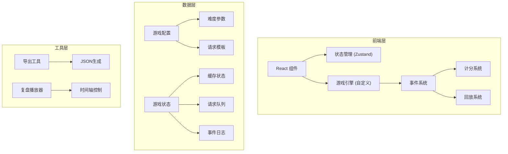

## 1. 架构设计



## 2. 技术描述
- **前端框架**：React@18 + TypeScript
- **构建工具**：Vite@5
- **样式方案**：TailwindCSS@3 + CSS Modules
- **状态管理**：Zustand (轻量级，适合游戏状态)
- **图表可视化**：Recharts (用于结算页雷达图)
- **动画库**：Framer Motion (流畅的微交互)
- **后端**：纯前端实现，无需后端服务

## 3. 路由定义
| 路由 | 用途 |
|------|------|
| / | 游戏主页，介绍和开始 |
| /game | 游戏主界面 |
| /result | 结算页面 |
| /replay | 复盘模式 |

## 4. 数据模型

### 4.1 核心数据结构

```typescript
// 缓存条目
interface CacheEntry {
  id: string;
  key: string;
  value: string;
  ttl: number; // 剩余存活时间(ms)
  maxTtl: number;
  status: 'valid' | 'expired' | 'dirty';
  dirtySource?: string; // 脏数据来源
  lastAccessed: number;
}

// 请求
interface Request {
  id: string;
  type: 'read' | 'write' | 'delete';
  key: string;
  expectedValue?: string;
  timeout: number;
  createdAt: number;
  isHotKey: boolean; // 是否热点key(可能引发击穿)
  penalty: number; // 超时扣分
}

// 游戏事件
interface GameEvent {
  id: string;
  timestamp: number;
  type: 'hit' | 'miss' | 'dirty_read' | 'expired_read' | 'breakdown' | 'timeout' | 'write' | 'delete';
  key?: string;
  message: string;
  scoreChange: number;
  details?: Record<string, any>;
}

// 游戏状态
interface GameState {
  status: 'idle' | 'playing' | 'paused' | 'finished';
  difficulty: 'easy' | 'normal' | 'hard';
  score: number;
  totalRequests: number;
  cacheHits: number;
  cache: CacheEntry[];
  requestQueue: Request[];
  eventLog: GameEvent[];
  startTime: number;
  duration: number; // 游戏时长(ms)
  breakdownsPrevented: number;
  breakdownsOccurred: number;
}

// 结算报告
interface SettlementReport {
  totalScore: number;
  hitRate: number;
  events: GameEvent[];
  penalties: {
    event: GameEvent;
    reason: string;
    suggestion: string;
  }[];
  breakdownAnalysis: {
    total: number;
    prevented: number;
    occurred: number;
    details: GameEvent[];
  };
}
```

## 5. 游戏引擎设计

### 5.1 核心循环
```
每一帧 (~16ms):
1. 更新缓存TTL
2. 检查过期缓存，标记状态
3. 按难度生成新请求
4. 处理超时请求，记录扣分
5. 更新事件日志
6. 检查游戏结束条件
```

### 5.2 计分规则
| 操作 | 得分 |
|------|------|
| 缓存命中 | +10 |
| 正确回源后缓存 | +5 |
| 成功拦截缓存击穿 | +50 |
| 脏数据读取 | -20 |
| 过期数据读取 | -15 |
| 缓存击穿发生 | -100 |
| 请求超时 | -30 |

### 5.3 难度参数
| 参数 | 简单 | 普通 | 困难 |
|------|------|------|------|
| 缓存格数 | 3x3 | 4x4 | 5x5 |
| 请求间隔 | 2000ms | 1200ms | 800ms |
| 热点key概率 | 5% | 15% | 30% |
| 脏数据概率 | 5% | 10% | 20% |
| 游戏时长 | 90s | 120s | 180s |
