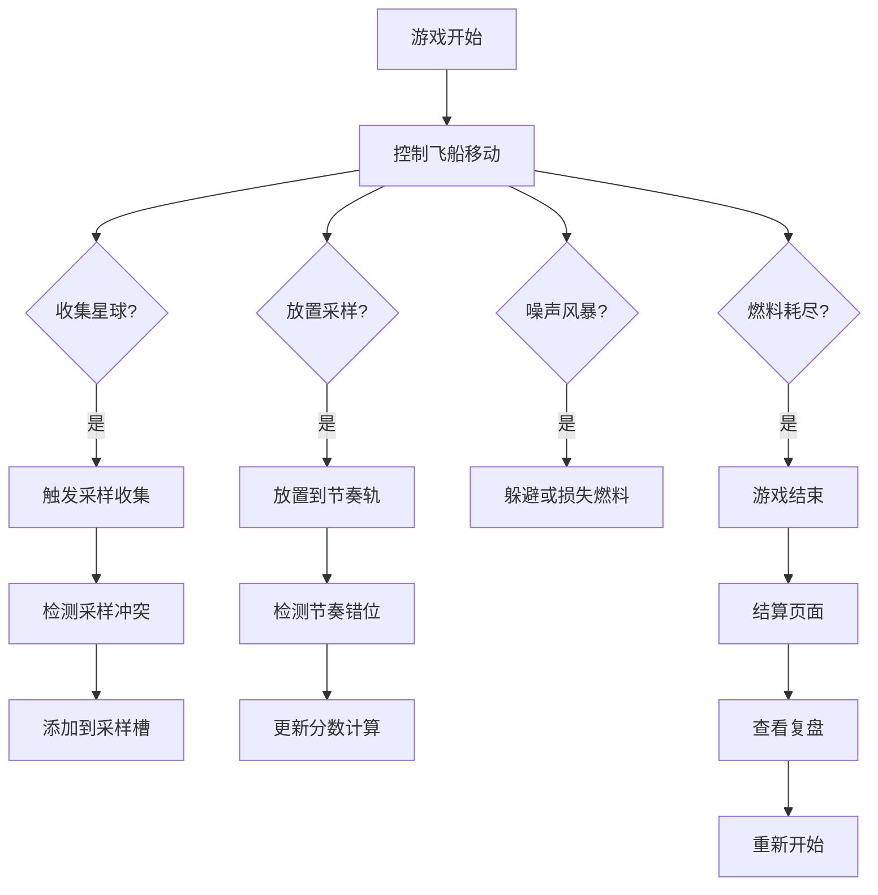

## 1. 产品概述

太空音乐采样器是一款浏览器端音乐太空小游戏，玩家在太空中收集星球声音采样并拼成节奏，同时躲避噪声风暴。游戏注重可玩性和音乐创作体验，支持完整的游戏流程和复盘分析。

## 2. 核心功能

### 2.1 用户角色

| 角色 | 注册方式 | 核心权限 |
|------|----------|----------|
| 玩家 | 无需注册 | 完整游戏体验、成绩记录、复盘查看 |

### 2.2 功能模块

1. **游戏主界面**：太空场景、飞船控制、星球收集
2. **节奏编辑区**：采样槽、节奏轨、播放预览
3. **游戏控制**：开始、暂停、重开、结算
4. **复盘系统**：采样历史、分数分析、结果分类
5. **状态系统**：燃料管理、采样冲突检测、节奏错位判定

### 2.3 页面详情

| 页面名称 | 模块名称 | 功能描述 |
|----------|----------|----------|
| 游戏主界面 | 太空场景 | 2D 太空背景、动态星球、飞船控制 |
| 游戏主界面 | HUD 面板 | 燃料显示、分数显示、采样数量、噪声风暴预警 |
| 节奏编辑区 | 采样槽 | 已收集星球声音采样展示和选择 |
| 节奏编辑区 | 节奏轨 | 8 拍节奏轨道、采样放置和移除 |
| 游戏控制 | 控制按钮 | 开始/暂停/重开按钮组 |
| 结算页面 | 成绩展示 | 最终分数、采样数量、完成度统计 |
| 结算页面 | 结果分类 | 可直接用、需确认、节奏错位三类结果 |
| 复盘页面 | 时间线 | 采样收集触发点、关键事件回放 |
| 复盘页面 | 分数分析 | 节奏合成对分数的影响详情 |

## 3. 核心流程

玩家进入游戏 → 点击开始 → 控制飞船收集星球采样 → 放置采样到节奏轨 → 躲避噪声风暴 → 燃料耗尽或游戏结束 → 结算展示 → 查看复盘 → 重新开始

## 4. 用户界面设计

### 4.1 设计风格

- **主色调**：深空蓝 (#0a0a1a)、星云紫 (#4a1a6b)、星光青 (#00d4ff)
- **强调色**：节奏粉 (#ff00aa)、警告橙 (#ff6b00)、成功绿 (#00ff88)
- **按钮风格**：圆角霓虹边框、悬浮发光效果、按压动画
- **字体**：展示字体使用 Orbitron（太空科技感），正文字体使用 JetBrains Mono
- **布局风格**：半透明玻璃态面板、霓虹光效边框、深色太空背景
- **图标风格**：线性霓虹图标、发光效果、太空主题 emoji

### 4.2 页面设计概览

| 页面名称 | 模块名称 | UI 元素 |
|----------|----------|---------|
| 游戏主界面 | 太空场景 | 星空粒子背景、动态星球、飞船 sprite、噪声风暴特效 |
| 游戏主界面 | HUD 面板 | 左上角燃料条、右上角分数、采样计数器、噪声预警条 |
| 节奏编辑区 | 采样槽 | 底部横向滚动采样卡片、波形预览、颜色编码 |
| 节奏编辑区 | 节奏轨 | 8 格轨道、拍点指示器、播放光标、采样块 |
| 结算页面 | 成绩卡片 | 大字体分数、采样统计、节奏完成度环形图 |
| 结算页面 | 结果分类 | 三栏结果卡片、状态标签、详情展开 |
| 复盘页面 | 时间线 | 垂直时间轴、事件标记、采样点高亮 |
| 复盘页面 | 分数分析 | 瀑布图展示、正负加分项、节奏错位标记 |

### 4.3 响应性

- 桌面端优先设计，支持 1280x720 及以上分辨率
- 节奏轨和采样槽自适应宽度
- 触控设备支持虚拟摇杆或触摸滑动控制

### 4.4 特效与动画

- **环境**：星空粒子流动、星球自转、星云脉动
- **交互**：采样收集时的爆炸光效、节奏播放时的脉冲动画
- **反馈**：噪声风暴时的屏幕震动、燃料不足时的红色闪烁警告
