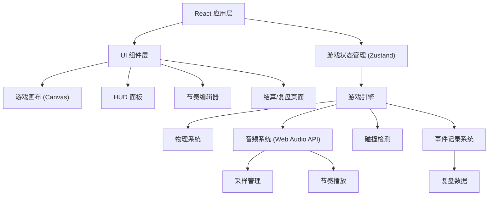
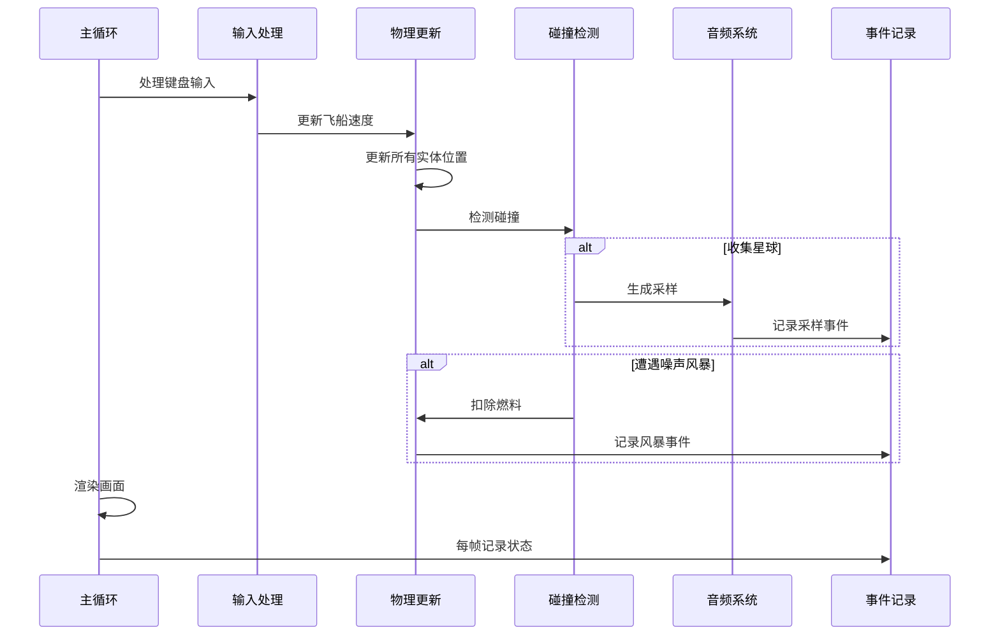

## 1. 架构设计



## 2. 技术选型

- **前端框架**：React@18 + TypeScript
- **构建工具**：Vite
- **样式方案**：TailwindCSS@3
- **状态管理**：Zustand
- **游戏渲染**：HTML5 Canvas 2D
- **音频处理**：Web Audio API
- **动画**：CSS Animations + requestAnimationFrame

## 3. 目录结构

```
src/
├── components/
│   ├── game/
│   │   ├── GameCanvas.tsx      # 游戏画布
│   │   ├── HUDPanel.tsx        # HUD 面板
│   │   └── GameControls.tsx    # 游戏控制按钮
│   ├── rhythm/
│   │   ├── SampleSlot.tsx      # 采样槽
│   │   ├── RhythmTrack.tsx     # 节奏轨
│   │   └── SampleCard.tsx      # 采样卡片
│   ├── result/
│   │   ├── ResultPage.tsx      # 结算页面
│   │   ├── ResultCard.tsx      # 结果分类卡片
│   │   └── ReplayPanel.tsx     # 复盘面板
│   └── common/
│       └── NeonButton.tsx      # 霓虹按钮组件
├── hooks/
│   ├── useGameLoop.ts          # 游戏循环 hook
│   ├── useKeyboard.ts          # 键盘控制 hook
│   └── useAudio.ts             # 音频 hook
├── store/
│   └── gameStore.ts            # 游戏状态管理
├── engine/
│   ├── GameEngine.ts           # 游戏引擎核心
│   ├── PhysicsSystem.ts        # 物理系统
│   ├── CollisionSystem.ts      # 碰撞检测
│   └── EventRecorder.ts        # 事件记录器
├── audio/
│   ├── AudioManager.ts         # 音频管理器
│   ├── SampleGenerator.ts      # 采样生成器
│   └── RhythmPlayer.ts         # 节奏播放器
├── types/
│   └── game.ts                 # 类型定义
└── utils/
    └── helpers.ts              # 工具函数
```

## 4. 核心类型定义

```typescript
// 游戏状态
interface GameState {
  status: 'idle' | 'playing' | 'paused' | 'ended';
  score: number;
  fuel: number;
  maxFuel: number;
  time: number;
}

// 飞船
interface Ship {
  x: number;
  y: number;
  vx: number;
  vy: number;
  radius: number;
}

// 星球
interface Planet {
  id: string;
  x: number;
  y: number;
  radius: number;
  color: string;
  soundType: 'bass' | 'snare' | 'hihat' | 'melody' | 'fx';
  frequency: number;
  collected: boolean;
}

// 采样
interface Sample {
  id: string;
  planetId: string;
  soundType: string;
  frequency: number;
  color: string;
  collectedAt: number;
}

// 节奏轨
interface RhythmTrack {
  beats: (Sample | null)[];
  bpm: number;
}

// 噪声风暴
interface NoiseStorm {
  id: string;
  x: number;
  y: number;
  radius: number;
  intensity: number;
  duration: number;
}

// 游戏事件
interface GameEvent {
  type: 'sample_collect' | 'sample_place' | 'collision' | 'fuel_low' | 'rhythm_mismatch' | 'storm_hit';
  timestamp: number;
  data: Record<string, any>;
}

// 结算结果
interface GameResult {
  category: 'usable' | 'needs_confirm' | 'rhythm_mismatch';
  score: number;
  samplesCollected: number;
  rhythmQuality: number;
  events: GameEvent[];
}
```

## 5. 游戏引擎核心流程



## 6. 音频系统设计

- **采样生成**：使用 Web Audio API 生成不同类型的合成音（bass, snare, hihat, melody, fx）
- **节奏播放**：按 BPM 循环播放节奏轨上的采样
- **冲突检测**：同一拍点放置多个采样时判定为采样冲突
- **错位检测**：采样放置与节拍网格偏差超过阈值时判定为节奏错位

## 7. 复盘系统

- **事件记录**：全程记录采样收集、放置、碰撞等关键事件
- **时间线回放**：按时间轴展示所有关键事件
- **分数分析**：分解每一项加分/扣分的来源
- **结果分类**：根据节奏质量自动分类结果
