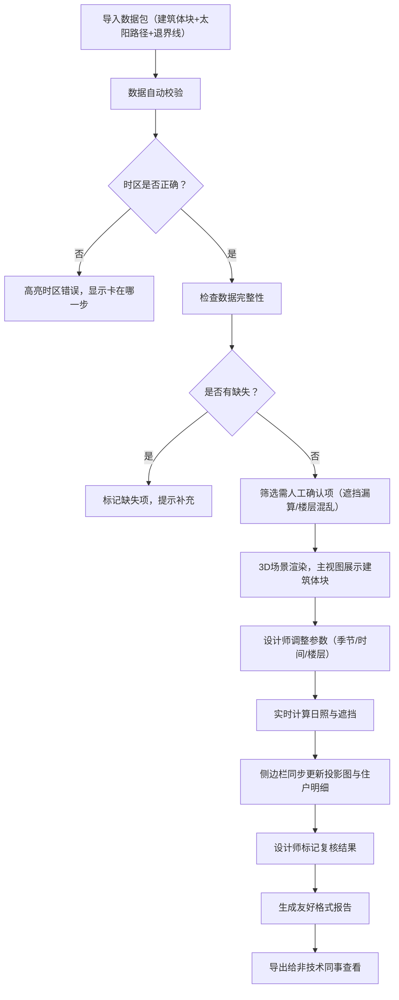

## 1. 产品概述

城市天际线日照盒是一款面向城市规划设计师的Web3D日照分析工具，解决方案评审阶段因高楼遮挡争议导致的沟通效率问题。通过直观的3D可视化呈现不同季节的日照影响，将专业的日照分析结果转化为非技术人员也能理解的可视化内容。

- 核心价值：让3D体块"说话"，用可视化消除日照遮挡争议
- 目标用户：城市规划设计师、建筑方案评审人员、非技术决策人员
- 市场定位：规划设计团队内部高效沟通工具，提升方案评审效率

## 2. 核心特性

### 2.1 用户角色

| 角色 | 登录方式 | 核心权限 |
|------|----------|----------|
| 规划设计师 | 本地单机使用（无需登录） | 数据导入、参数调整、3D交互、标记复核、生成报告 |
| 非技术评审人员 | 接收报告链接/文件 | 查看3D视图、阅读分析报告、理解日照影响 |

### 2.2 功能模块

1. **3D主视图**：建筑体块渲染、太阳路径可视化、退界线显示、相机交互控制
2. **日照分析引擎**：时区校验、季节切换、太阳位置计算、遮挡分析
3. **数据验证模块**：自动检测时区错误、数据完整性检查、高亮需人工确认项
4. **参数控制面板**：季节切换、时间轴、时区设置、楼层选择、视角管理
5. **侧边明细栏**：日照投影图、住户日照明细表、人工复核标记列表
6. **报告生成模块**：导出友好格式报告、时区错误人话解释、遮挡分析结论

### 2.3 页面详情

| 页面名称 | 模块名称 | 功能描述 |
|-----------|-------------|---------------------|
| 主工作台 | 3D视图区 | 可旋转缩放的3D场景，显示建筑体块、太阳轨迹、日照阴影、退界线 |
| 主工作台 | 参数控制面板 | 季节切换（春夏秋冬）、时间滑块、时区选择、楼层选择器 |
| 主工作台 | 数据验证状态条 | 实时显示数据检查结果，高亮时区错误、缺失数据等问题 |
| 主工作台 | 侧边明细栏（日照投影） | 2D投影图展示不同时段的阴影覆盖范围 |
| 主工作台 | 侧边明细栏（住户明细） | 表格展示各楼层各住户的日照时长、遮挡情况 |
| 主工作台 | 人工复核标记面板 | 列出遮挡漏算、楼层混乱等需设计师确认的条目 |
| 报告预览页 | 报告展示区 | 整合所有分析结果的可视化报告，带时区错误的人话解释 |

## 3. 核心流程

## 4. 用户界面设计

### 4.1 设计风格

- **主色调**：深海蓝 `#0F172A`（专业稳重）+ 日光橙 `#F97316`（日照主题）
- **辅助色**：晨曦金 `#EAB308`（警告/需确认）、薄荷绿 `#10B981`（正常/通过）、珊瑚红 `#EF4444`（错误）
- **字体**：展示字体用 `Archivo Black`（粗重有力的标题），正文字体用 `Inter`（清晰易读）
- **按钮风格**：微立体方角按钮，悬停时有轻微上浮和发光效果
- **布局风格**：三栏式专业布局，左侧参数控制、中间3D主视图、右侧明细数据
- **图标**：lucide-react 线性图标，配合日光、建筑、时钟等主题图标

### 4.2 页面设计概览

| 页面名称 | 模块名称 | UI元素 |
|-----------|-------------|-------------|
| 主工作台 | 3D视图区 | 深色背景带噪点纹理、建筑体块半透明玻璃质感、太阳用发光橙色球体、阴影用半透明黑色叠加、虚线显示太阳轨迹弧线 |
| 主工作台 | 参数控制面板 | 卡片式分组、季节切换用分段控制器、时间轴用带刻度的滑块、按钮带图标+文字、状态灯指示当前模式 |
| 主工作台 | 数据验证条 | 顶部固定窄条，错误时显示珊瑚红色背景配人话解释，正常时显示薄荷绿 |
| 主工作台 | 侧边明细栏 | 上下分栏，上半部分2D投影图（等高线风格），下半部分数据表格（斑马纹行） |
| 主工作台 | 复核标记面板 | 可折叠抽屉，每项带状态标签、人话描述、快捷定位按钮 |
| 报告预览页 | 报告展示区 | 白色背景、清晰章节划分、大字号总结、图表化日照数据、时区错误用对话气泡解释 |

### 4.3 响应式设计

- **桌面端优先**：1920px+ 最佳体验，三栏布局充分利用屏幕宽度
- **平板适配**：1024px-1440px，侧边栏可折叠为图标模式
- **移动适配**：1024px以下，改为上下堆叠布局，3D视图优先
- **触控优化**：支持双指旋转缩放，按钮最小尺寸44px

### 4.4 3D场景设计

- **环境/HDRI**：程序化生成的渐变天空（从地平线橙到天顶蓝），无HDRI依赖
- **光照设置**：主光源（太阳）随时间变化位置和颜色，环境光提供基础照明，阴影使用PCFSoftShadowMap实现柔和边缘
- **相机设置**：透视相机，初始45度俯视角，支持轨道控制（OrbitControls），限制最小/最大缩放距离
- **构图**：建筑群体居中，预留天空空间显示太阳轨迹，地面网格辅助空间感知
- **交互动画**：季节切换时太阳平滑过渡、点击建筑高亮并显示信息卡片、楼层选择时对应楼层闪烁提示
- **后处理**：轻微泛光（Bloom）效果增强太阳发光感，色调映射保持色彩自然
- **性能预算**：单体建筑最多100个面，场景总面数控制在5000以内，保持60fps

