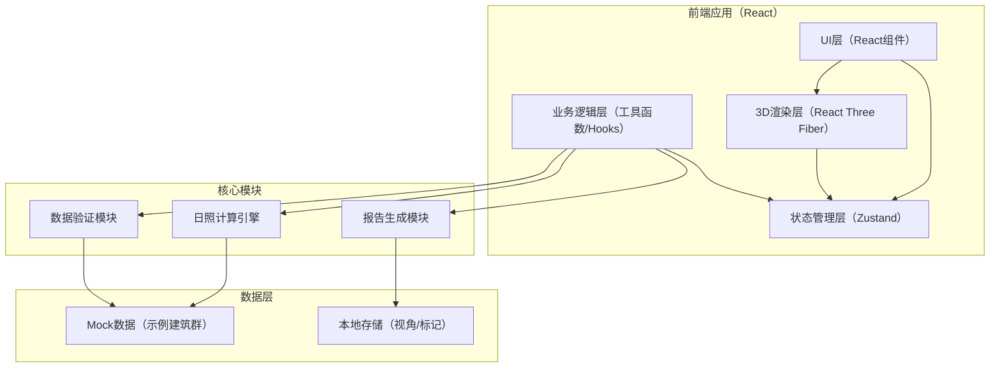
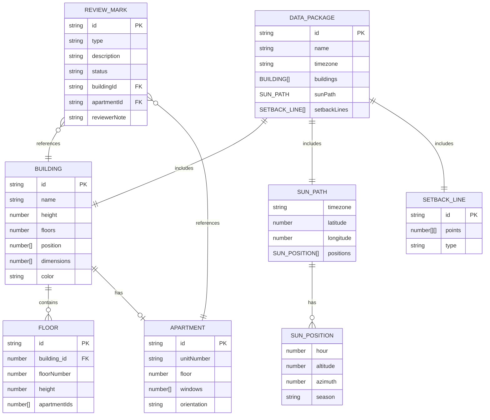

## 1. 架构设计



## 2. 技术描述

- **前端框架**：React@18 + TypeScript@5
- **构建工具**：Vite@5
- **样式方案**：TailwindCSS@3
- **3D渲染**：three@0.160 + @react-three/fiber@8 + @react-three/drei@9 + @react-three/postprocessing@2
- **状态管理**：zustand@4
- **图标库**：lucide-react@0.300
- **后端**：无（纯前端应用，数据本地处理）
- **数据库**：无（使用localStorage存储用户偏好和标记）

## 3. 路由定义

| 路由 | 页面 | 用途 |
|-------|------|------|
| `/` | 主工作台 | 3D视图、参数控制、侧边明细、人工复核 |
| `/report` | 报告预览页 | 展示完整分析报告，可导出 |

## 4. 数据模型

### 4.1 核心数据结构



### 4.2 TypeScript 类型定义

```typescript
// 建筑相关
interface Building {
  id: string;
  name: string;
  height: number;
  floors: number;
  position: [number, number, number];
  dimensions: [number, number, number];
  color: string;
  apartments: Apartment[];
}

interface Apartment {
  id: string;
  unitNumber: string;
  floor: number;
  orientation: 'N' | 'S' | 'E' | 'W' | 'NE' | 'NW' | 'SE' | 'SW';
  windowPositions: [number, number, number][];
}

// 日照相关
interface SunPosition {
  hour: number;
  altitude: number;
  azimuth: number;
}

interface SunPath {
  timezone: string;
  latitude: number;
  longitude: number;
  spring: SunPosition[];
  summer: SunPosition[];
  autumn: SunPosition[];
  winter: SunPosition[];
}

interface ShadowAnalysis {
  apartmentId: string;
  date: string;
  totalSunlightHours: number;
  shadowPeriods: { start: number; end: number; reason: string }[];
  issues: string[];
}

// 验证相关
interface ValidationResult {
  valid: boolean;
  errors: ValidationError[];
  warnings: ValidationWarning[];
  needsReview: ReviewItem[];
}

interface ValidationError {
  code: string;
  message: string;
  humanMessage: string;
  step: string;
  details: Record<string, unknown>;
}

interface ReviewItem {
  id: string;
  type: 'occlusion_miss' | 'floor_confusion' | 'data_inconsistency';
  description: string;
  humanDescription: string;
  buildingId?: string;
  apartmentId?: string;
  status: 'pending' | 'confirmed' | 'resolved';
  reviewerNote?: string;
}

// 状态管理
interface AppState {
  currentSeason: 'spring' | 'summer' | 'autumn' | 'winter';
  currentTime: number;
  selectedBuildingId: string | null;
  selectedFloor: number | null;
  cameraPosition: [number, number, number];
  savedViews: { name: string; position: [number, number, number]; target: [number, number, number] }[];
  dataPackage: DataPackage | null;
  validationResult: ValidationResult | null;
  analysisResults: ShadowAnalysis[];
  reviewMarks: ReviewItem[];
}
```

## 5. 目录结构

```
src/
├── components/
│   ├── three/              # 3D相关组件
│   │   ├── Scene.tsx       # 主3D场景
│   │   ├── BuildingMesh.tsx # 建筑体块
│   │   ├── SunLight.tsx    # 太阳光
│   │   ├── SunPathLine.tsx # 太阳轨迹线
│   │   ├── SetbackLine.tsx # 退界线
│   │   └── Ground.tsx      # 地面网格
│   ├── ui/                 # UI组件
│   │   ├── ControlPanel.tsx # 参数控制面板
│   │   ├── Sidebar.tsx     # 侧边栏容器
│   │   ├── ShadowChart.tsx # 日照投影图
│   │   ├── ApartmentTable.tsx # 住户明细表
│   │   ├── ReviewPanel.tsx # 人工复核面板
│   │   ├── ValidationBar.tsx # 数据验证状态条
│   │   └── SeasonSelector.tsx # 季节选择器
│   └── layout/             # 布局组件
│       └── WorkspaceLayout.tsx
├── pages/
│   ├── Workspace.tsx       # 主工作台页面
│   └── Report.tsx          # 报告预览页面
├── hooks/
│   ├── useSunCalculation.ts # 日照计算hook
│   ├── useDataValidation.ts # 数据验证hook
│   ├── useShadowAnalysis.ts # 遮挡分析hook
│   └── useViewManagement.ts # 视角管理hook
├── utils/
│   ├── sunCalculator.ts    # 太阳位置计算
│   ├── shadowDetector.ts   # 阴影检测算法
│   ├── dataValidator.ts    # 数据验证逻辑
│   ├── reportGenerator.ts  # 报告生成
│   └── timezoneUtils.ts    # 时区工具
├── store/
│   └── useAppStore.ts      # Zustand状态管理
├── types/
│   └── index.ts            # 类型定义
├── data/
│   └── mockData.ts         # 示例数据
├── App.tsx
├── main.tsx
└── index.css
```

## 6. 核心算法说明

### 6.1 太阳位置计算
- 基于纬度、经度、日期、时区计算太阳高度角和方位角
- 使用NOAA太阳位置算法简化版，保证精度同时兼顾性能
- 缓存各季节典型日（春分、夏至、秋分、冬至）的逐小时太阳位置

### 6.2 遮挡分析算法
- 对每个住户窗户位置，向太阳方向发射射线
- 检测射线是否与其他建筑体块相交
- 计算全天日照时长和被遮挡时段
- 标记可能漏算的边界情况（如擦边遮挡）

### 6.3 数据验证流程
1. 时区校验：检查时区格式、与经纬度匹配度、标准时区列表比对
2. 完整性检查：必填字段、建筑几何数据、太阳路径数据
3. 一致性检查：楼层数与高度匹配、建筑位置无重叠
4. 人工复核筛选：自动识别遮挡边界情况、楼层编号不连续等

### 6.4 报告生成
- 整合所有分析结果，使用人话模板转换专业术语
- 时区错误解释："您的数据使用了UTC时区，但项目位于北京（UTC+8），这会导致计算的日出日落时间偏差8小时"
- 导出为HTML格式，可直接在浏览器打开查看

