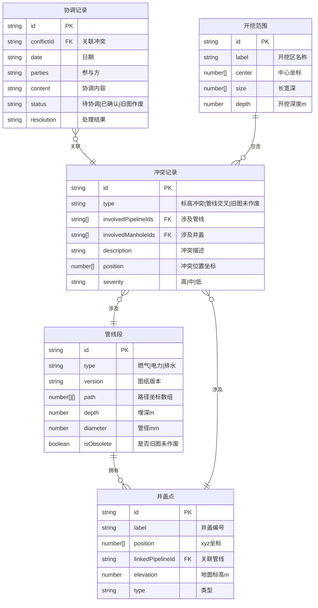

## 1. 架构设计

```mermaid
graph TB
    subgraph "前端层"
        "React App" --> "3D场景模块"
        "React App" --> "UI面板模块"
        "React App" --> "状态管理"
    end
    subgraph "3D场景模块"
        "Three.js 场景" --> "管线渲染器"
        "Three.js 场景" --> "井盖渲染器"
        "Three.js 场景" --> "开挖范围渲染器"
        "Three.js 场景" --> "剖切引擎"
        "Three.js 场景" --> "冲突检测引擎"
    end
    subgraph "UI面板模块"
        "图层控制" --> "状态管理"
        "冲突列表" --> "状态管理"
        "协调记录" --> "状态管理"
        "视角管理" --> "状态管理"
        "报告导出" --> "状态管理"
    end
    subgraph "数据层"
        "样例数据JSON" --> "管线数据"
        "样例数据JSON" --> "井盖数据"
        "样例数据JSON" --> "开挖范围数据"
        "样例数据JSON" --> "协调记录数据"
    end
    "状态管理" --> "3D场景模块"
    "数据层" --> "状态管理"
```

## 2. 技术说明

- 前端：React@18 + TypeScript + Tailwind CSS@3 + Vite
- 3D引擎：Three.js + @react-three/fiber + @react-three/drei + @react-three/postprocessing
- 状态管理：Zustand
- 初始化工具：vite-init
- 后端：无（纯前端，数据内嵌）
- 数据库：无（JSON样例数据内嵌前端）

## 3. 路由定义

| 路由 | 用途 |
|------|------|
| / | 沙盘主页：3D场景 + 图层控制 + 冲突检测 + 剖切 + 视角 + 协调记录 |
| /records | 协调记录列表页 |

## 4. 数据模型

### 4.1 数据模型定义



### 4.2 样例数据概要

样例数据模拟一段约200m城市道路，包含：

- **燃气管线**：2个版本（v1旧版未作废 + v2新版），共4段，管径φ110
- **电力管线**：1个版本，共3段，10kV电缆
- **排水管线**：1个版本，共3段，DN400混凝土管
- **井盖点**：6个（燃气2+电力2+排水2），含地面标高
- **开挖范围**：1个开挖区域
- **冲突记录**：5条（2条标高冲突、1条管线交叉、2条旧图未作废）
- **协调记录**：4条

### 4.3 冲突检测规则

1. **标高冲突**：不同管线在同一水平位置的埋深差 < 最小安全间距（默认0.5m）
2. **管线交叉**：两条不同类型管线在3D空间距离 < 最小安全间距
3. **旧图未作废**：管线标记 isObsolete=true 且与同位置新版管线共存

## 5. 关键技术方案

### 5.1 管线3D渲染

- 每条管线段通过 `CatmullRomCurve3` 生成平滑路径
- 使用 `TubeGeometry` 沿路径生成管状网格
- 按管线类型着色，旧图管线使用虚线材质（`LineDashedMaterial`叠加）
- 冲突段使用 `emissive` 发光 + 脉冲动画

### 5.2 剖切实现

- 使用 Three.js `Plane` 作为 `clippingPlane`
- 水平剖切：法线朝上的平面，调整y值
- 垂直剖切：法线朝侧面的平面，调整x/z值
- 剖面处使用 `stencil` 渲染填充色增强可视化

### 5.3 冲突定位

- 冲突记录包含 `position` 坐标，点击冲突项时相机平滑飞行到该位置
- 高亮冲突涉及的管线段和井盖点
- 在3D场景中用 `Html` 标签（drei）显示冲突标注

### 5.4 视角保存

- 保存相机 `position`、`target`、`up` 向量
- 使用 `localStorage` 持久化
- 加载时通过 `lerp` 平滑过渡

### 5.5 报告导出

- 导出JSON格式，包含：冲突列表、井盖点结论、协调记录摘要
- 井盖点相关结论必须与界面显示的冲突列表中井盖相关条目完全一致
- 导出前自动校验数据一致性
