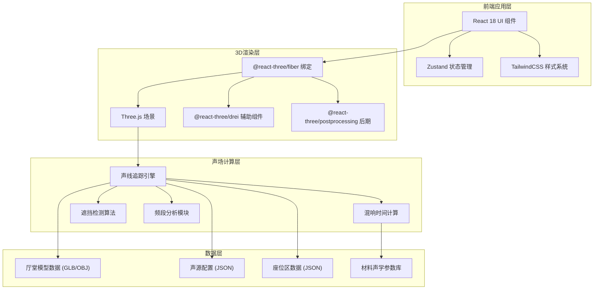
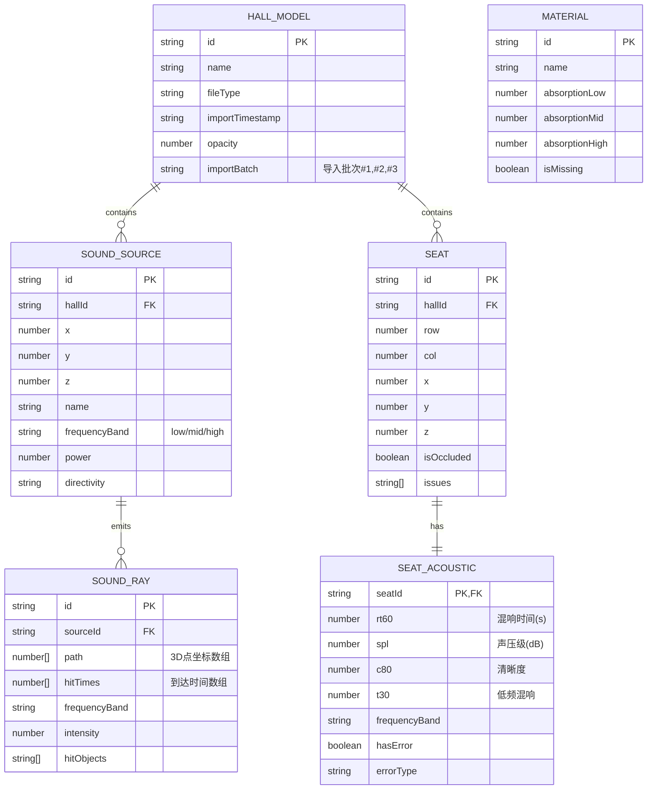

## 1. 架构设计



## 2. 技术描述

- **前端框架**：React 18 + TypeScript 5
- **构建工具**：Vite 5
- **3D引擎**：Three.js 0.160 + @react-three/fiber 8.15 + @react-three/drei 9.92 + @react-three/postprocessing 2.15
- **状态管理**：Zustand 4.4 (轻量、无需Provider包裹，适合复杂3D状态)
- **样式方案**：TailwindCSS 3.4
- **动画库**：Framer Motion 10.16 (UI动画)
- **数据导入**：three/addons/loaders/GLTFLoader、OBJLoader
- **数据校验**：Zod 3.22 (运行时类型校验)
- **后端**：无，纯前端应用，所有计算在浏览器端完成
- **数据存储**：LocalStorage 存储用户偏好和导入历史

## 3. 目录结构

```
src/
├── components/
│   ├── ui/                    # 基础UI组件
│   │   ├── Button.tsx
│   │   ├── Panel.tsx
│   │   └── Table.tsx
│   ├── three/                 # 3D相关组件
│   │   ├── Scene3D.tsx        # 主3D场景容器
│   │   ├── HallModel.tsx      # 厅堂模型渲染
│   │   ├── SoundSource.tsx    # 声源组件
│   │   ├── SoundRay.tsx       # 声线组件
│   │   ├── SeatsArea.tsx      # 座位区组件
│   │   └── Lights.tsx         # 灯光系统
│   ├── sidebar/               # 侧边面板
│   │   ├── HeatMapPanel.tsx   # 热力图面板
│   │   ├── SeatsDetail.tsx    # 座位明细表
│   │   └── FilterPanel.tsx    # 筛选器面板
│   ├── controls/              # 控制组件
│   │   ├── Timeline.tsx       # 时间轴播放器
│   │   ├── Toolbar.tsx        # 顶部工具栏
│   │   └── ImportModal.tsx    # 导入对话框
│   └── issues/                # 问题提示
│       └── ValidationBadge.tsx # 数据校验徽章
├── store/
│   ├── useSceneStore.ts       # 3D场景状态
│   ├── useDataStore.ts        # 导入数据状态
│   └── usePlaybackStore.ts    # 播放控制状态
├── engine/
│   ├── rayTracer.ts           # 声线追踪核心算法
│   ├── acoustics.ts           # 声学参数计算
│   ├── validation.ts          # 数据校验逻辑
│   └── geometry.ts            # 几何计算工具
├── types/
│   ├── acoustics.ts           # 声学相关类型定义
│   └── models.ts              # 模型数据类型
├── data/
│   ├── materials.json         # 材料声学参数库
│   └── samples/               # 样例数据
│       ├── hall-model.glb     # 样例厅堂模型
│       ├── sound-sources.json # 样例声源
│       └── seats-data.json    # 样例座位数据
├── hooks/
│   ├── useAcousticCalc.ts     # 声学计算Hook
│   └── useRayAnimation.ts     # 声线动画Hook
├── App.tsx
├── main.tsx
└── index.css
```

## 4. 路由定义

| 路由 | 用途 |
|------|------|
| / | 主工作台(唯一页面) |

## 5. 核心数据模型

### 5.1 数据模型定义



### 5.2 关键类型定义 (TypeScript)

```typescript
// 频率频段
type FrequencyBand = 'low' | 'mid' | 'high';

// 问题类型
type IssueType = 'material_missing' | 'seat_occluded' | 'frequency_error';

// 导入批次标记
interface ImportMeta {
  batch: number;
  timestamp: number;
  fileName: string;
}

// 厅堂模型
interface HallModel {
  id: string;
  name: string;
  importMeta: ImportMeta;
  geometry?: THREE.BufferGeometry;
  materials: MaterialAssignment[];
  bounds: { min: Vec3; max: Vec3 };
}

// 材料分配
interface MaterialAssignment {
  meshName: string;
  materialId: string | null; // null表示材料缺失
}

// 座位数据
interface Seat {
  id: string;
  row: number;
  col: number;
  position: Vec3;
  isOccluded: boolean;
  issues: IssueType[];
  acoustics: Record<FrequencyBand, SeatAcoustics>;
}

// 座位声学参数
interface SeatAcoustics {
  rt60: number | null;
  spl: number | null;
  c80: number | null;
  hasError: boolean;
  errorType?: IssueType;
}

// 声线路径
interface SoundRay {
  id: string;
  sourceId: string;
  frequency: FrequencyBand;
  path: Vec3[];
  times: number[]; // 每个路径点的时间(秒)
  intensity: number[];
  hitSeatIds: string[];
  bouncedSurfaces: string[];
}

// 播放状态
interface PlaybackState {
  isPlaying: boolean;
  currentTime: number;
  duration: number;
  speed: number; // 0.5x, 1x, 2x, 4x
}
```

## 6. 核心算法说明

### 6.1 声线追踪算法
- 从声源位置发射N条声线(默认1000条，可调)
- 每帧检测声线与厅堂表面的碰撞
- 基于材料吸声系数计算每次反射后的能量衰减
- 声线与座位相交时记录到达时间和强度

### 6.2 遮挡检测
- 从每个座位向声源做视线检测
- 检测连线与厅堂几何体是否相交
- 标记被遮挡座位并加入问题列表

### 6.3 数据校验
- 导入时使用Zod Schema校验所有字段
- 材料参数为null时标记`material_missing`
- 频段数据超出合理范围时标记`frequency_error`
- 校验不通过时不自动计算，需要用户确认

