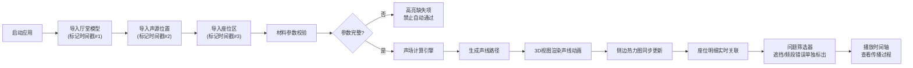

## 1. 产品概述
音乐厅声场可视化系统，为声学顾问提供3D交互式声场分析工具。解决剧场改造会议中"甲方只听得见形容词"的沟通难题，将混响、遮挡、声线传播等抽象声学概念转化为直观的3D可视化效果。

- **核心问题**：声学参数抽象难懂，人工盯场效率低下，数据验证不严谨
- **目标用户**：声学顾问、剧场设计师、建筑声学工程师
- **核心价值**：让3D声线"说话"，用可视化数据支撑专业决策

## 2. 核心功能

### 2.1 用户角色
| 角色 | 注册方式 | 核心权限 |
|------|----------|----------|
| 声学顾问 | 本地部署直接使用 | 模型导入、声场分析、数据筛选、报告导出 |

### 2.2 功能模块
1. **主视图**：3D厅堂模型、声线路径动画、声源与座位区实时交互
2. **侧边面板**：热力映射视图、座位明细表格、数据筛选器
3. **时间轴控制**：声线传播动画播放、暂停、逐帧控制
4. **数据导入**：厅堂模型、声源位置、座位区分批导入，带时间戳标记
5. **数据验证**：材料参数缺失拦截、座位遮挡标记、频段错误筛选

### 2.3 页面详情
| 页面名称 | 模块名称 | 功能描述 |
|----------|----------|----------|
| 主工作台 | 3D场景视图 | Three.js渲染厅堂模型，支持拖拽旋转、缩放、视角重置 |
| 主工作台 | 声线可视化 | 实时光线追踪声线路径，动画展示声音传播过程，不同频段用颜色区分 |
| 主工作台 | 模型导入层 | 分批导入的模型用不同透明度/边框区分，显示导入顺序标签 |
| 侧边面板 | 热力映射 | 座位区混响时间、声压级热力图，支持按频段切换 |
| 侧边面板 | 座位明细 | 每个座位的声学参数表格，支持单列排序、多条件筛选 |
| 侧边面板 | 问题筛选器 | 一键筛选"材料缺失"、"座位遮挡"、"频段错误"三类问题 |
| 底部控制 | 时间轴播放器 | 声线传播动画进度条，支持倍速播放、关键帧跳转 |
| 顶部工具栏 | 导入按钮 | 支持GLB/OBJ模型、JSON声源/座位数据导入 |
| 顶部工具栏 | 视图切换 | 透视图/俯视图/侧视图快速切换 |

## 3. 核心流程

## 4. 用户界面设计

### 4.1 设计风格
- **主色调**：深海蓝 (#0A1628) 为背景，营造专业声学分析氛围
- **强调色**：声线用渐变色系 — 低频红(#FF4D6D) → 中频绿(#4ECDC4) → 高频蓝(#4D96FF)
- **警示色**：材料缺失用橙黄(#FFB800)，遮挡错误用鲜红(#FF3333)
- **字体**：展示字体用 Space Grotesk，数据表格用 JetBrains Mono
- **布局**：左侧边栏(280px) + 中央3D视图 + 右侧明细面板(320px)，三栏专业布局
- **视觉质感**：深色科技风，带磨砂玻璃面板效果，低饱和度环境光

### 4.2 页面设计概述
| 页面名称 | 模块名称 | UI元素 |
|----------|----------|--------|
| 主工作台 | 3D场景 | 深色背景 + 网格化地板 + 体积光效果 + 模型边缘高亮 |
| 主工作台 | 声线动画 | 发光线条 + 粒子拖尾 + 碰撞点闪烁反馈 |
| 侧边面板 | 热力图 | 颜色渐变图例 + 座位网格 + 鼠标悬停显示数值 |
| 侧边面板 | 座位明细 | 斑马纹表格 + 问题行红底高亮 + 可拖动列宽 |
| 底部控制 | 时间轴 | 刻度标尺 + 播放按钮组 + 关键帧标记点 |
| 顶部工具栏 | 导入状态 | 导入时间线胶囊 + 批次序号徽章 |

### 4.3 响应性
- 桌面端优先设计(最小支持1440×900)
- 侧边面板可折叠收起，腾出空间给3D视图
- 时间轴在窗口缩小时自适应高度

### 4.4 3D场景指导
- **环境**：纯深色背景 + 柔和环境光 + 聚光灯照亮模型主体，避免分散注意力
- **光照**：三点光源系统 — 主光(冷白色)、补光(暖蓝色)、轮廓光(青色)，突出模型结构
- **相机**：默认45°俯视角，可自由轨道旋转，支持正交/透视切换
- **交互**：鼠标左键旋转、右键平移、滚轮缩放，双击座位高亮并联动侧边明细
- **后期处理**：Bloom发光效果(声线)、轻微景深、FXAA抗锯齿
- **资产**：内置3个样例厅堂模型(扇形剧场、鞋盒音乐厅、圆形报告厅)

