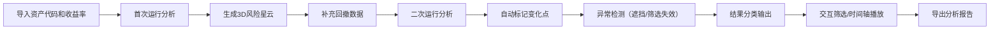

## 1. 产品概述

投资组合风险星云是一款面向基金研究员的3D可视化分析工具，将投资组合的收益、波动和回撤数据转化为立体星云图，解决传统二维图表风险点过于拥挤、难以识别的问题。支持动态交互、时间轴演进和多轮对比分析，帮助研究员高效识别投资组合中的风险异常。

### 目标用户
- 基金研究员、投资分析师、风控人员

### 核心价值
- 将三维风险指标立体可视化，避免二维图表的信息拥挤
- 支持动态交互和时间轴播放，可追溯风险演化过程
- 多轮运行对比，自动标记风险变化点
- 智能异常检测和结果分类，提升分析效率

---

## 2. 核心功能

### 2.1 用户角色

| 角色 | 注册方式 | 核心权限 |
|------|----------|----------|
| 基金研究员 | 无需注册，本地使用 | 导入数据、可视化分析、筛选对比、导出结果 |

### 2.2 功能模块

1. **3D星云可视化主界面**：三维散点图展示、坐标轴映射、视角控制
2. **数据导入与处理**：资产代码/收益率导入、回撤数据补充、权重计算
3. **交互控制面板**：行业筛选、风险高亮、时间轴播放、视图切换
4. **多轮对比分析**：两次运行结果对比、变化点自动标记
5. **异常检测引擎**：异常点遮挡检测、行业筛选失效检测
6. **结果分类展示**：三类结果（可直接用、需确认、筛选失效）分区展示

### 2.3 页面详情

| 页面名称 | 模块名称 | 功能描述 |
|----------|----------|----------|
| 主界面 | 3D星云画布 | Three.js渲染的3D散点图，X轴=收益，Y轴=波动，Z轴=回撤，支持鼠标拖动旋转、滚轮缩放 |
| 主界面 | 左侧控制面板 | 数据导入区、行业筛选器、风险阈值设置、显示选项切换 |
| 主界面 | 底部时间轴 | 时间序列播放控制、进度条、播放/暂停/重置按钮 |
| 主界面 | 右侧信息面板 | 选中点详情、当前筛选条件、统计摘要 |
| 主界面 | 顶部工具栏 | 运行模式切换（首次/二次）、视图切换、导出按钮 |
| 主界面 | 结果分类区 | 底部三栏展示：可直接用（绿色）、需确认（黄色）、筛选失效（红色） |

---

## 3. 核心流程

### 3.1 主业务流程

### 3.2 交互流程

用户导入资产数据 → 系统自动计算三维指标 → 渲染3D星云 → 用户可拖动旋转查看 → 切换行业筛选 → 播放时间轴观察演化 → 切换二次运行对比 → 查看分类结果 → 导出结论

---

## 4. 用户界面设计

### 4.1 设计风格

**设计定位**：科技感金融数据可视化，克制但专业

- **主色调**：深空蓝 (#0A0E1A) 背景，营造宇宙星云氛围
- **强调色**：
  - 低风险：青绿渐变 (#00D4AA → #0099FF)
  - 中风险：金黄渐变 (#FFD700 → #FF8C00)
  - 高风险：橙红渐变 (#FF6B35 → #DC143C)
  - 变化标记：霓虹紫 (#9D4EDD)
- **字体**：
  - 标题：Space Mono（等宽科技感）
  - 正文：Inter（清晰易读）
- **按钮风格**：极简圆角边框按钮，hover时有微妙发光效果
- **布局**：暗黑模式，中心3D画布，四周半透明玻璃态控制面板
- **图标**：线性简约图标，配合微妙发光效果

### 4.2 页面设计概览

| 页面名称 | 模块名称 | UI元素 |
|----------|----------|--------|
| 主界面 | 3D星云画布 | 深空背景、星点粒子、彩色散点、网格辅助线、坐标轴标签、发光hover效果 |
| 主界面 | 控制面板 | 毛玻璃效果 (backdrop-filter: blur(12px))、深灰半透明背景、细边框、表单控件 |
| 主界面 | 时间轴 | 渐变进度条、圆形播放按钮、时间刻度标记 |
| 主界面 | 结果分类区 | 三栏等分布局、彩色状态指示条、资产列表、计数徽章 |

### 4.3 响应式设计

- **桌面优先**：主要面向大屏显示器（≥1920×1080），3D画布占据中央70%区域
- **平板适配**：控制面板改为可折叠抽屉模式
- **触控优化**：3D画布支持双指缩放旋转，按钮尺寸≥44px

### 4.4 3D场景设计

- **环境与氛围**：深空黑背景，细微噪点纹理，营造宇宙空间感
- **光照设置**：
  - 主光源：冷白色半球光，模拟环境光
  - 点光源：3个彩色点光源（青/紫/橙）从不同角度照射，产生丰富的色彩层次
  - 发光材质：高风险点使用自发光材质，产生光晕效果
- **相机设置**：PerspectiveCamera，初始位置(15, 10, 15)，看向原点，支持OrbitControls
- **构图与焦点**：
  - 星云整体居中，周围留出充足负空间
  - 高风险点自动纳入视角范围
  - 选中点有镜头平滑推进效果
- **交互与动画**：
  - 散点hover时放大并显示标签
  - 时间轴播放时散点平滑过渡到新位置
  - 二次运行时，变化点有脉冲动画提示
  - 筛选时非选中点淡出为半透明
- **后处理效果**：
  - Bloom泛光效果（高风险点和选中点）
  - 细微的景深效果，增强空间感
  - 抗锯齿处理
- **性能预算**：
  - 最多支持500个资产点实时渲染
  - 目标帧率≥60fps
  - 使用InstancedMesh优化批量渲染

---

## 5. 数据处理规则

### 5.1 三维坐标映射

| 轴 | 指标 | 归一化方式 | 方向 |
|----|------|------------|------|
| X轴 | 预期收益率 | Min-Max归一化 [-5, 5] | 右=高收益 |
| Y轴 | 波动率（标准差） | Min-Max归一化 [0, 10] | 上=高波动 |
| Z轴 | 最大回撤 | Min-Max归一化 [0, 10] | 远=大回撤 |

### 5.2 权重处理

- 支持权重≠1的资产，权重影响散点大小和最终组合风险计算
- 权重0的资产自动隐藏但保留在数据集中
- 权重异常值（>2或<0）标记为需要确认

### 5.3 异常检测规则

1. **异常点遮挡**：两点三维距离<0.5且风险等级不同，标记为遮挡
2. **行业筛选失效**：筛选后剩余资产<5个或集中度>80%，标记为筛选失效
3. **结果分类**：
   - ✅ 可直接用：无异常、权重正常、筛选有效
   - ⚠️ 需研究员确认：权重异常、存在遮挡、接近风险阈值
   - ❌ 筛选失效：行业筛选后样本不足或过度集中

---

## 6. 非功能需求

- **性能**：500个点实时渲染≥60fps，交互响应<100ms
- **可用性**：所有操作可在3步内完成，关键功能有tooltip提示
- **可解释性**：每个数据点点击可查看详细指标和计算过程
- **数据安全**：纯前端处理，数据不上传服务器
