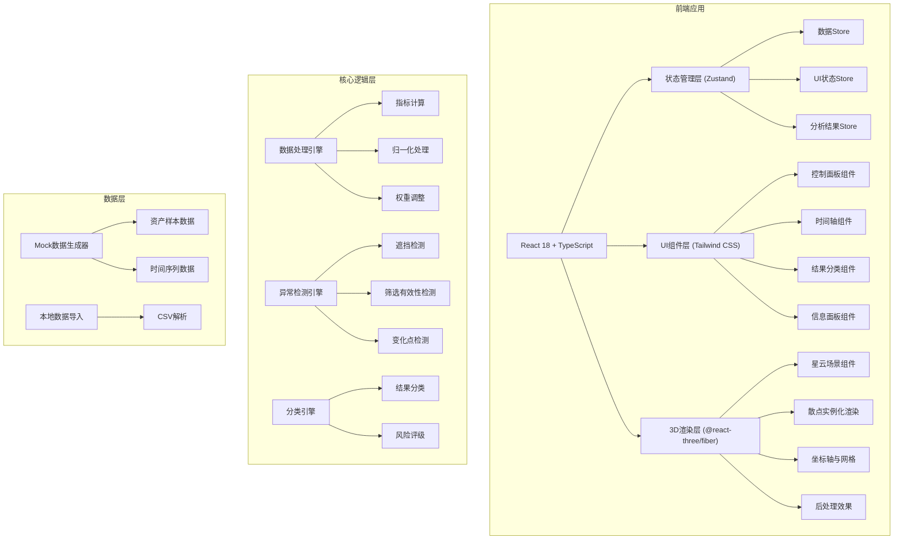

## 1. 架构设计



---

## 2. 技术栈说明

| 层级 | 技术选型 | 版本 | 用途 |
|------|----------|------|------|
| 前端框架 | React | 18.x | UI框架 |
| 开发构建 | Vite | 5.x | 构建工具，热更新 |
| 语言 | TypeScript | 5.x | 类型安全 |
| 样式 | Tailwind CSS | 3.x | 原子化CSS |
| 3D引擎 | three | 0.160.x | WebGL渲染核心 |
| 3D React封装 | @react-three/fiber | 8.15.x | Three.js的React渲染器 |
| 3D工具库 | @react-three/drei | 9.92.x | 常用3D组件集合 |
| 3D后处理 | @react-three/postprocessing | 2.15.x | Bloom、景深等效果 |
| 状态管理 | Zustand | 4.4.x | 轻量状态管理 |
| 动画 | framer-motion | 10.16.x | UI动画和过渡 |
| 数学计算 | mathjs | 12.0.x | 统计计算、矩阵运算 |

---

## 3. 目录结构

```
src/
├── components/
│   ├── ui/                    # 基础UI组件
│   │   ├── Button.tsx
│   │   ├── Slider.tsx
│   │   ├── Badge.tsx
│   │   └── Panel.tsx
│   ├── control/               # 控制面板
│   │   ├── ControlPanel.tsx
│   │   ├── DataImport.tsx
│   │   ├── IndustryFilter.tsx
│   │   └── RiskThreshold.tsx
│   ├── timeline/              # 时间轴
│   │   └── Timeline.tsx
│   ├── results/               # 结果分类
│   │   └── ResultCategories.tsx
│   ├── info/                  # 信息面板
│   │   └── InfoPanel.tsx
│   └── nebula/                # 3D星云
│       ├── NebulaScene.tsx
│       ├── NebulaPoints.tsx
│       ├── NebulaAxes.tsx
│       └── NebulaEffects.tsx
├── store/                     # 状态管理
│   ├── dataStore.ts
│   ├── uiStore.ts
│   └── analysisStore.ts
├── engine/                    # 核心逻辑
│   ├── dataProcessor.ts
│   ├── anomalyDetector.ts
│   └── classifier.ts
├── types/                     # 类型定义
│   ├── asset.ts
│   └── analysis.ts
├── utils/                     # 工具函数
│   ├── mock.ts
│   ├── color.ts
│   └── math.ts
├── App.tsx
├── main.tsx
└── index.css
```

---

## 4. 路由定义

| 路由 | 页面 | 用途 |
|------|------|------|
| / | 主界面 | 3D星云可视化主工作台 |

---

## 5. 核心数据模型

### 5.1 资产数据模型

```typescript
interface Asset {
  id: string;
  code: string;
  name: string;
  industry: string;
  weight: number;
  returns: number[];
  volatility: number;
  maxDrawdown: number;
  expectedReturn: number;
  riskLevel: 'low' | 'medium' | 'high';
  position: {
    x: number;
    y: number;
    z: number;
  };
  timeSeries: TimePoint[];
}

interface TimePoint {
  timestamp: number;
  return: number;
  volatility: number;
  drawdown: number;
}
```

### 5.2 分析结果模型

```typescript
interface AnalysisResult {
  runId: string;
  runType: 'first' | 'second';
  timestamp: number;
  assets: Asset[];
  anomalies: Anomaly[];
  categories: CategoryResult;
  changes?: ChangePoint[];
}

interface Anomaly {
  type: 'occlusion' | 'weight' | 'filter_failure';
  severity: 'warning' | 'error';
  assetIds: string[];
  description: string;
}

interface CategoryResult {
  ready: Asset[];
  needReview: Asset[];
  filterFailed: Asset[];
}

interface ChangePoint {
  assetId: string;
  field: 'return' | 'volatility' | 'drawdown' | 'position';
  change: number;
  direction: 'up' | 'down';
}
```

### 5.3 状态模型

```typescript
interface UIState {
  selectedAssetId: string | null;
  hoveredAssetId: string | null;
  isPlaying: boolean;
  currentTimeIndex: number;
  viewMode: '3d' | 'comparison';
  showAxes: boolean;
  showGrid: boolean;
  highlightRisk: 'all' | 'low' | 'medium' | 'high';
  selectedIndustries: string[];
}
```

---

## 6. 核心算法

### 6.1 三维坐标归一化

```typescript
function normalizeTo3D(
  assets: Asset[],
  bounds: { return: [number, number]; volatility: [number, number]; drawdown: [number, number] }
): Asset[] {
  return assets.map(asset => ({
    ...asset,
    position: {
      x: normalize(asset.expectedReturn, bounds.return, [-5, 5]),
      y: normalize(asset.volatility, bounds.volatility, [0, 10]),
      z: normalize(asset.maxDrawdown, bounds.drawdown, [0, 10])
    }
  }));
}
```

### 6.2 异常点遮挡检测

```typescript
function detectOcclusions(assets: Asset[], threshold: number = 0.5): Anomaly[] {
  const anomalies: Anomaly[] = [];
  for (let i = 0; i < assets.length; i++) {
    for (let j = i + 1; j < assets.length; j++) {
      const dist = distance3D(assets[i].position, assets[j].position);
      if (dist < threshold && assets[i].riskLevel !== assets[j].riskLevel) {
        anomalies.push({
          type: 'occlusion',
          severity: 'warning',
          assetIds: [assets[i].id, assets[j].id],
          description: `资产 ${assets[i].code} 与 ${assets[j].code} 风险等级不同但空间位置接近`
        });
      }
    }
  }
  return anomalies;
}
```

### 6.3 行业筛选有效性检测

```typescript
function checkFilterValidity(
  allAssets: Asset[],
  filteredAssets: Asset[]
): Anomaly | null {
  if (filteredAssets.length < 5) {
    return {
      type: 'filter_failure',
      severity: 'error',
      assetIds: filteredAssets.map(a => a.id),
      description: `筛选后仅剩余 ${filteredAssets.length} 个资产，样本量不足`
    };
  }
  
  const concentration = calculateConcentration(filteredAssets);
  if (concentration > 0.8) {
    return {
      type: 'filter_failure',
      severity: 'error',
      assetIds: filteredAssets.map(a => a.id),
      description: `筛选后资产集中度达 ${(concentration * 100).toFixed(1)}%，过度集中`
    };
  }
  
  return null;
}
```

### 6.4 变化点检测

```typescript
function detectChanges(
  firstRun: Asset[],
  secondRun: Asset[]
): ChangePoint[] {
  const changes: ChangePoint[] = [];
  const firstMap = new Map(firstRun.map(a => [a.id, a]));
  
  for (const second of secondRun) {
    const first = firstMap.get(second.id);
    if (!first) continue;
    
    const fields = ['expectedReturn', 'volatility', 'maxDrawdown'] as const;
    for (const field of fields) {
      const change = second[field] - first[field];
      const changePercent = Math.abs(change) / Math.abs(first[field] || 1);
      if (changePercent > 0.1) {
        changes.push({
          assetId: second.id,
          field: field === 'expectedReturn' ? 'return' : field === 'volatility' ? 'volatility' : 'drawdown',
          change,
          direction: change > 0 ? 'up' : 'down'
        });
      }
    }
  }
  
  return changes;
}
```

---

## 7. 性能优化策略

1. **实例化渲染**：使用 `InstancedMesh` 批量渲染所有散点，减少draw call
2. **LOD控制**：远距离时降低点的细分程度
3. **视锥体剔除**：Three.js 内置视锥体剔除，不可见点不渲染
4. **动画插值**：使用帧间插值实现平滑过渡，避免每帧重计算
5. **WebWorker**：将数据计算和异常检测放在Worker中执行，不阻塞UI
6. **状态细粒度**：使用Zustand的selector避免不必要的重渲染
7. **内存管理**：场景卸载时正确dispose所有Three.js资源

---

## 8. Mock数据方案

由于用户要求基金研究员会拿资产代码和收益率先试跑，我们需要生成符合真实金融数据特征的Mock数据：

1. **资产池**：50-100个资产，覆盖10个行业
2. **行业分类**：科技、金融、医药、消费、能源、制造、地产、通信、军工、农业
3. **指标分布**：
   - 收益率：正态分布 N(0.08, 0.15)
   - 波动率：对数正态分布，范围 [0.05, 0.4]
   - 最大回撤：与波动率正相关，范围 [0.05, 0.5]
4. **权重设置**：包含权重≠1的测试用例，如 0.8, 1.2, 0, 2.5（异常值）
5. **时间序列**：24个时间点（月度数据，2年）

---

## 9. 构建与部署

- **构建命令**：`npm run build`
- **输出目录**：`dist/`
- **本地开发**：`npm run dev`，端口 5173
- **类型检查**：`npm run typecheck`
- **纯前端部署**：无需后端，可部署到任何静态文件服务器
