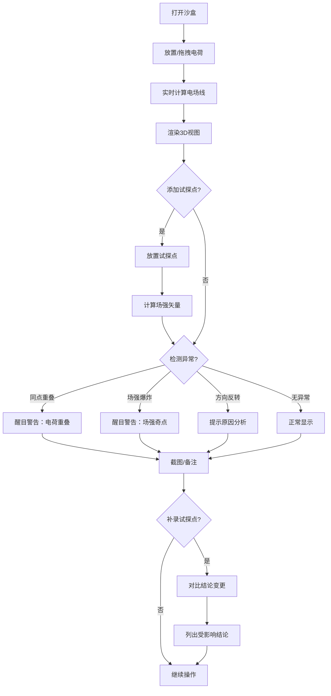

## 1. 产品概述

物理电场线沙盒——面向高中物理课堂的3D交互式电场可视化工具。学生可在3D空间中自由拖放点电荷，实时观察电场线方向与密度的变化，通过试探点读取场强数值，解决"方向与强弱混淆"的核心教学痛点。
- 目标用户：高中物理教师（备课/课堂演示）、高中学生（自主探究）
- 核心价值：让抽象电场概念具象化，异常问题可诊断、可截图、可追溯

## 2. 核心功能

### 2.1 用户角色

| 角色 | 使用方式 | 核心权限 |
|------|----------|----------|
| 物理教师 | 直接打开使用 | 创建/编辑电荷、设置试探点、截图、备注 |
| 学生 | 直接打开使用 | 拖拽电荷、观察场线、添加试探点 |

### 2.2 功能模块

1. **沙盒主页**：3D电场场景、电荷管理面板、试探点面板、异常告警栏、备注与截图工具栏

### 2.3 页面详情

| 页面名称 | 模块名称 | 功能描述 |
|----------|----------|----------|
| 沙盒主页 | 3D电场视图 | Three.js渲染3D空间，显示点电荷（球体）、电场线（流线+箭头）、采样网格、试探点标记 |
| 沙盒主页 | 电荷管理面板 | 左侧面板：增删电荷、调节电量（正/负）、拖拽修改位置、坐标显示 |
| 沙盒主页 | 试探点面板 | 右侧面板：添加/删除试探点、显示场强矢量（数值+方向）、场强数值表 |
| 沙盒主页 | 异常告警栏 | 顶部/底部醒目横幅：同点重叠警告、场强爆炸警告、箭头方向反转原因提示 |
| 沙盒主页 | 备注与截图工具栏 | 底部工具栏：课堂备注输入、截图按钮（含标注信息导出） |
| 沙盒主页 | 结论变更检测 | 补录试探点后自动对比，列出受影响的电荷位置相关结论是否被改动 |

## 3. 核心流程

1. 教师打开沙盒，在3D空间中放置点电荷（正/负），调节电量
2. 电场线根据电荷分布实时计算并渲染（流线+方向箭头+疏密）
3. 教师或学生拖拽电荷，电场线实时跟随变化
4. 用户在关键位置放置试探点，读取场强矢量（E的大小与方向）
5. 系统自动检测异常：同点重叠电荷、场强爆炸、方向箭头反转
6. 如发现箭头方向反转，系统给出原因（如"负电荷包围区"、"零场强点附近数值误差"）
7. 用户可随时截图（3D视图+数值标注），添加课堂备注
8. 补录试探点后，系统自动对比并提示结论变更

## 4. 用户界面设计

### 4.1 设计风格

- **主色调**：深色科学仪器风（深蓝黑底 #0a0e1a），搭配电场线霓虹青 (#00f0ff) 和正电荷红 (#ff3b5c) / 负电荷蓝 (#3b7dff)
- **按钮风格**：圆角矩形，带微光边框，悬浮时发光
- **字体**：数据/数值用等宽字体 JetBrains Mono，标签/说明用 Noto Sans SC
- **布局风格**：左面板（电荷管理）+ 中央3D视图 + 右面板（试探点/读数），顶/底部工具栏
- **图标风格**：线性图标（lucide-react），配合电场主题的简洁线条

### 4.2 页面设计概览

| 页面名称 | 模块名称 | UI元素 |
|----------|----------|--------|
| 沙盒主页 | 3D电场视图 | 深色背景，电场线霓虹青流线+白色箭头，正电荷红色球体带"+"标注，负电荷蓝色球体带"-"标注，试探点黄色锥体带场强数值标签 |
| 沙盒主页 | 电荷管理面板 | 左侧窄面板，暗色半透明背景，电荷列表卡片（显示坐标+电量+颜色），拖拽手柄，增删按钮 |
| 沙盒主页 | 试探点面板 | 右侧窄面板，试探点列表+场强数值表（|E|、Ex、Ey、Ez、方向角），支持导出 |
| 沙盒主页 | 异常告警栏 | 顶部红色/橙色横幅，闪烁图标+文字描述，点击展开详细原因 |
| 沙盒主页 | 备注与截图工具栏 | 底部窄栏，备注文本框+截图按钮，截图时自动叠加电荷标注和场强数值 |

### 4.3 响应式

- 桌面优先设计，3D视图占据中央主要区域
- 面板可折叠，小屏幕时自动收起为图标

### 4.4 3D场景指引

- **环境**：深色空间背景，微弱星空粒子增加深度感
- **光照**：环境光 + 电荷球体自发光，无需物理灯光
- **相机**：透视相机，默认45度俯角，支持鼠标旋转/缩放/平移
- **构图**：电荷和场线为视觉焦点，试探点作为辅助标注
- **交互**：电荷可拖拽（限制在XY平面移动），场线实时重算
- **后处理**：电场线微弱辉光（Bloom），异常区域红色脉冲

## 5. 核心计算规则

### 5.1 电场计算

- 库仑定律：E = kQ/r²，k = 8.99×10⁹ N·m²/C²
- 多电荷叠加：E_total = Σ E_i
- 电场线起止：从正电荷出发，终止于负电荷或边界

### 5.2 异常检测阈值

| 异常类型 | 检测条件 | 告警级别 | 原因说明模板 |
|----------|----------|----------|------------|
| 同点重叠 | 两电荷距离 < 0.1 单位 | 严重（红色） | "电荷Q₁和Q₂位置重叠（距离=0.0x），请分开放置" |
| 场强爆炸 | |E| > 1000 单位 | 严重（红色） | "场强=xxxx 超出安全范围，距离电荷过近（r=0.0x）" |
| 方向反转 | 相邻采样点E方向夹角 > 120° | 警告（橙色） | "方向反转可能原因：① 负电荷包围区 ② 零场强点附近数值误差 ③ 电荷位置重叠" |
