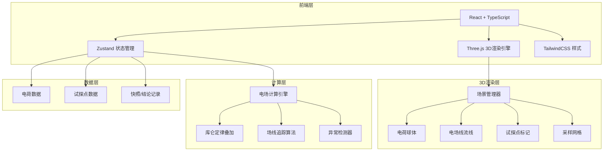

## 1. 架构设计



## 2. 技术说明

- **前端**：React@18 + TypeScript + TailwindCSS@3 + Vite
- **初始化工具**：vite-init
- **3D渲染**：Three.js + @react-three/fiber + @react-three/drei + @react-three/postprocessing
- **状态管理**：Zustand
- **后端**：无（纯前端计算）
- **数据库**：无（内存状态，支持localStorage持久化）

## 3. 路由定义

| 路由 | 用途 |
|------|------|
| / | 沙盒主页，包含3D视图和所有面板 |

## 4. 数据模型

### 4.1 核心数据结构

```typescript
interface Charge {
  id: string;
  position: [number, number, number];
  magnitude: number;
  label: string;
}

interface TestPoint {
  id: string;
  position: [number, number, number];
  fieldVector: [number, number, number];
  fieldMagnitude: number;
}

interface Anomaly {
  type: 'overlap' | 'explosion' | 'direction_reversal';
  severity: 'critical' | 'warning';
  message: string;
  reason: string;
  relatedChargeIds: string[];
  relatedTestPointIds: string[];
}

interface Snapshot {
  id: string;
  timestamp: number;
  imageDataUrl: string;
  charges: Charge[];
  testPoints: TestPoint[];
  anomalies: Anomaly[];
  notes: string;
}

interface ConclusionState {
  chargePositions: Map<string, [number, number, number]>;
  fieldDirections: Map<string, [number, number, number]>;
  timestamp: number;
}
```

### 4.2 电场计算模块

```typescript
function calculateFieldAt(
  point: [number, number, number],
  charges: Charge[]
): { vector: [number, number, number]; magnitude: number };

function traceFieldLine(
  start: [number, number, number],
  charges: Charge[],
  steps: number,
  stepSize: number
): [number, number, number][];

function detectAnomalies(
  charges: Charge[],
  testPoints: TestPoint[]
): Anomaly[];

function compareConclusions(
  previous: ConclusionState,
  current: ConclusionState
): { changed: boolean; details: string[] };
```

## 5. 项目目录结构

```
src/
  components/
    Scene3D/           # 3D场景组件
      ChargeMesh.tsx   # 电荷球体渲染+拖拽
      FieldLines.tsx   # 电场线渲染
      TestPointMesh.tsx# 试探点渲染
      GridHelper.tsx   # 采样网格
      AnomalyMarker.tsx# 异常标记
    Panels/
      ChargePanel.tsx  # 电荷管理面板
      TestPointPanel.tsx# 试探点面板
      AnomalyBar.tsx   # 异常告警栏
      NotesBar.tsx     # 备注与截图工具栏
    Layout/
      MainLayout.tsx   # 主布局
  hooks/
    useFieldCalculation.ts # 电场计算hook
    useAnomalyDetection.ts # 异常检测hook
    useSnapshot.ts    # 截图hook
    useConclusionTracker.ts# 结论变更追踪hook
  utils/
    fieldCalculation.ts# 电场计算核心算法
    fieldLineTracer.ts # 场线追踪算法
    anomalyDetection.ts# 异常检测逻辑
    conclusionComparison.ts# 结论对比
  store/
    useStore.ts       # Zustand全局状态
  pages/
    Sandbox.tsx       # 沙盒主页
  App.tsx
  main.tsx
```
