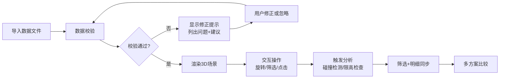

## 1. 产品概述

机场跑道净空模型可视化工具，帮助机场规划员在扩建评审会中直观展示跑道周边建筑高度限制。工具专注于解决实际工作中的常见问题：坐标系错误、限高面遮挡、建筑重复、数据缺字段等，提供可读的修正提示和交互式3D净空分析。

### 核心价值
- 将复杂的净空限制规则转化为直观的3D可视化模型
- 提供数据质量检测和修正提示，处理不完整/错误数据
- 支持筛选定位、碰撞检测、多方案比较，辅助评审决策

---

## 2. 核心功能

### 2.1 用户角色
| 角色 | 注册方式 | 核心权限 |
|------|----------|----------|
| 机场规划员 | 本地工具，无需注册 | 导入数据、查看3D模型、筛选分析、导出报告 |

### 2.2 功能模块
1. **主工作台**：3D视图区、侧边筛选面板、底部数据明细
2. **数据导入**：JSON格式导入、实时数据校验、修正提示
3. **3D交互**：旋转/缩放/平移、净空面切换、建筑高亮
4. **分析工具**：碰撞检测、限高分析、坐标系检查
5. **方案比较**：多场景切换、差异对比、问题定位

### 2.3 页面详情
| 页面名称 | 模块名称 | 功能描述 |
|-----------|-------------|---------------------|
| 主工作台 | 3D视图区 | Three.js渲染跑道、建筑、净空面，支持鼠标交互旋转查看 |
| 主工作台 | 左侧筛选面板 | 按建筑类型、高度区间、问题类型筛选，与3D视图联动 |
| 主工作台 | 底部明细面板 | 展示选中建筑/净空面的详细参数，同步筛选结果 |
| 主工作台 | 顶部工具栏 | 数据导入、视图切换、碰撞检测、方案比较、导出 |
| 数据校验弹窗 | 修正提示 | 列出数据问题（缺字段、坐标错误、重复、遮挡），提供可读解释和修正建议 |

---

## 3. 核心流程

### 主要用户流程
1. 规划员导入跑道、建筑、净空面的JSON数据
2. 系统自动检测数据质量问题，展示可读的修正提示
3. 用户处理问题后，3D场景渲染完整模型
4. 用户旋转查看净空面，通过筛选器定位特定建筑
5. 点击建筑或净空面查看详细参数，底部面板同步更新
6. 运行碰撞检测，高亮违反限高的建筑
7. 切换不同方案进行比较

---

## 4. 用户界面设计

### 4.1 设计风格
- **主色调**：深空蓝 `#0a1628` 作为背景，专业航空蓝 `#1e40af` 作为主色，警示橙 `#f97316` 标记碰撞问题，正常绿 `#10b981` 标记合规建筑
- **按钮风格**：扁平化直角按钮，细边框，悬停时有轻微发光效果
- **字体**：等宽字体 `JetBrains Mono` 用于数据展示，无衬线 `Inter` 用于界面文本
- **布局风格**：三栏式布局，左侧筛选面板（280px）+ 中央3D视图 + 底部可拉伸明细面板
- **视觉元素**：细线网格地面、半透明净空面、发光边缘选中效果

### 4.2 页面设计概述
| 页面名称 | 模块名称 | UI元素 |
|-----------|-------------|-------------|
| 主工作台 | 3D视图区 | 暗色背景、网格地面、半透明彩色净空面、发光选中边框、视角控制按钮 |
| 主工作台 | 筛选面板 | 分组复选框、滑块区间选择、搜索框、问题类型过滤器 |
| 主工作台 | 明细面板 | 数据表格、属性键值对、问题标签、修正建议按钮 |
| 主工作台 | 工具栏 | 图标按钮组、方案下拉选择、导入/导出按钮 |
| 校验弹窗 | 修正提示 | 问题分组列表、严重性图标、问题描述、修正建议、快速修复按钮 |

### 4.3 响应性
- 桌面端优先设计，最小支持1280px宽度
- 面板可拖拽调整宽度，底部面板可折叠
- 3D视图自适应容器大小

### 4.4 3D场景指导
- **环境**：纯深色背景 + 柔和方向光，无HDRI，突出模型本身
- **光照设置**：主方向光 + 环境光，建筑使用标准材质，净空面使用半透明材质
- **相机设置**：透视相机，初始俯视角45度，支持OrbitControls旋转缩放
- **交互**：点击选中发光高亮，悬停显示信息标签，筛选结果淡入淡出
- **动画**：场景加载渐入、筛选切换平滑过渡、碰撞检测结果脉冲闪烁
- **性能**：建筑使用InstancedMesh批量渲染，净空面使用少量多边形
