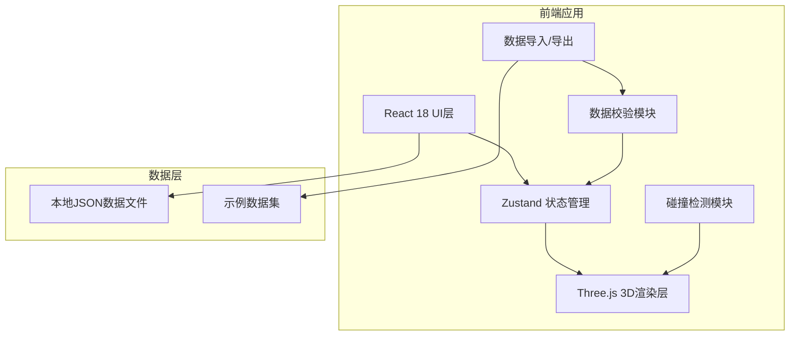
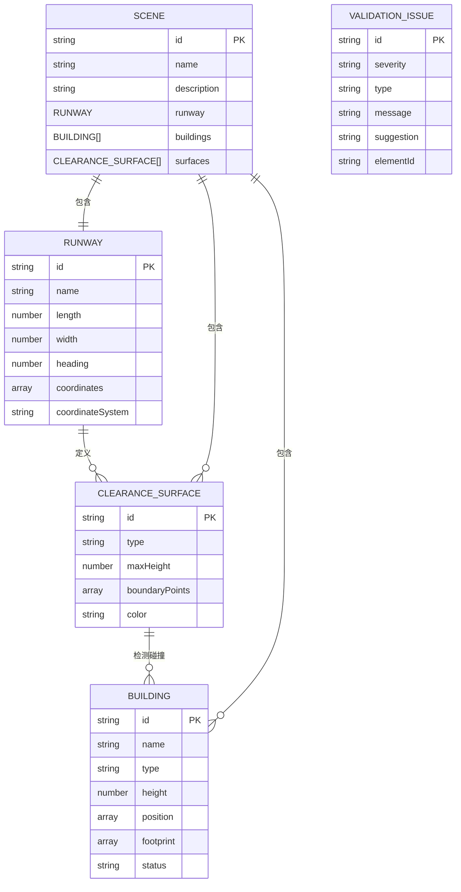

## 1. 架构设计



## 2. 技术描述

- **前端**：React@18 + TypeScript + Vite + TailwindCSS@3
- **3D引擎**：Three.js + @react-three/fiber + @react-three/drei
- **状态管理**：Zustand
- **图标**：lucide-react
- **后端**：无，纯前端工具
- **数据库**：无，使用本地JSON文件

## 3. 路由定义

| 路由 | 用途 |
|-------|---------|
| / | 主工作台，包含3D视图、筛选面板、明细面板 |

## 4. 数据模型

### 4.1 数据模型定义



### 4.2 TypeScript 类型定义

```typescript
// 跑道数据
interface Runway {
  id: string;
  name: string;
  length: number;
  width: number;
  heading: number;
  coordinates: [number, number, number];
  coordinateSystem: 'WGS84' | 'local' | 'unknown';
}

// 建筑数据
interface Building {
  id: string;
  name: string;
  type: 'terminal' | 'hangar' | 'tower' | 'hotel' | 'office' | 'residential' | 'other';
  height: number;
  position: [number, number, number];
  footprint: [number, number];
  status: 'existing' | 'planned' | 'proposed';
  floors?: number;
  address?: string;
}

// 净空面数据
interface ClearanceSurface {
  id: string;
  type: 'approach' | 'takeoff' | 'transition' | 'inner' | 'conical' | 'horizontal';
  maxHeight: number;
  boundaryPoints: [number, number, number][];
  color: string;
  description?: string;
}

// 场景数据
interface SceneData {
  id: string;
  name: string;
  description: string;
  runway: Runway;
  buildings: Building[];
  surfaces: ClearanceSurface[];
  coordinateSystem?: string;
}

// 校验问题
interface ValidationIssue {
  id: string;
  severity: 'error' | 'warning' | 'info';
  type: 'missing_field' | 'coordinate_error' | 'duplicate' | 'occlusion' | 'height_exceeded' | 'unknown';
  message: string;
  suggestion: string;
  elementId: string;
  elementType: 'runway' | 'building' | 'surface' | 'scene';
}

// 碰撞检测结果
interface CollisionResult {
  buildingId: string;
  surfaceId: string;
  exceededHeight: number;
  distance: number;
}

// 应用状态
interface AppState {
  currentScene: SceneData | null;
  validationIssues: ValidationIssue[];
  collisionResults: CollisionResult[];
  selectedElement: { type: 'building' | 'surface' | 'runway'; id: string } | null;
  filters: {
    buildingTypes: string[];
    heightRange: [number, number];
    statusTypes: string[];
    issueTypes: string[];
    searchQuery: string;
  };
  visibleLayers: {
    buildings: boolean;
    surfaces: boolean;
    runway: boolean;
    grid: boolean;
  };
  comparisonScenes: SceneData[];
  isCollisionDetected: boolean;
}
```

## 5. 项目结构

```
src/
├── components/
│   ├── three/
│   │   ├── Scene3D.tsx          # 3D场景容器
│   │   ├── Runway3D.tsx         # 跑道3D组件
│   │   ├── Building3D.tsx       # 建筑3D组件
│   │   ├── Surface3D.tsx        # 净空面3D组件
│   │   └── GroundGrid.tsx       # 地面网格
│   ├── ui/
│   │   ├── FilterPanel.tsx      # 左侧筛选面板
│   │   ├── DetailPanel.tsx      # 底部明细面板
│   │   ├── Toolbar.tsx          # 顶部工具栏
│   │   ├── ValidationModal.tsx  # 数据校验弹窗
│   │   └── ComparisonPanel.tsx  # 方案比较面板
│   └── layout/
│       └── WorkspaceLayout.tsx  # 工作台布局
├── hooks/
│   ├── useCollisionDetection.ts # 碰撞检测hook
│   ├── useDataValidation.ts     # 数据校验hook
│   └── useSceneLoader.ts        # 场景加载hook
├── store/
│   └── useAppStore.ts           # Zustand状态管理
├── utils/
│   ├── geometry.ts              # 几何计算工具
│   ├── validation.ts            # 校验规则
│   └── coordinate.ts            # 坐标转换工具
├── data/
│   ├── sample-success.json      # 顺利样例数据
│   └── sample-error.json        # 坐标系错误样例
├── types/
│   └── index.ts                 # 类型定义
├── App.tsx
├── main.tsx
└── index.css
```

## 6. 核心模块设计

### 6.1 数据校验模块
- **必填字段检查**：检查跑道、建筑、净空面的必填字段是否缺失
- **坐标系校验**：检测坐标范围是否合理，是否存在坐标系混用
- **重复检测**：检查ID重复、位置重叠的建筑
- **遮挡检测**：检测净空面之间是否存在不合理重叠
- **高度合理性**：检查建筑高度是否为合理正数

### 6.2 碰撞检测模块
- **点-面检测**：判断建筑顶点是否穿透净空面
- **边界检测**：计算建筑与净空面边界的距离
- **实时更新**：筛选条件变化时重新计算碰撞

### 6.3 3D渲染模块
- **场景管理**：Three.js场景、相机、光照设置
- **实例化渲染**：建筑使用InstancedMesh优化性能
- **交互系统**：Raycaster点击检测、高亮选中
- **图层控制**：净空面可独立开关显示

### 6.4 状态同步模块
- **筛选同步**：筛选条件变化时，3D视图和明细面板同时更新
- **选中同步**：3D视图中点击元素，明细面板自动跳转
- **比较同步**：多方案比较时保持视角一致
