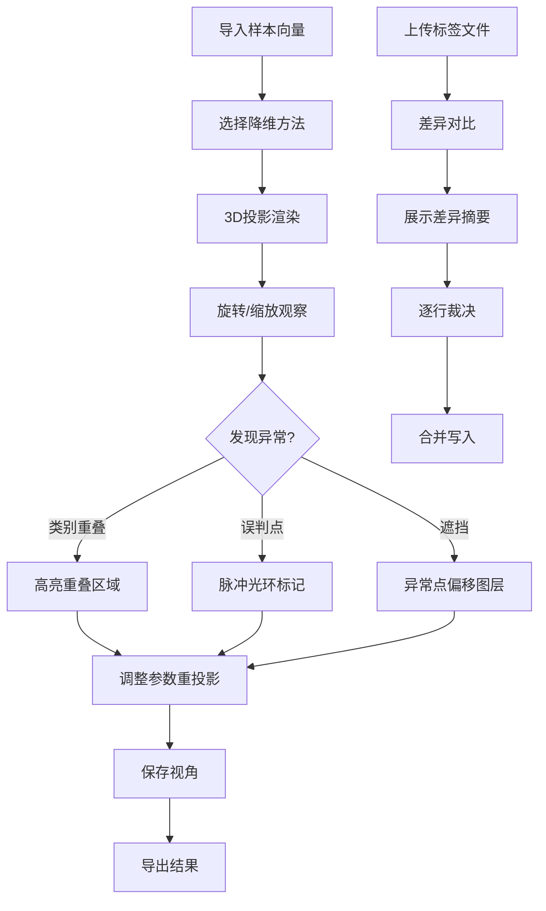

## 1. 产品概述

AI特征空间投影是一款面向算法工程师和业务评审人员的Web3D可视化工具，解决模型评审时业务同事无法理解高维特征分布的痛点。通过3D交互式嵌入图将样本向量、真实标签、模型预测和误判点投影到可旋转的三维空间，让类别重叠、异常点遮挡和降维不稳定性一目了然。

- 目标用户：算法工程师（上传样本/调试模型）、业务评审人员（理解特征分布与误判）
- 核心价值：将黑盒特征空间变为可交互、可解释、可汇报的3D可视化成果

## 2. 核心功能

### 2.1 用户角色

| 角色 | 使用方式 | 核心权限 |
|------|----------|----------|
| 算法工程师 | 导入样本向量与预测结果 | 上传/编辑样本、切换降维参数、保存视角、导出报告 |
| 业务评审人员 | 查看投影结果 | 旋转3D视图、筛选类别、查看误判高亮、对比合并差异 |

### 2.2 功能模块

1. **投影主页面**：3D嵌入图、误判高亮、旋转交互、参数面板、筛选联动、视角保存
2. **合并差异页面**：样本向量与真实标签的合并对比，展示差异而非静默覆盖

### 2.3 页面详情

| 页面名称 | 模块名称 | 功能描述 |
|----------|----------|----------|
| 投影主页面 | 3D嵌入图 | 基于PCA/t-SNE/UMAP降维的3D散点图，样本点按类别着色，支持鼠标拖拽旋转、滚轮缩放 |
| 投影主页面 | 误判高亮层 | 预测≠真实标签的样本点以脉冲光环标记，大小与误判置信度成正比 |
| 投影主页面 | 类别重叠检测 | 自动识别不同类别在3D空间中的重叠区域，以半透明体积壳标示 |
| 投影主页面 | 异常点遮挡处理 | 异常点自动偏移至独立图层，可通过开关切换显示/隐藏，避免遮挡主体分布 |
| 投影主页面 | 降维参数切换 | 侧栏面板切换PCA/t-SNE/UMAP，调整perplexity/n_neighbors等参数，实时重投影 |
| 投影主页面 | 降维不稳定性可视化 | 多次运行降维后叠加显示点云抖动轨迹，以连线表示同一样本在不同运行间的位移 |
| 投影主页面 | 视角保存/恢复 | 一键保存当前相机位置与朝向，命名后可从列表恢复 |
| 投影主页面 | 筛选联动面板 | 左侧类别筛选器与3D视图实时联动，选中类别时其余类别半透明；筛选结果同步反映在统计面板 |
| 合并差异页面 | 向量-标签合并对比 | 左右分栏展示"样本向量源"与"真实标签源"的差异，差异行高亮，支持逐行确认采用哪一侧 |
| 合并差异页面 | 差异统计摘要 | 顶部显示新增/删除/修改的样本数和标签冲突数 |

## 3. 核心流程

**主流程**：用户导入样本向量 → 选择降维方法与参数 → 3D投影渲染 → 旋转观察 → 发现误判/重叠 → 切换参数重投影 → 保存视角 → 导出结果

**合并流程**：上传样本向量文件 → 上传真实标签文件 → 系统对比差异 → 展示差异摘要 → 用户逐行裁决 → 合并写入

## 4. 用户界面设计

### 4.1 设计风格

- **主题**：深色科技感（深蓝黑底色 #0a0e1a），辅助色青绿 #00ffc8（正常点）、琥珀 #ff6b35（误判点）、品红 #ff2d78（重叠区域）
- **按钮风格**：圆角微光按钮，hover时发光边框
- **字体**：显示字体 JetBrains Mono（数据/代码感），正文字体 Noto Sans SC
- **布局**：左侧参数/筛选面板（280px），中央3D画布（flex-1），右侧统计面板（240px）
- **图标**：Lucide图标，线性风格

### 4.2 页面设计概览

| 页面名称 | 模块名称 | UI元素 |
|----------|----------|--------|
| 投影主页面 | 3D嵌入图 | 深色背景3D画布，点云按类别着色，网格地面，坐标轴标签 |
| 投影主页面 | 误判高亮层 | 脉冲光环动画（CSS keyframes驱动shader），误判点放大1.5x |
| 投影主页面 | 参数面板 | 下拉选择降维方法，滑块调参，"重新投影"按钮 |
| 投影主页面 | 视角管理 | "保存当前视角"按钮 + 已保存视角列表（点击恢复） |
| 投影主页面 | 筛选联动 | 类别复选框列表，选中项在3D中全不透明，未选中半透明 |
| 合并差异页面 | 差异对比表 | 左右分栏表格，差异行黄底高亮，每行"采用左/右"按钮 |
| 合并差异页面 | 差异摘要 | 顶部统计卡片：新增N条、删除M条、标签冲突K条 |

### 4.3 响应式策略

- 桌面优先设计，3D画布最小宽度800px
- 面板可折叠，小屏时自动收起为抽屉

### 4.4 3D场景指导

- **环境**：深色空间感，无HDRI，纯色背景 #0a0e1a
- **灯光**：环境光（白色低强度 0.4）+ 点光源（青绿色，从上方45°照射）
- **相机**：透视相机，初始位置 [0, 0, 12]，fov 50°，OrbitControls开启阻尼
- **构图**：点云居中，坐标轴辅助线，底部微弱网格
- **交互**：OrbitControls旋转/缩放，点击样本点弹出详情tooltip
- **后处理**：Bloom发光效果用于误判点脉冲，轻微Vignette暗角
