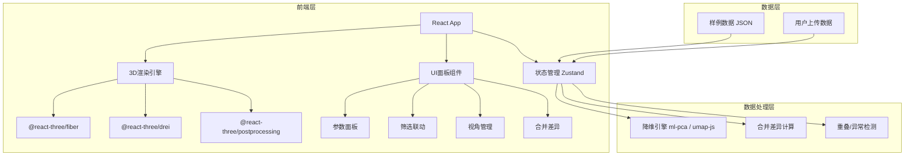

## 1. 架构设计



## 2. 技术说明

- **前端**：React@18 + TypeScript + tailwindcss@3 + Vite
- **初始化工具**：vite-init（react-ts模板）
- **3D渲染**：three + @react-three/fiber + @react-three/drei + @react-three/postprocessing
- **降维算法**：ml-pca（PCA）、umap-js（UMAP），t-SNE使用tsne-js
- **状态管理**：zustand
- **后端**：无（纯前端，数据使用JSON样例 + 文件上传解析）
- **数据库**：无（内存数据 + localStorage持久化视角）

## 3. 路由定义

| 路由 | 用途 |
|------|------|
| `/` | 投影主页面：3D嵌入图 + 参数面板 + 筛选联动 + 视角管理 |
| `/merge` | 合并差异页面：向量与标签的合并对比 |

## 4. 数据模型

### 4.1 核心数据结构

```typescript
interface Sample {
  id: string;
  vector: number[];
  predictedLabel: string;
  trueLabel: string;
  isMisjudged: boolean;
  confidence: number;
}

interface ProjectionPoint {
  sampleId: string;
  x: number;
  y: number;
  z: number;
}

interface Viewpoint {
  id: string;
  name: string;
  position: [number, number, number];
  target: [number, number, number];
  timestamp: number;
}

interface DimensionReductionConfig {
  method: 'pca' | 'tsne' | 'umap';
  params: Record<string, number>;
}

interface MergeDiff {
  sampleId: string;
  field: string;
  sourceValue: string | number[];
  targetValue: string | number[];
  resolution: 'source' | 'target' | 'unresolved';
}

interface OverlapRegion {
  labels: [string, string];
  center: [number, number, number];
  radius: number;
}

interface OutlierInfo {
  sampleId: string;
  distance: number;
  isOccluded: boolean;
  displacedPosition: [number, number, number];
}
```

### 4.2 样例数据定义

内置约30条样例数据，包含：
- 3个类别（A/B/C），其中A与B有部分重叠区域
- 5个误判点（预测标签≠真实标签）
- 3个异常点（远离主体分布）
- 合并差异：2个样本的向量有临时改动，3个样本的真实标签不一致
