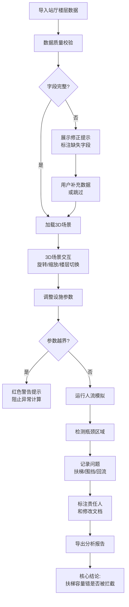

## 1. 产品概述

轨道交通换乘客流Web3D分析工具，专为城市交通分析师设计，解决换乘站改造前不同楼层人流瓶颈可视化分析难题。通过3D场景旋转、参数切换、视角保存等功能，直观展示拥堵源头位置，提供数据质量检测和修正提示，确保扶梯容量计算准确性。

---

## 2. 核心功能

### 2.1 用户角色

| 角色 | 说明 | 核心权限 |
|------|------|----------|
| 城市交通分析师 | 目标用户，负责换乘站改造规划 | 导入站厅数据、3D可视化分析、参数调整、导出分析报告 |

### 2.2 功能模块

1. **数据导入页面**：站厅楼层数据上传、数据质量检测、修正提示展示
2. **3D分析主界面**：多层站厅3D可视化、人流热力图、瓶颈区域高亮
3. **参数控制面板**：扶梯容量、闸机通行效率、围挡配置等参数调整
4. **问题追踪面板**：数据缺口记录、责任人追踪、修改文档指引
5. **报告导出**：扶梯容量校验报告、问题汇总、分析结论

### 2.3 页面详情

| 页面名称 | 模块名称 | 功能描述 |
|-----------|-------------|---------------------|
| 数据导入页 | 文件上传区 | 支持JSON/CSV格式站厅数据拖拽上传 |
| 数据导入页 | 数据校验报告 | 字段完整性检查、缺失字段列表、修正建议 |
| 3D分析主界面 | 3D场景渲染 | 多层站厅结构、扶梯/闸机/围挡位置可视化 |
| 3D分析主界面 | 视角控制 | 鼠标旋转、缩放、平移、视角保存/加载 |
| 3D分析主界面 | 人流模拟 | 客流流向动画、瓶颈区域实时高亮、楼层切换 |
| 参数控制面板 | 设施参数 | 扶梯容量、闸机速率、围挡状态调整 |
| 参数控制面板 | 越界提醒 | 参数超出合理范围时红色警告提示 |
| 问题追踪面板 | 异常记录 | 扶梯容量错误、围挡未生效、客流回流问题列表 |
| 问题追踪面板 | 责任追踪 | 每项问题标注对接人、对应修改文档路径 |
| 报告导出页 | 核心校验 | 扶梯容量错误拦截统计、数据完整性评估 |
| 报告导出页 | 导出功能 | PDF/Excel格式报告下载 |

---

## 3. 核心流程

---

## 4. 用户界面设计

### 4.1 设计风格
- **主色调**：深蓝(#0F2B5B) - 专业、可靠的交通工程感
- **辅助色**：警示红(#E63946) - 参数越界、数据缺失警告；安全绿(#2A9D8F) - 正常状态
- **字体**：标题使用 Space Grotesk，正文使用 JetBrains Mono，体现工程专业感
- **布局风格**：左侧控制面板 + 中央3D场景 + 右侧问题追踪面板的三栏布局
- **视觉元素**：科技感网格线、数据流动画、半透明玻璃态面板

### 4.2 页面设计概览

| 页面名称 | 模块名称 | UI元素 |
|-----------|-------------|-------------|
| 数据导入页 | 上传区 | 大尺寸拖拽区域、虚线边框、上传进度动画 |
| 数据导入页 | 校验报告 | 表格展示缺失字段、红色警告图标、修正建议按钮 |
| 3D分析主界面 | 3D场景 | 深蓝色背景、网格地面、楼层半透明分层 |
| 3D分析主界面 | 人流效果 | 橙色粒子流、红色高亮瓶颈区域、动态热力图 |
| 参数控制面板 | 滑块控件 | 数值滑块、实时数值显示、越界时红色边框闪烁 |
| 问题追踪面板 | 问题列表 | 可展开卡片、状态标签、责任人信息、文档链接 |
| 报告导出页 | 核心结论区 | 大号数字展示拦截次数、绿色/红色状态指示 |

### 4.3 响应式设计
- **桌面优先**：三栏布局最大化利用屏幕空间
- **平板适配**：控制面板可折叠，问题追踪面板移至底部
- **触屏优化**：按钮最小尺寸48px，支持双指缩放旋转

### 4.4 3D场景设计
- **环境**：深蓝色科技感背景，配合柔和的顶部补光
- **光照**：主光源模拟室内顶灯，辅以环境光，突出楼层结构层次
- **相机**：默认45度俯视视角，支持轨道控制，最小缩放距离限制防止穿透模型
- **动画**：客流粒子沿路径流动，瓶颈区域脉冲高亮，楼层切换时平滑过渡
- **后期效果**：轻微泛光效果提升科技感，瓶颈区域应用 bloom 效果增强视觉提示
