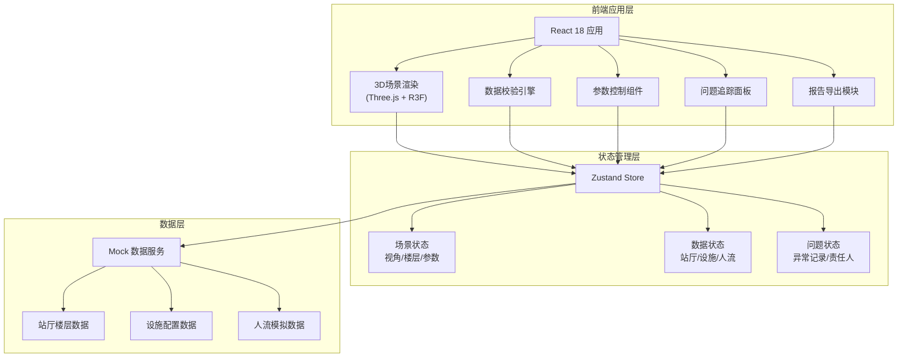

## 1. 架构设计



---

## 2. 技术选型

| 层级 | 技术栈 | 版本 | 说明 |
|------|--------|------|------|
| 前端框架 | React | 18.2.0 | UI组件化开发 |
| 构建工具 | Vite | 5.0.0 | 快速开发构建 |
| 样式方案 | TailwindCSS | 3.4.0 | 原子化CSS |
| 3D渲染 | Three.js | 0.160.0 | WebGL 3D引擎 |
| React 3D | @react-three/fiber | 8.15.0 | React 声明式 Three.js |
| 3D 工具库 | @react-three/drei | 9.92.0 | 常用3D组件集合 |
| 状态管理 | Zustand | 4.4.0 | 轻量级状态管理 |
| UI组件 | Headless UI | 1.7.0 | 无样式组件库 |
| 图标 | Lucide React | 0.294.0 | 现代图标库 |
| 导出 | html2canvas + jspdf | 最新 | PDF报告生成 |

---

## 3. 路由定义

| 路由路径 | 页面名称 | 主要功能 |
|----------|----------|----------|
| `/` | 数据导入页 | 文件上传、数据校验、修正提示 |
| `/analyzer` | 3D分析主界面 | 3D场景、参数控制、问题追踪 |
| `/report` | 报告导出页 | 核心结论展示、报告导出 |

---

## 4. 数据模型

### 4.1 站厅楼层数据模型

```typescript
interface StationFloor {
  id: string;
  name: string;
  level: number;
  height: number;
  color: string;
  boundaries: { x: number; y: number }[];
  escalators: Escalator[];
  gates: Gate[];
  barriers: Barrier[];
  walkways: Walkway[];
}

interface Escalator {
  id: string;
  name: string;
  fromFloor: number;
  toFloor: number;
  position: { x: number; y: number; z: number };
  direction: 'up' | 'down' | 'bidirectional';
  capacity: number;
  maxCapacity: number;
  status: 'normal' | 'warning' | 'error';
}

interface Gate {
  id: string;
  name: string;
  position: { x: number; y: number; z: number };
  passRate: number;
  maxPassRate: number;
}

interface Barrier {
  id: string;
  name: string;
  position: { x: number; y: number; z: number };
  width: number;
  active: boolean;
}

interface Walkway {
  id: string;
  from: { x: number; y: number };
  to: { x: number; y: number };
  width: number;
  flowDirection: 'forward' | 'backward' | 'both';
}
```

### 4.2 人流数据模型

```typescript
interface PassengerFlow {
  id: string;
  origin: string;
  destination: string;
  path: { x: number; y: number; z: number; timestamp: number }[];
  currentPosition: { x: number; y: number; z: number };
  status: 'moving' | 'waiting' | 'blocked';
}

interface Bottleneck {
  id: string;
  location: { x: number; y: number; z: number };
  floor: number;
  type: 'escalator' | 'gate' | 'walkway' | 'corner';
  severity: 'low' | 'medium' | 'high' | 'critical';
  waitingCount: number;
  relatedFacilityId?: string;
}
```

### 4.3 问题追踪模型

```typescript
interface Issue {
  id: string;
  type: 'escalator_capacity' | 'barrier_inactive' | 'flow_reflux' | 'data_missing';
  severity: 'warning' | 'error' | 'critical';
  title: string;
  description: string;
  floor?: number;
  facilityId?: string;
  responsiblePerson: string;
  documentPath: string;
  status: 'open' | 'in_progress' | 'resolved';
  createdAt: Date;
  parameterSnapshot?: Record<string, any>;
}
```

### 4.4 视角保存模型

```typescript
interface ViewPreset {
  id: string;
  name: string;
  cameraPosition: { x: number; y: number; z: number };
  cameraTarget: { x: number; y: number; z: number };
  visibleFloors: number[];
  createdAt: Date;
}
```

---

## 5. 核心算法与校验规则

### 5.1 扶梯容量校验

```typescript
const ESCALATOR_CAPACITY_RANGE = {
  min: 20,
  max: 120,
  warningThreshold: 0.8,
  errorThreshold: 1.0
};

function validateEscalatorCapacity(capacity: number, maxCapacity: number): ValidationResult {
  const ratio = capacity / maxCapacity;
  if (capacity < ESCALATOR_CAPACITY_RANGE.min || capacity > ESCALATOR_CAPACITY_RANGE.max) {
    return { valid: false, level: 'error', message: '容量参数越界，已拦截' };
  }
  if (ratio >= ESCALATOR_CAPACITY_RANGE.errorThreshold) {
    return { valid: false, level: 'critical', message: '扶梯满载，严重拥堵' };
  }
  if (ratio >= ESCALATOR_CAPACITY_RANGE.warningThreshold) {
    return { valid: true, level: 'warning', message: '容量接近上限' };
  }
  return { valid: true, level: 'normal', message: '正常运行' };
}
```

### 5.2 数据完整性校验

```typescript
interface DataValidationReport {
  isValid: boolean;
  missingFields: { field: string; location: string; suggestion: string }[];
  warnings: string[];
  escalatorIssues: number;
  gateIssues: number;
}
```

---

## 6. 导出报告数据结构

```typescript
interface AnalysisReport {
  generatedAt: Date;
  stationName: string;
  coreConclusion: {
    escalatorCapacityBlocked: boolean;
    blockedCount: number;
    totalEscalators: number;
    dataIntegrityScore: number;
  };
  issues: Issue[];
  bottlenecks: Bottleneck[];
  parameterSnapshot: {
    escalatorCapacities: Record<string, number>;
    gateRates: Record<string, number>;
    activeBarriers: string[];
  };
  recommendations: string[];
}
```
