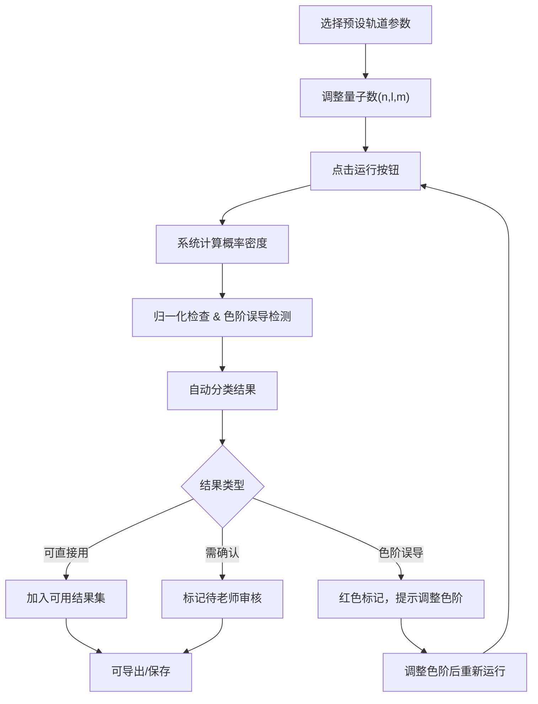
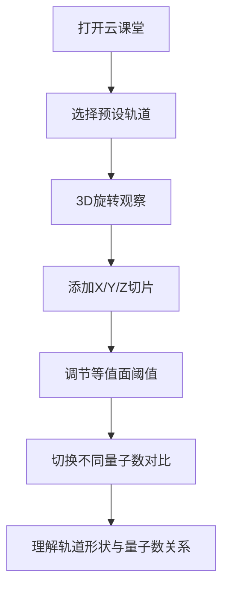

## 1. 产品概述

量子轨道云课堂是一款面向科普教育的交互式3D原子轨道可视化工具，解决传统教材静态图片难以展示电子云空间分布的问题。用户（科普老师、学生）可以通过调整量子数、切换视角、添加切片、对比不同轨道，直观理解原子结构与量子力学原理。

### 产品价值
- 将抽象的量子数转化为可视的3D电子云模型
- 支持多角度观察、切片分析、多轨道对比
- 内置概率密度归一化检查和色阶误导检测
- 提供三类结果分类，辅助科普老师高效备课

---

## 2. 核心功能

### 2.1 用户角色
| 角色 | 使用方式 | 核心需求 |
|------|----------|----------|
| 科普老师 | 课前试跑参数、准备教学材料 | 快速验证轨道参数、检查色阶误导、导出可用结果 |
| 学生 | 课堂互动、自主探索 | 旋转观察、切换轨道、理解量子数含义 |

### 2.2 功能模块
1. **主可视化页面**：3D轨道渲染区、参数控制面板、结果分类面板
2. **轨道参数样例库**：预设常见轨道参数，含故意未归一化的测试用例
3. **切片与等值面控制**：三维切片、等值面阈值调节
4. **结果分析系统**：归一化检查、色阶误导检测、三类结果分类

### 2.3 页面详情
| 页面名称 | 模块名称 | 功能描述 |
|----------|----------|----------|
| 主可视化页面 | 3D渲染区 | 展示电子云概率密度分布，支持鼠标旋转、缩放、平移 |
| 主可视化页面 | 参数控制面板 | 量子数(n,l,m)滑块、概率密度公式展示、预设参数快速选择 |
| 主可视化页面 | 切片控制区 | X/Y/Z轴切片开关、切片位置调节、切片透明度控制 |
| 主可视化页面 | 等值面控制 | 等值面阈值滑块、表面透明度、显示/隐藏切换 |
| 主可视化页面 | 颜色标尺 | 概率密度色阶、可自定义色彩映射、色阶范围自动/手动调节 |
| 主可视化页面 | 结果分类面板 | 三类结果标签：可直接用、需科普老师确认、色阶误导 |
| 主可视化页面 | 对比视图 | 最多4个轨道同时显示，支持同步旋转/独立控制 |
| 主可视化页面 | 运行记录 | 标记两次运行间的参数变化和结果差异 |

---

## 3. 核心流程

### 3.1 科普老师备课流程

### 3.2 学生探索流程

---

## 4. 用户界面设计

### 4.1 设计风格
- **主色调**：深空蓝 `#0a1628` 作为背景，营造宇宙/微观世界氛围
- **辅助色**：量子紫 `#7c3aed` 用于交互元素，霓虹青 `#06b6d4` 用于高亮数据
- **警示色**：橙色 `#f97316`（需确认）、红色 `#ef4444`（色阶误导）、绿色 `#22c55e`（可直接用）
- **字体**：标题使用 `Space Grotesk`（科技感），正文使用 `Inter`（清晰易读）
- **按钮风格**：半透明玻璃态，边框微光，悬停时有轻微上浮和发光效果
- **布局**：左侧控制面板 + 中央3D视图 + 右侧结果面板，三栏布局

### 4.2 视觉元素
| 页面名称 | 模块名称 | UI元素 |
|----------|----------|--------|
| 主可视化页面 | 3D渲染区 | 深空背景、粒子光效、电子云半透明体积渲染、坐标轴辅助线 |
| 主可视化页面 | 参数控制面板 | 玻璃态卡片、渐变滑块、量子数公式展示（LaTeX渲染）、预设标签组 |
| 主可视化页面 | 颜色标尺 | 垂直渐变条、数值刻度、色阶范围输入框、自动检测结果徽章 |
| 主可视化页面 | 结果分类 | 三色状态徽章（绿/橙/红）、问题说明文字、修正建议 |
| 主可视化页面 | 运行记录 | 时间线展示、参数变更高亮（diff效果）、两次运行对比按钮 |

### 4.3 响应式
- **桌面端**：三栏布局（左25% + 中50% + 右25%）
- **平板端**：可折叠侧边栏，中央视图自适应
- **移动端**：垂直堆叠，控制区可展开/收起，优先保证3D视图可视区域

### 4.4 3D场景设计
- **环境**：深空渐变背景，轻微噪点纹理营造空间感
- **光照**：三点光源系统，主光源冷白色，补光量子紫，轮廓光霓虹青
- **相机**：透视相机，初始距离适中，支持轨道控制（OrbitControls）
- **后处理**：轻微泛光（Bloom）效果增强电子云发光感，色调映射保持颜色准确
- **性能**：体积渲染使用WebGL 2.0，网格分辨率可调节（平衡质量与性能）
- **交互**：左键旋转、滚轮缩放、右键平移，双击重置视角

---

## 5. 特殊功能说明

### 5.1 色阶误导检测
- 检测概率密度分布是否存在极端值导致色阶压缩
- 检查是否有超过95%的数据集中在色阶的10%范围内
- 自动建议对数刻度或截断范围优化可视化效果

### 5.2 归一化检查
- 数值积分验证概率密度是否归一化（∫|ψ|²dτ ≈ 1）
- 允许用户输入未归一化的测试参数，系统会标记并提示
- 提供一键归一化功能

### 5.3 运行变更标记
- 记录每次运行的所有参数
- 第二次运行时自动对比并高亮变化的参数（量子数、色阶范围、切片设置等）
- 在结果面板中显示"变更点"列表

### 5.4 切片越界保护
- 限制切片位置在有效范围内
- 当用户尝试设置越界切片时，自动修正并给出提示
- 记录越界尝试作为"需确认"项
