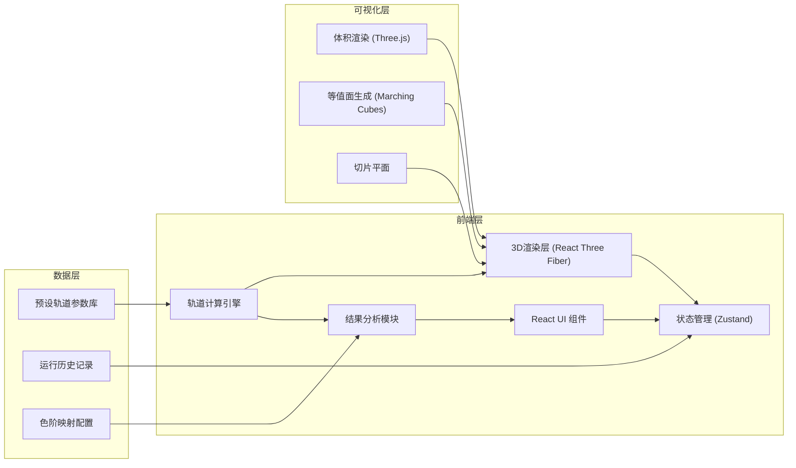

## 1. 架构设计



## 2. 技术描述

### 2.1 核心技术栈
- **前端框架**：React 18 + TypeScript 5
- **构建工具**：Vite 5
- **样式方案**：Tailwind CSS 3
- **3D引擎**：Three.js 0.160 + @react-three/fiber 8.15 + @react-three/drei 9.92
- **后处理**：@react-three/postprocessing 2.15
- **状态管理**：Zustand 4.4
- **数学计算**：math.js 12.0（用于波函数计算和积分）
- **数学公式渲染**：KaTeX 0.29
- **UI组件**：Radix UI + lucide-react

### 2.2 核心模块说明
1. **轨道计算引擎**：实现氢原子波函数ψ(n,l,m,r,θ,φ)的数值计算，支持实球谐函数形式
2. **体积数据生成**：将球坐标概率密度转换为三维笛卡尔网格数据
3. **结果分析模块**：归一化检查、色阶误导检测、切片越界检测
4. **可视化组件**：
   - VolumeCloud：基于射线步进的体积云渲染
   - Isosurface：Marching Cubes等值面提取
   - ClipPlane：可交互切片平面

---

## 3. 路由定义

| 路由 | 页面 | 说明 |
|------|------|------|
| `/` | 主可视化页面 | 包含3D视图、控制面板、结果面板的完整交互界面 |
| `/compare` | 多轨道对比页面 | 支持最多4个轨道同时显示对比 |
| `/presets` | 预设参数库 | 浏览和管理所有预设轨道参数 |

---

## 4. 数据模型

### 4.1 轨道参数类型定义
```typescript
interface OrbitalParams {
  id: string;
  name: string;
  n: number;      // 主量子数 1-7
  l: number;      // 角量子数 0..n-1
  m: number;      // 磁量子数 -l..+l
  isNormalized: boolean;  // 是否已归一化
  normalizationFactor?: number;  // 归一化因子（未归一化时使用）
  description: string;
}

interface VisualizationSettings {
  resolution: number;     // 体数据分辨率 32-128
  gridSize: number;       // 空间范围 (±a₀单位)
  colorMap: string;       // 色图名称 'viridis'|'plasma'|'rainbow'|'quantum'
  colorRange: [number, number];  // 色阶范围
  useLogScale: boolean;   // 是否使用对数刻度
  isoThreshold: number;   // 等值面阈值 0-1
  isoOpacity: number;     // 等值面透明度
  volumeOpacity: number;  // 体积渲染透明度
}

interface SliceSettings {
  xEnabled: boolean;
  yEnabled: boolean;
  zEnabled: boolean;
  xPosition: number;      // -gridSize 到 +gridSize
  yPosition: number;
  zPosition: number;
  sliceOpacity: number;
  showGrid: boolean;
}

interface RunResult {
  id: string;
  timestamp: number;
  params: OrbitalParams;
  vizSettings: VisualizationSettings;
  sliceSettings: SliceSettings;
  normalizationCheck: {
    passed: boolean;
    integralValue: number;
    tolerance: number;
  };
  colorScaleCheck: {
    passed: boolean;
    issues: ColorScaleIssue[];
  };
  sliceBoundsCheck: {
    passed: boolean;
    violations: SliceViolation[];
  };
  classification: 'ready' | 'needs-review' | 'misleading';
  warnings: string[];
}

interface ComparisonSession {
  id: string;
  orbitals: string[];     // OrbitalParams.id 数组，最多4个
  syncCamera: boolean;
  layout: 'grid' | 'row' | 'column';
}
```

### 4.2 预设轨道参数（部分样例）
```typescript
const PRESET_ORBITALS: OrbitalParams[] = [
  { id: '1s', name: '1s 轨道', n: 1, l: 0, m: 0, isNormalized: true, description: '基态氢原子轨道，球对称' },
  { id: '2s', name: '2s 轨道', n: 2, l: 0, m: 0, isNormalized: true, description: '第一激发态s轨道，含一个节面' },
  { id: '2pz', name: '2p_z 轨道', n: 2, l: 1, m: 0, isNormalized: true, description: '沿z轴的哑铃形p轨道' },
  { id: '2px', name: '2p_x 轨道', n: 2, l: 1, m: 1, isNormalized: true, description: '沿x轴的哑铃形p轨道（实组合）' },
  { id: '3dxy', name: '3d_{xy} 轨道', n: 3, l: 2, m: 2, isNormalized: true, description: '四叶形d轨道' },
  { id: '3dz2', name: '3d_{z²} 轨道', n: 3, l: 2, m: 0, isNormalized: true, description: '哑铃+环形d轨道' },
  // 故意未归一化的测试用例
  { id: '1s-unnorm', name: '1s 轨道(未归一化测试)', n: 1, l: 0, m: 0, isNormalized: false, normalizationFactor: 2.5, description: '用于测试归一化检查功能' },
  { id: '2pz-unnorm', name: '2p_z 轨道(未归一化测试)', n: 2, l: 1, m: 0, isNormalized: false, normalizationFactor: 0.3, description: '故意放大的概率密度' },
];
```

---

## 5. 核心计算逻辑

### 5.1 波函数计算模块 (`src/utils/orbitalCalculations.ts`)
```typescript
// 关联拉盖尔多项式
function associatedLaguerre(n: number, l: number, x: number): number;

// 球谐函数（实形式）
function realSphericalHarmonic(l: number, m: number, theta: number, phi: number): number;

// 氢原子径向波函数
function radialWavefunction(n: number, l: number, r: number): number;

// 完整波函数 ψ(r,θ,φ)
function wavefunction(n: number, l: number, m: number, r: number, theta: number, phi: number): number;

// 概率密度 |ψ|²
function probabilityDensity(n: number, l: number, m: number, r: number, theta: number, phi: number, normFactor = 1): number;

// 生成三维体数据
function generateVolumeData(params: OrbitalParams, settings: VisualizationSettings): Float32Array;

// 数值积分（用于归一化检查）
function numericalIntegral(data: Float32Array, gridSize: number, resolution: number): number;
```

### 5.2 结果分析模块 (`src/utils/analysis.ts`)
```typescript
// 归一化检查
function checkNormalization(data: Float32Array, gridSize: number, resolution: number, tolerance = 0.05): {
  passed: boolean;
  integralValue: number;
  tolerance: number;
};

// 色阶误导检测
function checkColorScale(data: Float32Array, colorRange: [number, number], useLogScale: boolean): {
  passed: boolean;
  issues: ColorScaleIssue[];
};

// 切片越界检测
function checkSliceBounds(sliceSettings: SliceSettings, gridSize: number): {
  passed: boolean;
  violations: SliceViolation[];
};

// 自动分类结果
function classifyResult(normCheck: any, colorCheck: any, sliceCheck: any): 'ready' | 'needs-review' | 'misleading';

// 两次运行对比
function compareRuns(run1: RunResult, run2: RunResult): ParameterChange[];
```

---

## 6. 组件结构

```
src/
├── components/
│   ├── orbital3d/
│   │   ├── OrbitalScene.tsx        # 3D场景主组件
│   │   ├── VolumeCloud.tsx         # 体积云渲染
│   │   ├── Isosurface.tsx          # 等值面
│   │   ├── ClipPlanes.tsx          # 切片平面
│   │   └── AxesHelper.tsx          # 坐标轴
│   ├── controls/
│   │   ├── QuantumNumberPanel.tsx  # 量子数控制面板
│   │   ├── VisualizationPanel.tsx  # 可视化设置
│   │   ├── SlicePanel.tsx          # 切片控制
│   │   └── PresetSelector.tsx      # 预设选择器
│   ├── analysis/
│   │   ├── ResultPanel.tsx         # 结果分类面板
│   │   ├── ColorScaleBar.tsx       # 颜色标尺
│   │   ├── RunHistory.tsx          # 运行历史
│   │   └── ChangeHighlighter.tsx   # 变更高亮
│   └── layout/
│       ├── Sidebar.tsx
│       └── ComparisonView.tsx
├── hooks/
│   ├── useOrbitalCalculation.ts    # 轨道计算hook
│   ├── useResultAnalysis.ts        # 结果分析hook
│   └── useRunHistory.ts            # 运行历史hook
├── store/
│   └── useAppStore.ts              # Zustand全局状态
├── utils/
│   ├── orbitalCalculations.ts      # 核心数学计算
│   ├── analysis.ts                 # 结果分析逻辑
│   ├── colormaps.ts                # 色图定义
│   └── presets.ts                  # 预设参数
├── types/
│   └── index.ts                    # 类型定义
├── pages/
│   ├── MainPage.tsx
│   ├── ComparePage.tsx
│   └── PresetsPage.tsx
└── App.tsx
```

---

## 7. 状态管理 (Zustand)

```typescript
interface AppState {
  // 当前参数
  currentParams: OrbitalParams;
  vizSettings: VisualizationSettings;
  sliceSettings: SliceSettings;
  
  // 计算结果
  volumeData: Float32Array | null;
  currentResult: RunResult | null;
  
  // 历史记录
  runHistory: RunResult[];
  selectedRuns: string[];  // 用于对比
  
  // 操作方法
  setParams: (params: Partial<OrbitalParams>) => void;
  setVizSettings: (settings: Partial<VisualizationSettings>) => void;
  setSliceSettings: (settings: Partial<SliceSettings>) => void;
  runCalculation: () => void;
  loadPreset: (presetId: string) => void;
  compareWithPrevious: (runId: string) => ParameterChange[];
  clearHistory: () => void;
}
```

---

## 8. 性能优化策略

1. **计算优化**：
   - Web Worker 处理体数据生成，避免阻塞UI
   - 分辨率自适应（根据设备性能自动调整）
   - 增量更新（仅当参数变化时重新计算）

2. **渲染优化**：
   - Three.js 实例化渲染
   - 视锥体剔除
   - LOD（细节层次）控制
   - 体积渲染步进距离自适应

3. **内存管理**：
   - 体数据纹理及时释放
   - 历史记录数量限制（最多20条）
   - 旧数据自动清理
