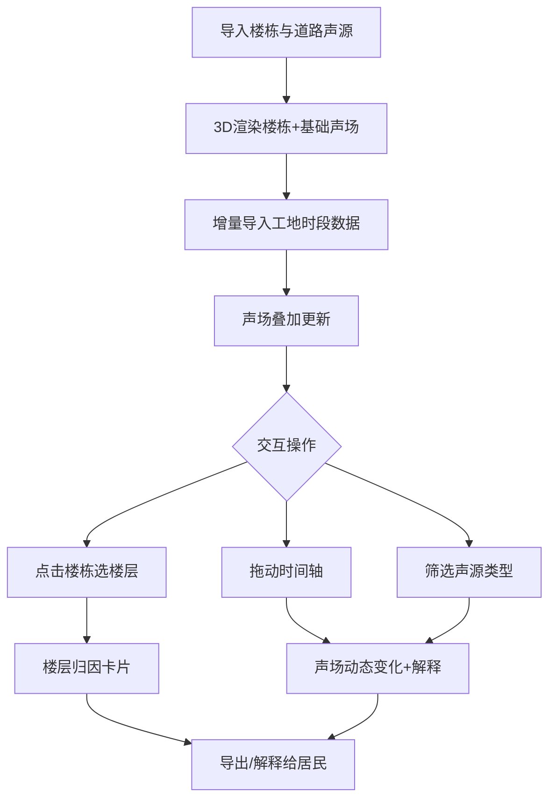
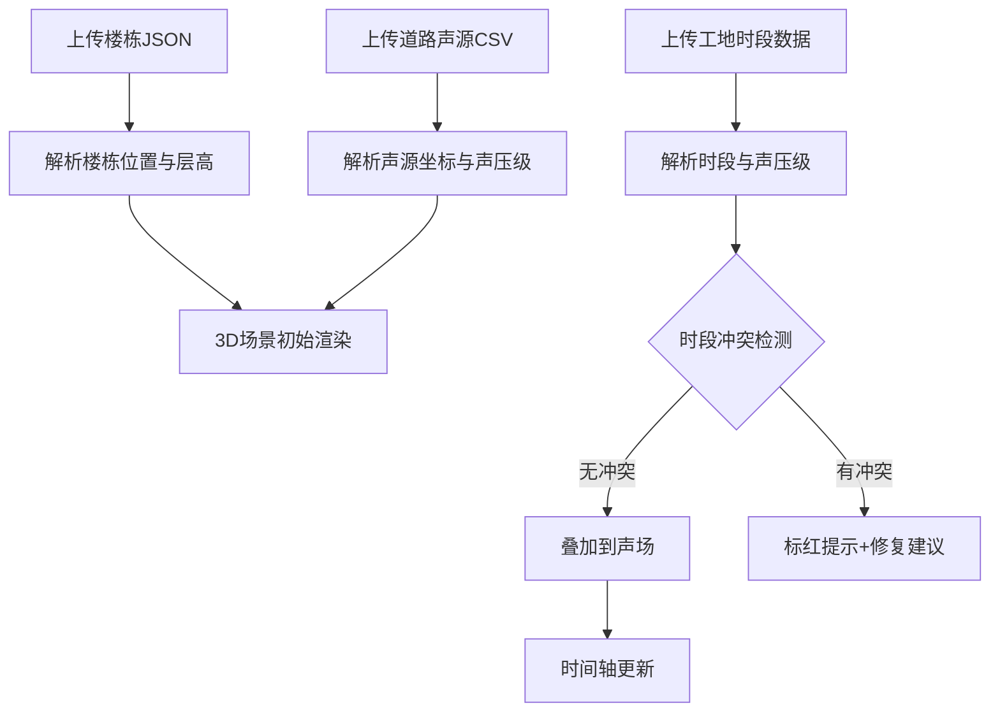

## 1. 产品概述

城市噪声立体地图——面向环保监测员的噪声溯源与解释工具。将道路、工地、商业街等多源噪声叠加到3D楼栋模型上，让投诉居民直观了解"我这层为什么吵"，并通过时间轴、筛选和楼层切换完成从数据导入到归因解释的完整工作流。

- 核心用户：基层环保监测员、噪声投诉处理人员
- 核心价值：把"噪声数值"变成"噪声归因"，让投诉居民直接看到楼层噪声来源与贡献占比

## 2. 核心功能

### 2.1 用户角色

| 角色 | 使用方式 | 核心权限 |
|------|----------|----------|
| 环保监测员 | 直接使用 | 导入声源、查看3D地图、播放时间轴、导出归因报告 |

### 2.2 功能模块

1. **3D噪声地图主页**：3D楼栋场景、声场热力叠加、楼层选择器、声源筛选面板、时间轴控制器
2. **声源导入管理页**：增量导入声源数据、时序标注（先到先标）、冲突与重复检测

### 2.3 页面详情

| 页面名称 | 模块名称 | 功能描述 |
|----------|----------|----------|
| 3D噪声地图主页 | 3D场景视口 | Three.js渲染的3D楼栋模型，叠加声场热力图层；支持拖拽旋转、缩放、点击楼栋选中楼层 |
| 3D噪声地图主页 | 楼层噪声面板 | 选中楼栋后，左侧/右侧弹出该楼各层噪声值及声源贡献占比饼图；楼层切换按钮醒目排列，非表格角落隐藏 |
| 3D噪声地图主页 | 声源筛选器 | 按声源类型（道路/工地/商业街）开关显示，按时段过滤，拖动/筛选后声场实时更新并附带解释文字 |
| 3D噪声地图主页 | 时间轴控制器 | 底部时间轴，播放/暂停/拖动；播放时3D声场动态变化，工地声源按时段出现/消失；当前时段标注已导入/未导入声源 |
| 3D噪声地图主页 | 归因解释卡片 | 点击某楼层后弹出"为什么这层吵"卡片，列出各声源贡献dB值、占比、距离衰减说明 |
| 3D噪声地图主页 | 图表与评分区 | 噪声评分（如超标等级）、声源贡献柱状图；每个图表旁标注"与楼栋距离X米、道路声源贡献Y%"的解释文字 |
| 声源导入管理页 | 增量导入面板 | 支持分批导入楼栋与道路声源（先到）、工地时段数据（后补）；导入记录列表标注导入时间和数据覆盖时段 |
| 声源导入管理页 | 时序标注区 | 可视化时间线展示各声源数据覆盖的时段范围，缺数据时段高亮提示 |
| 声源导入管理页 | 冲突检测区 | 自动检测时段错配、楼层遮挡冲突、声源重复；异常项标红并提供修复建议 |

## 3. 核心流程

**主流程**：监测员先导入楼栋和道路声源数据 → 系统3D渲染楼栋和基础声场 → 后续导入工地时段数据 → 声场自动叠加更新 → 监测员拖动时间轴或筛选声源 → 点击某楼层查看归因 → 向居民解释"为什么吵"

**导入流程**：先到数据先渲染 → 后补数据叠加 → 冲突自动检测 → 异常标注

## 4. 用户界面设计

### 4.1 设计风格

- **主色调**：深蓝灰（#1a1f2e）作为3D视口背景，搭配警示橙（#ff6b35）用于噪声超标高亮
- **辅助色**：声源类型色——道路声源蓝（#4a9eff）、工地声源黄（#ffc107）、商业街声源粉（#e040fb）
- **按钮风格**：圆角8px，微3D投影，hover态有1.05x缩放与光晕
- **字体**：标题用 Noto Sans SC Bold，正文用 Noto Sans SC Regular；数字用 JetBrains Mono 等宽字体突出声压级
- **布局风格**：左侧3D视口占70%宽度，右侧信息面板30%；底部时间轴通栏
- **图标风格**：Lucide图标，线性风格，与深色背景搭配

### 4.2 页面设计概览

| 页面名称 | 模块名称 | UI元素 |
|----------|----------|--------|
| 3D噪声地图主页 | 3D场景视口 | 深色背景Three.js Canvas，楼栋白色半透明线框，声场热力叠加彩色渐变；OrbitControls拖拽旋转缩放 |
| 3D噪声地图主页 | 楼层噪声面板 | 右侧竖排楼层按钮列表（1F-30F），当前选中楼层高亮；下方饼图显示声源占比 |
| 3D噪声地图主页 | 声源筛选器 | 顶部工具栏三个Toggle按钮（道路/工地/商业街），激活态对应声源类型色 |
| 3D噪声地图主页 | 时间轴控制器 | 底部横向时间轴滑块，24小时刻度，播放/暂停按钮，当前时间指针；已导入时段实线、未导入时段虚线 |
| 3D噪声地图主页 | 归因解释卡片 | 浮动卡片，顶部楼层标题，下方三列：声源名、贡献dB、占比条形图；底部"距离衰减说明"文字 |
| 3D噪声地图主页 | 图表与评分区 | 右侧面板底部，超标等级徽章+柱状图；柱状图旁每根柱子标注声源关系文字 |
| 声源导入管理页 | 增量导入面板 | 左侧上传区域（拖拽上传），右侧导入记录列表（时间戳+覆盖时段+状态标签） |
| 声源导入管理页 | 时序标注区 | 横向甘特图式时间线，各声源数据条带，缺数据时段红色虚线框 |
| 声源导入管理页 | 冲突检测区 | 表格列：冲突类型、涉及声源、时段范围、修复建议；异常行红色背景 |

### 4.3 响应式

- 桌面优先设计（1920×1080为主要分辨率）
- 中等屏幕（1366×768）时右侧面板可折叠为浮动抽屉
- 移动端暂不支持（监测员主要在桌面端使用）

### 4.4 3D场景指引

- **环境/氛围**：城市夜景风格，深色天空，楼栋带微光轮廓，声场热力层半透明叠加
- **光照**：AmbientLight微弱环境光 + DirectionalLight模拟月光，声源处有点光源高亮
- **相机**：透视相机，初始45度俯视，OrbitControls允许自由旋转缩放，最大距离限制
- **构图与焦点**：楼栋居中，声场热力从声源向外扩散，选中楼层高亮描边
- **交互与动画**：时间轴播放时声场渐变过渡（0.5s插值），楼层切换时相机平滑飞向该楼层，声源出现/消失有淡入淡出
- **后处理**：声场区域Bloom发光效果，楼栋选中时OutlinePass轮廓高亮
- **性能预算**：30栋楼×30层 + 3种声源类型，保持30fps以上

## 5. 边界样例与稳定性要求

| 场景 | 预期行为 |
|------|----------|
| 时段错配（工地数据覆盖22:00-06:00但道路数据只有08:00-20:00） | 时间轴上两段数据分别显示实线，中间时段虚线标注"数据缺失"，声场仅计算有数据的时段 |
| 楼层遮挡（前排楼栋挡住后排声源传播） | 声场计算考虑遮挡衰减，被遮挡楼层噪声值降低，归因卡片标注"前方楼栋遮挡减少X dB" |
| 声源重复（同一路段重复导入） | 导入时自动检测并合并，提示"已合并重复声源N个"，不产生双重叠加 |
| 空数据时段播放 | 时间轴播放到无数据时段，3D场景声场淡出，显示"当前时段无数据"浮层 |
| 重复运行一致性 | 相同输入数据多次计算，结果完全一致（确定性计算，无随机因素） |
