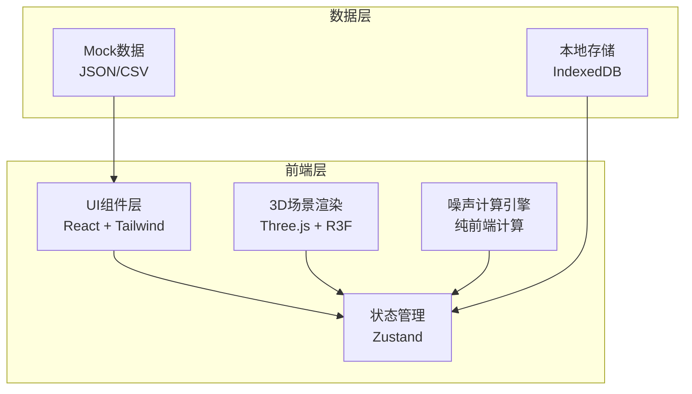
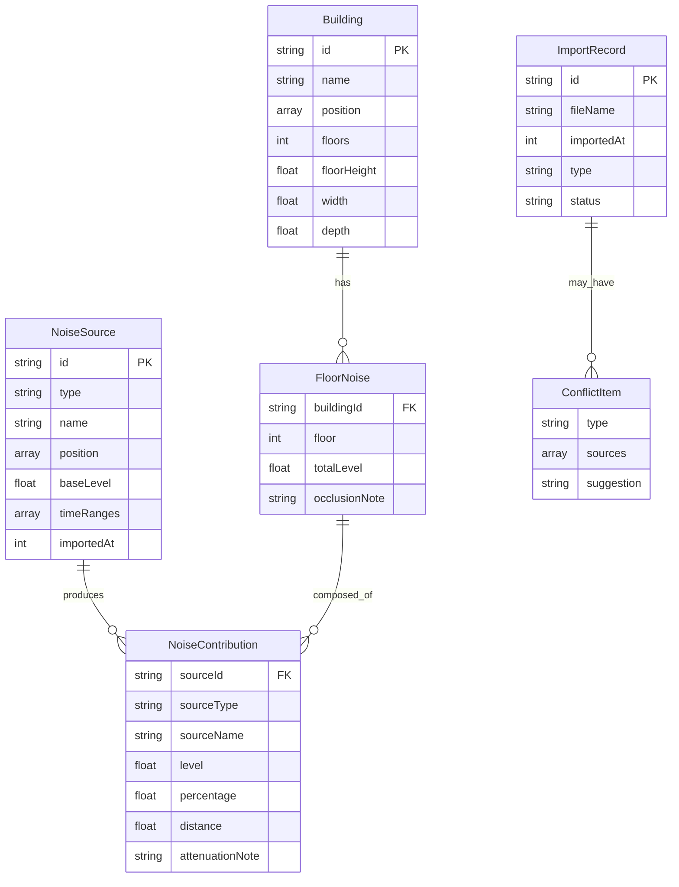

## 1. 架构设计



纯前端架构，无后端服务。噪声计算全部在浏览器端完成，确保确定性（相同输入→相同输出）。数据通过Mock JSON/CSV提供，导入后存入Zustand状态。

## 2. 技术说明

- **前端框架**：React@18 + TypeScript + Tailwind CSS@3 + Vite
- **初始化工具**：vite-init（react-ts模板）
- **3D渲染**：three + @react-three/fiber + @react-three/drei + @react-three/postprocessing
- **状态管理**：zustand
- **图表**：recharts
- **后端**：无（纯前端）
- **数据库**：无（Mock数据 + Zustand内存状态）

## 3. 路由定义

| 路由 | 用途 |
|------|------|
| / | 3D噪声地图主页（默认页） |
| /import | 声源导入管理页 |

## 4. API定义

无后端API。数据通过前端文件上传和Mock数据提供。

### 4.1 数据接口定义

```typescript
interface Building {
  id: string;
  name: string;
  position: [number, number, number];
  floors: number;
  floorHeight: number;
  width: number;
  depth: number;
}

type NoiseSourceType = "road" | "construction" | "commercial";

interface NoiseSource {
  id: string;
  type: NoiseSourceType;
  name: string;
  position: [number, number, number];
  baseLevel: number;
  timeRanges: TimeRange[];
  importedAt: number;
}

interface TimeRange {
  startHour: number;
  endHour: number;
  level: number;
}

interface FloorNoise {
  buildingId: string;
  floor: number;
  totalLevel: number;
  contributions: NoiseContribution[];
  occlusionNote?: string;
}

interface NoiseContribution {
  sourceId: string;
  sourceType: NoiseSourceType;
  sourceName: string;
  level: number;
  percentage: number;
  distance: number;
  attenuationNote: string;
}

interface ImportRecord {
  id: string;
  fileName: string;
  importedAt: number;
  type: "building" | "road" | "construction" | "commercial";
  timeCoverage: TimeRange[];
  status: "success" | "conflict" | "duplicate";
  conflictDetail?: string;
}

interface ConflictItem {
  type: "time_mismatch" | "floor_occlusion" | "source_duplicate";
  sources: string[];
  timeRange?: TimeRange;
  suggestion: string;
}
```

## 5. 服务器架构图

无后端，不适用。

## 6. 数据模型

### 6.1 数据模型定义



### 6.2 噪声计算模型

采用简化点声源衰减模型：

- **点声源衰减**：`Lp = Lw - 20*log10(r) - 11`（r为距离，米）
- **楼层高度修正**：每层增加 `floorHeight * (floor - 1)` 的高度距离
- **遮挡衰减**：若声源到接收点连线穿过前排楼栋，增加 5-10 dB 衰减
- **多声源叠加**：`L_total = 10 * log10(Σ10^(Li/10))`
- **时段判断**：仅计算当前时间轴指针所在时段内有数据的声源

计算过程完全确定性，无随机因素，确保重复运行一致性。

### 6.3 Mock数据定义

预置一组Mock数据用于演示：

- 5栋楼（A-E栋），每栋15-25层不等，排列在道路两侧
- 2条道路声源（主干道+支路），24小时数据
- 1个工地声源，仅08:00-20:00时段
- 1条商业街声源，仅10:00-22:00时段
- 预置冲突样例：工地数据与道路数据时段部分重叠
