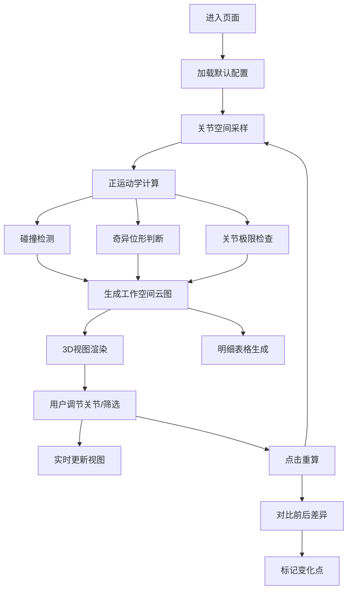

## 1. 产品概述

机器人工作空间云图可视化工具，帮助机器人调试人员直观分析机械臂的可达范围、碰撞风险、奇异位形和关节角越界问题。通过3D交互视图与明细数据的同步联动，快速定位调试中的问题来源。

- 解决的核心问题：学生调试机械臂时无法直观判断关节可达性、碰撞位置不明显、错误类型混淆
- 目标用户：机器人专业师生、机械臂调试工程师
- 产品价值：将抽象的运动学数据转化为直观的3D可视化，大幅提升调试效率

## 2. 核心功能

### 2.1 用户角色

| 角色 | 注册方式 | 核心权限 |
|------|----------|----------|
| 调试人员 | 无需注册 | 查看3D视图、调整关节角、筛选数据、导出分析结果 |

### 2.2 功能模块

1. **3D交互视图**：机械臂实时渲染、工作空间云图、障碍物展示、碰撞高亮
2. **控制面板**：关节角调节、采样参数配置、运行/重算按钮
3. **筛选器**：按冲突类型、关节编号、可达状态筛选
4. **明细表格**：采样点列表、冲突来源标记、状态分类展示
5. **对比模式**：修改关节角前后的结果差异对比

### 2.3 页面详情

| 页面名称 | 模块名称 | 功能描述 |
|-----------|-------------|---------------------|
| 主页面 | 3D视图区 | Three.js渲染的6自由度机械臂、可达云图点云、障碍物模型；支持旋转、缩放、平移；碰撞时红色高亮闪烁 |
| 主页面 | 控制面板 | 6个关节滑块实时调节角度；显示当前关节值与极限值对比；运行按钮重新计算工作空间 |
| 主页面 | 筛选器 | 多维度筛选：关节越界/奇异位形/碰撞/正常；按关节编号筛选；按置信度筛选 |
| 主页面 | 明细表格 | 展示所有采样点的关节角、笛卡尔坐标、冲突类型、来源关节；冲突来源单独列标记并高亮 |
| 主页面 | 差异对比条 | 修改关节角重跑后，高亮显示新增/消失/改变的采样点；颜色区分影响范围 |

## 3. 核心流程

1. 用户进入页面，加载默认关节角配置和障碍物模型
2. 系统自动采样关节空间，计算正运动学、碰撞检测、奇异位形判断
3. 3D视图展示机械臂当前姿态、可达云图（绿色可达、黄色警告、红色不可达）
4. 用户调节关节滑块，3D视图实时更新机械臂姿态
5. 用户点击"运行分析"，系统重新采样计算并更新云图和表格
6. 用户在筛选器选择冲突类型，3D视图和表格同步过滤
7. 用户点击表格行，3D视图跳转到对应采样点姿态并高亮
8. 修改关节参数后重跑，系统自动对比并标记差异

## 4. 用户界面设计

### 4.1 设计风格
- **主色调**：深蓝科技感背景 (#0a0e1a)，搭配霓虹青色高光 (#00f0ff)
- **警示色**：关节越界-橙色 (#ff9500)，碰撞-红色 (#ff3b30)，奇异位形-紫色 (#af52de)，正常-绿色 (#34c759)
- **字体**：显示字体 - Orbitron（科技感），正文字体 - JetBrains Mono（等宽清晰）
- **布局**：左侧3D视图占70%，右侧控制面板+表格占30%，底部差异对比条
- **交互风格**：暗色科技感，磨砂玻璃面板，发光边框，微交互动画
- **3D风格**：机械臂金属质感，点云半透明发光，障碍物线框模式

### 4.2 页面设计概述

| 页面名称 | 模块名称 | UI元素 |
|-----------|-------------|-------------|
| 主页面 | 3D视图区 | 暗色空间背景、网格地板、坐标轴指示、机械臂金属材质、点云球体、障碍物线框、碰撞时闪烁高亮 |
| 主页面 | 控制面板 | 磨砂玻璃面板、发光滑块、关节值实时显示、极限值红色警告线、运行按钮脉冲动画 |
| 主页面 | 筛选器 | 标签式筛选、多条件组合、选中态发光边框 |
| 主页面 | 明细表格 | 斑马纹、冲突行背景色、冲突来源图标标记、悬停行对应3D点高亮 |
| 主页面 | 差异对比条 | 左右分栏对比、箭头指示变化、新增点绿色+、消失点红色-、改变点黄色~ |

### 4.3 响应性
- 桌面端优先设计，保证1920x1080分辨率最佳体验
- 支持窗口缩放，3D画布自适应调整
- 平板端转为上下布局，3D视图在上，控制面板在下

### 4.4 3D场景指导
- **环境**：深空灰背景，弱环境光，配合方向光和点光源营造金属质感
- **光照**：主光源45度角投射，环境光强度0.3，机械臂自发光材质
- **相机**：PerspectiveCamera，初始距离3米，可环绕旋转，支持阻尼惯性
- **构图**：机械臂居中，工作空间云图环绕，底部网格平面参考
- **交互**：OrbitControls控制器，左键旋转，右键平移，滚轮缩放
- **动画**：碰撞时关节红色脉冲动画3秒，采样时点云渐入动画
- **后处理**：Bloom泛光效果增强科技感，轻微SSAO提升空间感
