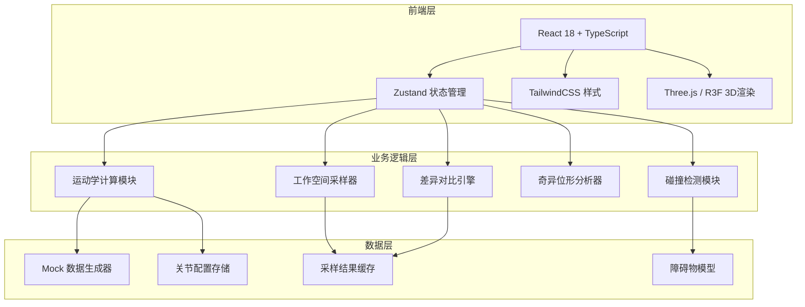
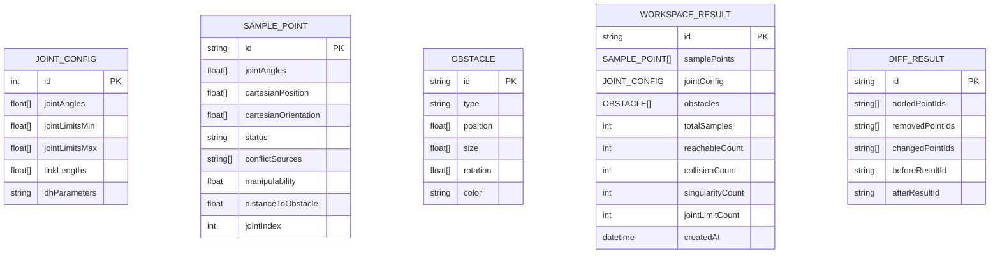

## 1. 架构设计



## 2. 技术描述

- **前端**：React@18 + TypeScript@5 + Vite@5 + TailwindCSS@3
- **状态管理**：Zustand@4（跨组件同步3D视图、筛选、表格状态）
- **3D渲染**：three@0.160 + @react-three/fiber@8 + @react-three/drei@9 + @react-three/postprocessing@2
- **图标**：lucide-react@0.294
- **后端**：无（纯前端计算，mock数据）
- **数据库**：无（内存状态管理）

## 3. 路由定义

| 路由 | 用途 |
|-------|---------|
| / | 主页面 - 机器人工作空间云图分析 |

## 4. 数据模型

### 4.1 数据模型定义



### 4.2 TypeScript 类型定义

```typescript
// 关节配置
interface JointConfig {
  jointAngles: number[];
  jointLimits: Array<{ min: number; max: number }>;
  linkLengths: number[];
  dhParameters: DHParameter[];
}

interface DHParameter {
  a: number;
  alpha: number;
  d: number;
  theta: number;
}

// 采样点状态
type PointStatus = 'reachable' | 'collision' | 'singularity' | 'joint_limit' | 'out_of_workspace';

interface SamplePoint {
  id: string;
  jointAngles: number[];
  cartesianPosition: [number, number, number];
  cartesianOrientation: [number, number, number, number]; // quaternion
  status: PointStatus;
  conflictSources: ConflictSource[];
  manipulability: number;
  distanceToObstacle: number;
  timestamp: number;
}

interface ConflictSource {
  type: 'joint_limit' | 'collision' | 'singularity';
  jointIndex?: number;
  obstacleId?: string;
  details: string;
  severity: 'warning' | 'error';
}

// 障碍物
interface Obstacle {
  id: string;
  type: 'box' | 'sphere' | 'cylinder' | 'mesh';
  position: [number, number, number];
  size: [number, number, number];
  rotation: [number, number, number];
  color: string;
}

// 工作空间计算结果
interface WorkspaceResult {
  id: string;
  samplePoints: SamplePoint[];
  jointConfig: JointConfig;
  obstacles: Obstacle[];
  statistics: {
    total: number;
    reachable: number;
    collision: number;
    singularity: number;
    jointLimit: number;
  };
  createdAt: number;
}

// 差异对比结果
interface DiffResult {
  added: string[];
  removed: string[];
  changed: string[];
  beforeId: string;
  afterId: string;
}

// 筛选条件
interface FilterOptions {
  status: PointStatus[];
  jointIndices: number[];
  conflictTypes: ConflictSource['type'][];
  manipulabilityRange: [number, number];
}

// 全局状态
interface AppState {
  currentJointConfig: JointConfig;
  workspaceResult: WorkspaceResult | null;
  previousResult: WorkspaceResult | null;
  diffResult: DiffResult | null;
  obstacles: Obstacle[];
  filters: FilterOptions;
  selectedPointId: string | null;
  isComputing: boolean;
  showDiff: boolean;
}
```

## 5. 核心模块说明

### 5.1 运动学计算模块 (`src/utils/kinematics.ts`)
- 正运动学：D-H参数法计算末端位姿
- 雅可比矩阵：用于奇异位形判断
- 可操纵度计算：衡量关节灵活性

### 5.2 碰撞检测模块 (`src/utils/collision.ts`)
- 简化胶囊体碰撞检测
- 障碍物距离计算
- 自碰撞检测

### 5.3 工作空间采样器 (`src/utils/sampler.ts`)
- 蒙特卡洛采样
- 网格采样
- 自适应采样（冲突区域加密）

### 5.4 状态管理 (`src/store/useWorkspaceStore.ts`)
- 关节配置状态
- 采样结果缓存
- 筛选条件同步
- 3D视图与表格联动

### 5.5 3D场景组件
- `RobotArm.tsx`：机械臂层级渲染
- `PointCloud.tsx`：可达云图点渲染
- `Obstacles.tsx`：障碍物渲染
- `Scene.tsx`：场景整合与光照

## 6. 性能优化策略

1. **点云渲染优化**：使用Three.js Points替代多个Mesh，支持十万级点渲染
2. **Web Worker计算**：运动学计算和碰撞检测在Worker线程执行，不阻塞UI
3. **增量更新**：修改关节角时，只重新计算受影响的采样点
4. **LOD策略**：远处点云降低分辨率，近处显示细节
5. **内存管理**：及时释放离屏BufferGeometry，避免内存泄漏
