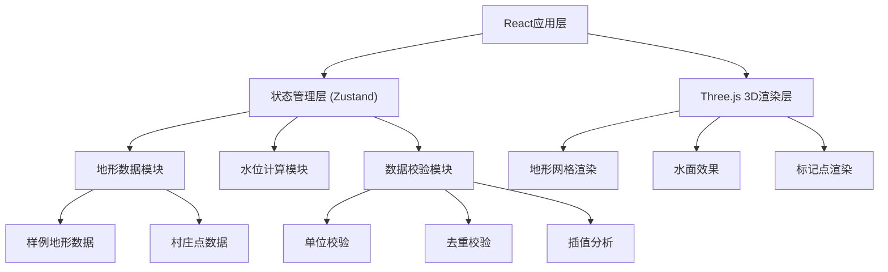

## 1. 架构设计



## 2. 技术描述

- **前端框架**: React@18 + TypeScript
- **构建工具**: Vite@5
- **样式方案**: TailwindCSS@3
- **3D渲染**: Three.js + @react-three/fiber + @react-three/drei
- **状态管理**: Zustand
- **数据可视化**: Recharts
- **后端**: 无（纯前端应用，数据本地存储）

## 3. 目录结构

```
src/
├── components/          # 组件目录
│   ├── ControlPanel/    # 左侧控制面板
│   ├── DetailPanel/     # 右侧明细面板
│   ├── Scene3D/         # 3D场景组件
│   └── Validation/      # 数据校验组件
├── store/               # Zustand状态管理
├── utils/               # 工具函数
│   ├── terrain.ts       # 地形计算
│   ├── validation.ts    # 数据校验
│   └── waterLevel.ts    # 水位计算
├── data/                # 样例数据
└── types/               # TypeScript类型定义
```

## 4. 数据模型

### 4.1 地形网格数据

```typescript
interface TerrainGrid {
  id: string;
  name: string;
  gridSize: { width: number; height: number };
  cellSize: number;
  elevations: number[][];
  minElevation: number;
  maxElevation: number;
  unit: 'meter' | 'feet';
  createdAt: string;
  updatedAt: string;
}
```

### 4.2 村庄点数据

```typescript
interface VillagePoint {
  id: string;
  name: string;
  x: number;
  y: number;
  elevation: number;
  population: number;
  riskLevel: 'low' | 'medium' | 'high';
  createdAt: string;
}
```

### 4.3 水位数据

```typescript
interface WaterLevelRecord {
  level: number;
  capacity: number;
  submergedArea: number;
  timestamp: string;
}
```

### 4.4 校验结果

```typescript
interface ValidationResult {
  type: 'error' | 'warning' | 'info';
  category: 'unit' | 'duplicate' | 'interpolation' | 'boundary' | 'gap';
  message: string;
  reason: string;
  suggestion: string;
  affectedData?: string[];
}
```

## 5. 状态管理设计

```typescript
interface AppState {
  // 地形数据
  terrain: TerrainGrid | null;
  villages: VillagePoint[];
  waterLevel: number;
  waterLevelHistory: WaterLevelRecord[];
  
  // UI状态
  selectedVillage: string | null;
  showContourLines: boolean;
  showSubmergedArea: boolean;
  
  // 校验状态
  validationResults: ValidationResult[];
  hasChanges: boolean;
  
  // Actions
  setTerrain: (terrain: TerrainGrid) => void;
  addVillage: (village: VillagePoint) => void;
  setWaterLevel: (level: number) => void;
  validateData: () => void;
  checkChanges: () => void;
}
```

## 6. 核心算法

### 6.1 淹没范围计算

```
输入：地形网格、目标水位
输出：淹没区域多边形
算法：
1. 遍历所有网格单元
2. 标记高程 < 水位的单元
3. 使用Marching Squares算法提取边界
4. 生成淹没区域多边形
```

### 6.2 库容计算

```
输入：地形网格、目标水位
输出：库容体积
算法：
1. 对每个淹没单元计算体积贡献
2. 使用梯形法积分计算总体积
3. 考虑网格分辨率进行校正
```

### 6.3 数据校验规则

1. **水位单位校验**：检查所有数据单位一致性
2. **村庄点去重**：基于坐标距离阈值判断重复
3. **库容插值分析**：检测异常值点，分析插值偏差原因
4. **参数越界检测**：检查高程值、水位值是否在合理范围
5. **数据缺口检测**：检测地形网格中的缺失数据区域
