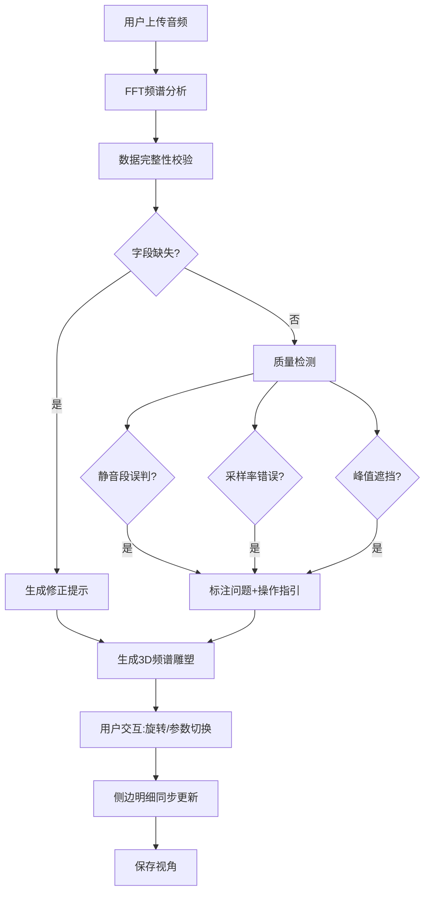

## 1. 产品概述

音乐频谱雕塑台是面向音乐制作教学的Web3D工具，将音频的频率、能量和时间三个维度转化为可旋转观察的3D形态，帮助学生建立频谱听觉与视觉的关联。

- 解决音乐制作教学中混音练习的可视化问题，让学生从单一波形观察转向多维度频谱理解
- 提供完整的数据质量校验体系，指导师生识别和修正音频数据问题

## 2. 核心功能

### 2.2 功能模块

1. **频谱雕塑主视图**：3D频谱可视化、旋转交互、视角控制
2. **参数切换面板**：频率范围、能量阈值、时间窗口参数调节
3. **音频导入系统**：文件上传、数据校验、错误修正提示
4. **侧边明细面板**：声部分层展示、峰值标注、质量问题清单
5. **视角管理**：视角保存、加载、命名管理

### 2.3 页面详情

| 页面名称 | 模块名称 | 功能描述 |
|----------|----------|----------|
| 主工作台 | 3D频谱雕塑 | Three.js渲染频率-能量-时间三维雕塑，支持鼠标拖拽旋转、滚轮缩放 |
| 主工作台 | 参数控制面板 | 切换可视化参数：频率范围(20Hz-20kHz)、能量阈值(-60dB到0dB)、时间窗口(1-10秒) |
| 主工作台 | 音频导入区 | 支持拖拽上传音频文件，实时分析频谱，生成频谱帧数据 |
| 主工作台 | 侧边明细栏 | 左侧显示声部分层（低频/中频/高频/超高频），右侧显示峰值标注点与数据质量问题清单 |
| 主工作台 | 视角管理 | 保存当前视角参数（相机位置、旋转角度），支持命名存储和快速切换 |

## 3. 核心流程

用户上传音频文件 → 系统进行FFT频谱分析 → 数据完整性校验（频谱帧、声部标签检查）→ 质量检测（静音段、采样率、峰值遮挡）→ 生成3D频谱雕塑 → 用户旋转观察/切换参数 → 查看侧边明细验证问题点 → 保存视角便于后续对比

## 4. 用户界面设计

### 4.1 设计风格

- **主色调**：深色背景(#0a0a0f)，频谱渐变色(深蓝→青→绿→黄→橙→红)
- **辅助色**：警告橙(#ff6b35)、错误红(#e63946)、成功绿(#2a9d8f)
- **字体**：显示字体用 Orbitron（科技感），正文字体用 JetBrains Mono（等宽易读）
- **布局**：左侧边栏(280px) + 中央3D视图(自适应) + 右侧边栏(320px)
- **视觉风格**：赛博朋克-音频工作室风格，霓虹光效、扫描线、网格地板

### 4.2 页面设计概述

| 页面名称 | 模块名称 | UI元素 |
|----------|----------|---------|
| 主工作台 | 3D频谱雕塑 | 半透明频谱柱体、X轴(频率)Y轴(能量)Z轴(时间)、网格参考线、峰值标记点 |
| 主工作台 | 参数控制面板 | 滑块控件、数值输入框、预设快速切换按钮 |
| 主工作台 | 音频导入区 | 拖拽上传区域、文件信息卡片、分析进度条 |
| 主工作台 | 侧边明细栏 | 声部能量条、峰值列表、问题卡片(带操作指引) |
| 主工作台 | 视角管理 | 保存按钮、视角列表、缩略图预览 |

### 4.3 响应性

- 桌面端优先(1280px+)，三栏布局
- 平板端(768-1279px)：左右边栏可折叠，中央视图自适应
- 移动端(<768px)：单栏布局，侧边栏改为底部抽屉

### 4.4 3D场景指引

- **环境**：深色空间，带微弱环境光，地板为半透明网格
- **光照**：3点光源系统，主光冷白色，补光蓝紫色，轮廓光青色
- **相机**：PerspectiveCamera，初始位置(30, 25, 30)，看向原点，OrbitControls控制
- **交互**：鼠标拖拽旋转、滚轮缩放、右键平移，双击重置视角
- **后处理**：Bloom效果让高亮频谱柱发光，轻微噪点增加质感
- **性能**：频谱柱体使用InstancedMesh，最多100x100=10000个实例
