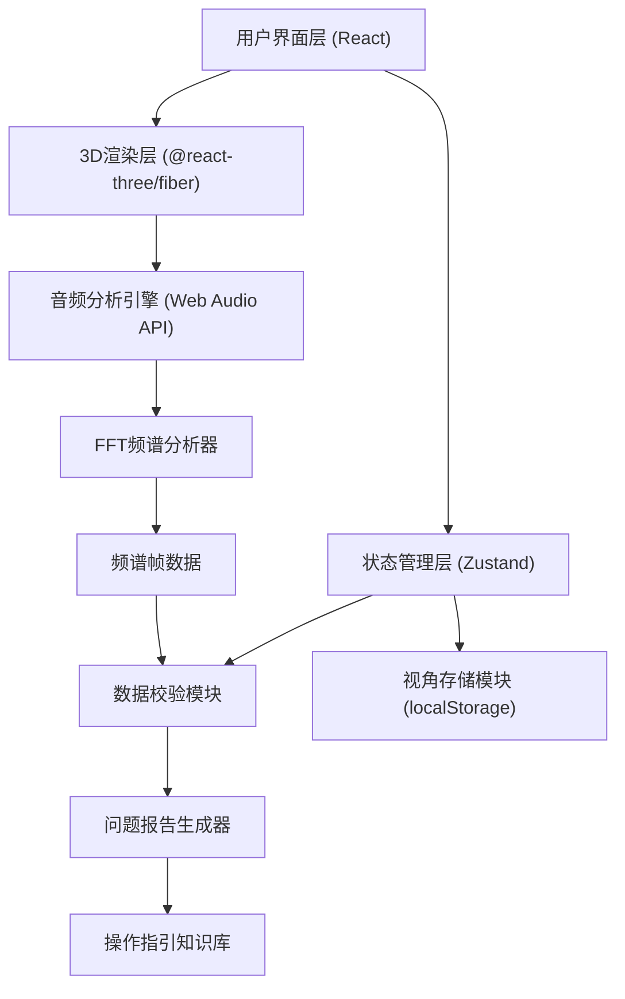

## 1. 架构设计



## 2. 技术描述

- **前端**：React@18 + TypeScript + Vite
- **3D引擎**：three@0.160 + @react-three/fiber@8 + @react-three/drei@9 + @react-three/postprocessing@2
- **状态管理**：Zustand@4
- **样式**：tailwindcss@3
- **音频处理**：原生 Web Audio API (AnalyserNode)
- **数据存储**：localStorage（视角配置）、内存存储（频谱数据）
- **无后端**：纯前端应用，所有分析在浏览器端完成

## 3. 目录结构

```
src/
├── components/
│   ├── Viewer3D/           # 3D频谱雕塑主视图
│   ├── SidebarLeft/        # 左侧边栏 - 声部分层
│   ├── SidebarRight/       # 右侧边栏 - 峰值标注/问题清单
│   ├── ControlPanel/       # 参数控制面板
│   ├── AudioUploader/      # 音频导入组件
│   └── ViewportManager/    # 视角管理组件
├── hooks/
│   ├── useAudioAnalyzer.ts # 音频分析Hook
│   └── useViewport.ts      # 视角控制Hook
├── store/
│   └── spectrumStore.ts    # 频谱数据状态管理
├── utils/
│   ├── audioValidator.ts   # 音频数据校验
│   ├── fftProcessor.ts     # FFT处理工具
│   └── colorMapper.ts      # 能量-颜色映射
├── types/
│   └── index.ts            # TypeScript类型定义
├── data/
│   └── guidance.json       # 问题操作指引知识库
├── App.tsx
├── main.tsx
└── index.css
```

## 4. 核心数据模型

### 4.1 频谱帧数据
```typescript
interface SpectrumFrame {
  time: number;           // 时间点(秒)
  frequencies: number[];  // 各频段能量值(dB)
  peakFrequency: number;  // 峰值频率
  peakEnergy: number;     // 峰值能量
}
```

### 4.2 声部标签
```typescript
interface VoiceLabel {
  name: string;           // 声部名称
  freqRange: [number, number]; // 频率范围
  energy: number;         // 当前能量
  color: string;          // 显示颜色
}
```

### 4.3 数据质量问题
```typescript
interface QualityIssue {
  type: 'missing_field' | 'silent_segment' | 'sample_rate_error' | 'peak_clipping';
  severity: 'warning' | 'error' | 'info';
  timeRange?: [number, number];
  message: string;
  guidance: {
    action: string;
    responsible: string;
    fileReference: string;
  };
}
```

### 4.4 视角配置
```typescript
interface ViewportConfig {
  id: string;
  name: string;
  camera: {
    position: [number, number, number];
    target: [number, number, number];
  };
  createdAt: number;
}
```

## 5. 音频校验规则

| 检查项 | 判定条件 | 处理方式 |
|--------|----------|----------|
| 缺失字段 | spectrum.frames.length === 0 或 voiceLabels 为 undefined | 生成修正提示，说明需要补充哪些字段 |
| 静音段误判 | 连续3帧以上能量 < -50dB，但实际音频有内容 | 标记为可疑静音段，建议人工确认 |
| 采样率错误 | 音频采样率 !== 44100 且 !== 48000 | 标注为非标准采样率，建议转码 |
| 峰值遮挡 | 任意频段能量 > -0.5dB | 标记为削波风险，建议降低增益 |
