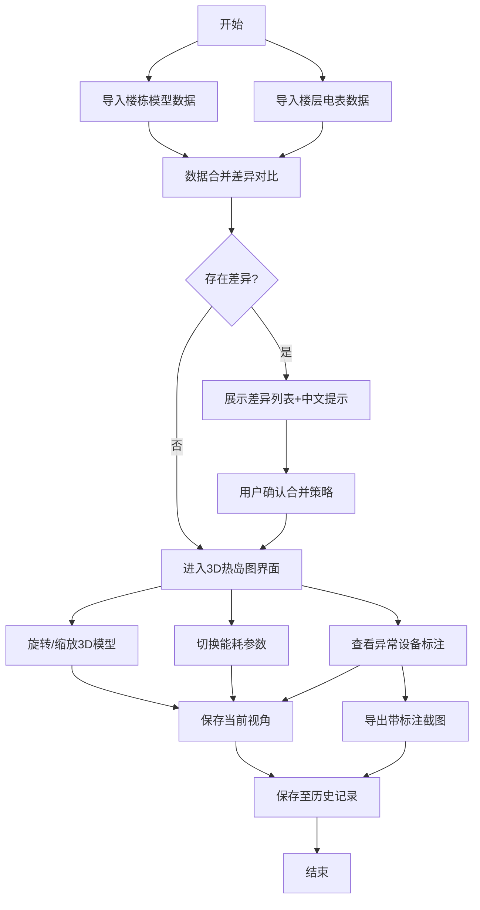

## 1. 产品概述
楼宇能耗热岛图Web3D工具，为园区能源经理提供可视化能耗监控平台，解决传统表格数据难以定位高负荷设备的痛点。支持3D模型交互、数据合并差异对比、异常标注和历史记录管理。
- 核心价值：将抽象能耗数据转化为直观3D热图，快速定位问题楼层和设备
- 目标用户：园区能源经理、设备维修队、物业管理人员

## 2. 核心功能

### 2.1 用户角色
| 角色 | 使用场景 | 核心需求 |
|------|----------|----------|
| 园区能源经理 | 日常能耗监控、会议汇报、异常排查 | 清晰的3D热图、异常标注、数据对比、截图导出、历史记录 |
| 维修队 | 定位高负荷设备 | 楼层设备定位、参数筛选、直观的问题指示 |
| 数据管理员 | 楼栋模型和电表数据维护 | 数据合并差异提示、冲突解决建议 |

### 2.2 功能模块
1. **3D楼宇热岛图主界面**：楼宇3D模型展示、能耗热图渲染、视角控制
2. **数据合并管理**：楼栋模型与电表数据导入、差异对比、冲突解决
3. **参数切换面板**：能耗类型切换、时间范围选择、楼层筛选
4. **异常检测与标注**：高负荷设备自动检测、文字标注、异常报告生成
5. **历史记录管理**：操作记录保存、视角恢复、避免重复结论
6. **截图导出功能**：带标注的3D视图截图、用于会议沟通

### 2.3 页面详情
| 页面名称 | 模块名称 | 功能描述 |
|---------|----------|----------|
| 主界面 | 3D视口 | 楼宇模型旋转、缩放、平移、视角保存/恢复 |
| 主界面 | 热图渲染 | 根据能耗数据渲染楼层/设备颜色渐变、支持鼠标悬停查看详情 |
| 主界面 | 参数面板 | 切换能耗类型(电/水/气)、选择时间范围、筛选楼层 |
| 主界面 | 异常标注层 | 高负荷设备红色边框+数字标注、点击查看详细信息 |
| 数据管理页 | 数据导入 | 上传楼栋模型JSON和电表数据CSV |
| 数据管理页 | 差异对比 | 并列展示两份数据差异、高亮新增/删除/修改项 |
| 数据管理页 | 冲突提示 | 楼层合并、设备重复的中文提示、能源经理可直接转述 |
| 历史记录页 | 记录列表 | 按时间展示历史操作、支持搜索筛选 |
| 历史记录页 | 视角恢复 | 点击记录恢复3D视角和参数设置 |
| 导出功能 | 截图导出 | 导出带标注的PNG图片、自动添加时间戳和说明 |

## 3. 核心流程
园区能源经理登录系统，导入最新楼栋模型和电表数据，系统自动对比并展示差异，确认合并后进入3D热岛图界面，通过旋转、缩放、切换参数查看能耗分布，系统自动高亮异常设备并标注，能源经理可保存视角、导出截图用于会议沟通，所有操作记录保存至历史记录。

## 4. 用户界面设计

### 4.1 设计风格
- **主色调**：深蓝(#1a365d)作为主色，体现专业科技感；橙色(#f97316)作为异常高亮色；绿色(#10b981)作为正常状态色
- **按钮风格**：圆角矩形(8px)，悬浮时轻微放大+阴影，点击时有按压效果
- **字体**：标题使用Noto Sans SC Bold，正文使用Noto Sans SC Regular，数字使用等宽字体JetBrains Mono
- **布局风格**：左侧参数面板+中间3D视口+右侧信息面板的三栏布局，数据管理和历史记录使用模态弹窗
- **图标风格**：使用线性图标，保持简洁统一，3D控制使用直观的方向箭头

### 4.2 页面设计概述
| 页面名称 | 模块名称 | UI元素 |
|---------|----------|--------|
| 主界面 | 顶部导航 | Logo、系统名称、数据管理按钮、历史记录按钮、导出按钮 |
| 主界面 | 左侧参数面板 | 能耗类型切换(单选卡)、时间选择器、楼层筛选(复选框)、视角保存按钮 |
| 主界面 | 3D视口 | 全高度3D画布、右下角视角控制按钮、鼠标操作提示 |
| 主界面 | 右侧信息面板 | 当前选中楼层/设备信息、能耗数值、异常说明、建议措施 |
| 主界面 | 异常标注 | 红色外发光边框+白色数字标签、悬浮显示详情卡片 |
| 数据管理 | 差异对比 | 左右分栏对比、差异行高亮、中文提示气泡、确认/忽略按钮 |
| 历史记录 | 记录列表 | 时间线布局、记录卡片、恢复视角按钮、删除按钮 |

### 4.3 响应式
- 桌面端(1920×1080)：三栏完整布局，3D视口占60%宽度
- 平板端：左右面板可折叠，3D视口全屏展示
- 移动端：优先保证3D视口，参数面板改为底部抽屉

### 4.4 3D场景指导
- **环境**：简约科技风格，深色渐变背景(#0f172a → #1e293b)，添加微弱网格地板增强空间感
- **光照**：主光源使用方向光模拟日光，辅助光使用环境光提亮暗部，异常设备添加点光源外发光效果
- **相机设置**：初始视角为45度俯角，支持轨道控制(OrbitControls)，限制最大仰角避免穿模
- **交互动画**：楼层选中时轻微上浮+高亮，异常设备脉冲发光，热图颜色平滑过渡
- **后处理**：添加轻微泛光(Bloom)效果增强科技感，异常标注添加光晕
- **性能优化**：楼宇使用实例化渲染，热图使用顶点着色器实现，LOD策略保证流畅
