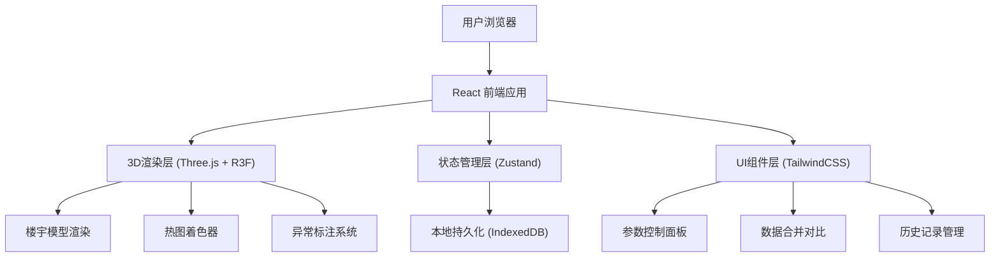
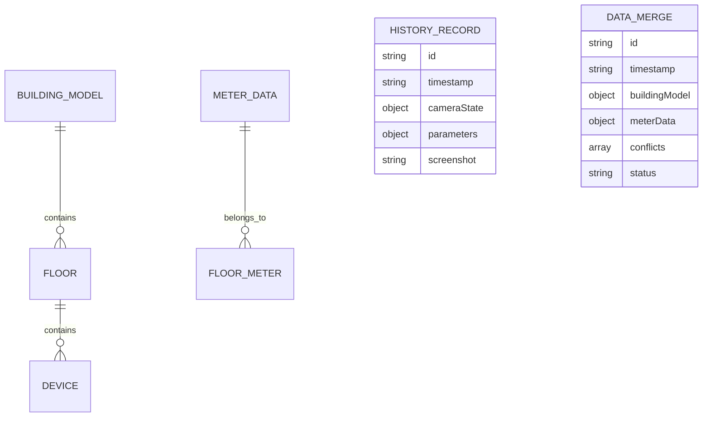

## 1. 架构设计



## 2. 技术描述
- **前端框架**: React@18 + TypeScript + Vite
- **3D渲染**: three@0.160 + @react-three/fiber@8.15 + @react-three/drei@9.92 + @react-three/postprocessing@2.15
- **状态管理**: zustand@4.4
- **样式方案**: tailwindcss@3.4 + postcss + autoprefixer
- **本地存储**: idb@8.0 (IndexedDB封装)
- **数据处理**: papaparse@5.4 (CSV解析) + html2canvas@1.4 (截图导出)
- **初始化工具**: npm create vite@latest

## 3. 路由定义
| 路由 | 页面/组件 | 功能说明 |
|------|-----------|----------|
| / | 主界面 | 3D热岛图展示、参数控制、异常标注 |
| /data-management | 数据管理模态框 | 数据导入、差异对比、冲突解决 |
| /history | 历史记录模态框 | 历史记录列表、视角恢复 |

## 4. 数据模型

### 4.1 数据模型定义



### 4.2 TypeScript 类型定义

```typescript
// 楼宇模型数据
interface BuildingModel {
  id: string;
  name: string;
  floors: Floor[];
  lastModified: string;
}

interface Floor {
  id: string;
  name: string;
  level: number;
  height: number;
  devices: Device[];
  position: [number, number, number];
  dimensions: [number, number, number];
}

interface Device {
  id: string;
  name: string;
  type: 'hvac' | 'lighting' | 'elevator' | 'other';
  position: [number, number, number];
  dimensions: [number, number, number];
}

// 电表数据
interface MeterData {
  id: string;
  period: { start: string; end: string };
  floorMeters: FloorMeter[];
  lastModified: string;
}

interface FloorMeter {
  floorId: string;
  floorName: string;
  energyConsumption: {
    electricity: number;
    water?: number;
    gas?: number;
  };
  devices: DeviceMeter[];
}

interface DeviceMeter {
  deviceId: string;
  deviceName: string;
  energyConsumption: {
    electricity: number;
    water?: number;
    gas?: number;
  };
  isAbnormal: boolean;
  abnormalReason?: string;
}

// 差异对比结果
interface MergeDiff {
  type: 'floor_added' | 'floor_removed' | 'floor_modified' | 'device_added' | 'device_removed' | 'device_duplicate' | 'meter_missing';
  floorId?: string;
  floorName?: string;
  deviceId?: string;
  deviceName?: string;
  oldValue?: any;
  newValue?: any;
  message: string;
  suggestion: string;
}

// 历史记录
interface HistoryRecord {
  id: string;
  timestamp: string;
  name: string;
  cameraState: {
    position: [number, number, number];
    target: [number, number, number];
  };
  parameters: {
    energyType: 'electricity' | 'water' | 'gas';
    timeRange: { start: string; end: string };
    selectedFloors: string[];
  };
  screenshot?: string;
  notes?: string;
}

// 应用状态
interface AppState {
  buildingModel: BuildingModel | null;
  meterData: MeterData | null;
  mergeDiffs: MergeDiff[];
  selectedFloor: string | null;
  selectedDevice: string | null;
  energyType: 'electricity' | 'water' | 'gas';
  timeRange: { start: string; end: string };
  historyRecords: HistoryRecord[];
  isDataManagementOpen: boolean;
  isHistoryOpen: boolean;
}
```

## 5. 核心组件结构

```
src/
├── components/
│   ├── layout/
│   │   ├── Header.tsx           # 顶部导航栏
│   │   ├── SidebarLeft.tsx      # 左侧参数面板
│   │   └── SidebarRight.tsx     # 右侧信息面板
│   ├── three/
│   │   ├── Building3D.tsx       # 3D楼宇主组件
│   │   ├── Floor3D.tsx          # 楼层3D组件
│   │   ├── Device3D.tsx         # 设备3D组件
│   │   ├── HeatmapMaterial.tsx  # 热图材质
│   │   ├── Annotations.tsx      # 异常标注组件
│   │   └── CameraControls.tsx   # 相机控制
│   ├── modals/
│   │   ├── DataManagement.tsx   # 数据管理模态框
│   │   ├── DiffComparison.tsx   # 差异对比组件
│   │   └── HistoryRecords.tsx   # 历史记录模态框
│   └── ui/                      # 基础UI组件
│       ├── Button.tsx
│       ├── Card.tsx
│       ├── Tabs.tsx
│       └── Badge.tsx
├── store/
│   ├── useAppStore.ts           # 应用状态管理
│   └── useHistoryStore.ts       # 历史记录管理
├── utils/
│   ├── dataMerge.ts             # 数据合并逻辑
│   ├── diffDetector.ts          # 差异检测
│   ├── heatmapColors.ts         # 热图颜色映射
│   ├── idb.ts                   # IndexedDB封装
│   └── screenshot.ts            # 截图导出
├── types/
│   └── index.ts                 # 类型定义
├── data/
│   └── mockData.ts              # 模拟数据
├── App.tsx
├── main.tsx
└── index.css
```

## 6. 关键技术实现点

### 6.1 3D热图渲染
- 使用自定义着色器材质(ShaderMaterial)实现能耗到颜色的映射
- 颜色渐变：绿色(#10b981) → 黄色(#eab308) → 橙色(#f97316) → 红色(#ef4444)
- 支持实时更新能耗数据和颜色过渡动画

### 6.2 数据合并与差异检测
- 深度对比楼栋模型和电表数据的结构差异
- 生成可被能源经理直接转述的中文提示
- 支持用户选择合并策略(保留模型/保留电表/手动选择)

### 6.3 历史记录持久化
- 使用IndexedDB存储历史记录，支持大数据量
- 记录相机位置、参数设置、缩略图截图
- 基于时间戳去重，避免重复结论
- 服务重启后数据不丢失

### 6.4 异常标注系统
- 3D空间中的HTML标注(CSS2DRenderer)
- 异常设备脉冲发光效果
- 点击标注显示详细信息面板

### 6.5 截图导出
- 使用html2canvas捕获3D画布和标注
- 自动添加时间戳、能耗参数水印
- 支持PNG格式下载
