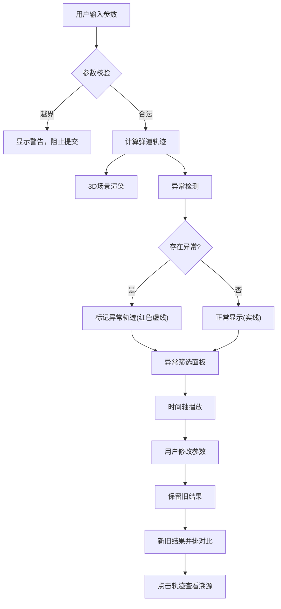

## 1. 产品概述

弹道抛物线实验室——面向物理社团的3D交互式抛体运动对比工具。社团练习抛体运动时总忽略空气阻力，本工具在3D空间中对比不同初速度、发射角度和阻力系数下的弹道轨迹，支持时间轴回放、异常检测和结果溯源，让每条结论都能追溯到具体参数来源。

- 目标用户：高中/大学物理社团老师和学生
- 核心价值：把"忽略空气阻力"的常见错误可视化，用3D对比直观展示阻力对弹道的真实影响

## 2. 核心功能

### 2.1 用户角色

| 角色 | 使用方式 | 核心权限 |
|------|----------|----------|
| 社团老师 | 直接使用 | 配置参数、修正参数、查看对比、筛选异常 |
| 学生 | 直接使用 | 调整参数、播放时间轴、查看轨迹与结论 |

### 2.2 功能模块

1. **3D弹道实验室页面**：3D轨迹渲染、参数面板、时间轴播放器、异常检测面板、结果对比视图

### 2.3 页面详情

| 页面名称 | 模块名称 | 功能描述 |
|----------|----------|----------|
| 3D弹道实验室 | 3D轨迹画布 | 渲染多条弹道轨迹（理想/有阻力），支持旋转缩放、拖动视角，轨迹穿越地面或发散时高亮标记 |
| 3D弹道实验室 | 参数输入面板 | 发射点坐标、初速度、发射角度、阻力系数输入，实时校验角度越界(0°-90°)、初速度正数、阻力系数非负，越界时阻止提交并显示警告 |
| 3D弹道实验室 | 时间轴播放器 | 播放/暂停/重置，拖动进度条查看任意时刻的位置、速度和受力状态，同步高亮3D场景中对应弹道点 |
| 3D弹道实验室 | 异常检测面板 | 自动检测轨迹穿地(y<0未落地)、阻力发散(轨迹无限延伸)等异常，支持按异常类型筛选，异常轨迹在3D场景中以红色虚线显示 |
| 3D弹道实验室 | 结果溯源标注 | 每条轨迹标注来源参数（初速度、角度、阻力系数），点击轨迹弹出详情卡片显示完整参数和计算公式 |
| 3D弹道实验室 | 手动修正与对比 | 修改初速度后，旧结果保留在左侧/上方，新结果渲染在右侧/下方，并排对比显示参数差异和轨迹偏差 |
| 3D弹道实验室 | 3D越界提醒 | 参数越界或数据缺口影响3D轨迹时，3D画布上方显示醒目警告横幅，不仅渲染场景 |

## 3. 核心流程

用户打开工具 → 输入发射参数（初速度、角度、阻力系数）→ 系统校验参数（越界则拦截并警告）→ 计算弹道轨迹（理想+有阻力）→ 3D场景渲染轨迹 → 异常检测（穿地/发散标记）→ 用户可拖动时间轴查看任意时刻状态 → 用户修改参数 → 旧结果保留，新结果并排展示 → 用户可筛选异常轨迹查看 → 点击轨迹溯源查看参数来源

## 4. 用户界面设计

### 4.1 设计风格

- 主色调：深空黑(#0a0e17) + 科技蓝(#00d4ff) + 警告橙(#ff6b35)
- 辅助色：暗灰(#1a1f2e)、中灰(#2a3040)、浅灰文字(#8892a4)
- 按钮：圆角8px，科技蓝主按钮，暗灰次按钮，警告橙异常按钮
- 字体：JetBrains Mono(数据/参数) + Noto Sans SC(中文界面)
- 布局：左侧参数面板(280px固定) + 中央3D画布(flex) + 底部时间轴 + 右侧异常/对比面板(可折叠)
- 图标：lucide-react 矢量图标

### 4.2 页面设计概览

| 页面名称 | 模块名称 | UI元素 |
|----------|----------|--------|
| 3D弹道实验室 | 3D轨迹画布 | 深空背景、网格地面、多色实线/虚线轨迹、发光弹道点、轴标签 |
| 3D弹道实验室 | 参数输入面板 | 深色卡片、数字输入框、范围滑块、实时校验提示、发射按钮 |
| 3D弹道实验室 | 时间轴播放器 | 进度条、播放/暂停/重置按钮、时间显示、速度标记点 |
| 3D弹道实验室 | 异常检测面板 | 异常类型标签(穿地/发散)、筛选开关、异常轨迹列表、红色高亮 |
| 3D弹道实验室 | 结果溯源标注 | 轨迹旁浮动标签、点击弹出详情卡片、参数回链 |
| 3D弹道实验室 | 手动修正与对比 | 分屏对比视图、参数差异高亮、轨迹叠加/分离切换 |
| 3D弹道实验室 | 3D越界提醒 | 画布顶部警告横幅、橙色边框闪烁、参数越界详情 |

### 4.3 响应式

- 桌面优先设计，最小支持1280px宽度
- 侧面板可折叠以适应小屏幕
- 3D画布始终占据主要空间

### 4.4 3D场景指引

- 环境：深空黑色背景，星空粒子点缀
- 光照：环境光(低强度) + 定向光(模拟太阳) + 轨迹发光效果
- 相机：透视相机，默认俯视30°角，支持OrbitControls旋转缩放
- 地面：半透明网格平面，Y=0处
- 轨迹：渐变色线条(理想轨迹青色、有阻力轨迹橙色)，异常轨迹红色虚线
- 交互：鼠标悬停轨迹高亮，点击弹出溯源信息
- 后处理：轨迹发光(Bloom效果)
