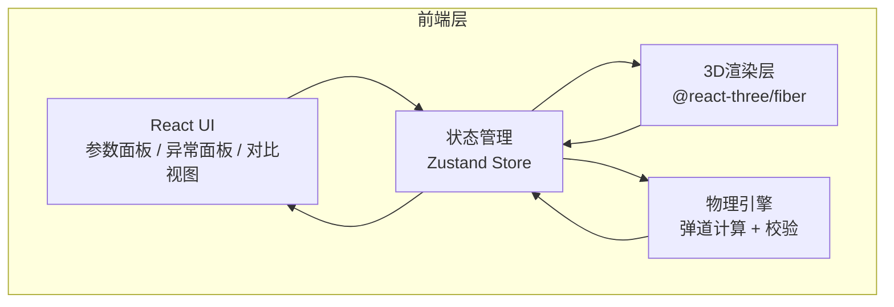

## 1. 架构设计



纯前端架构，无需后端服务。物理计算在浏览器端完成，状态由Zustand统一管理。

## 2. 技术说明

- 前端：React@18 + TypeScript + Tailwind CSS@3 + Vite
- 3D渲染：three + @react-three/fiber + @react-three/drei + @react-three/postprocessing
- 状态管理：zustand
- 初始化工具：vite-init (react-ts模板)
- 后端：无
- 数据库：无（所有数据在内存中计算）

## 3. 路由定义

| 路由 | 用途 |
|------|------|
| / | 3D弹道实验室主页面 |

## 4. 数据模型

### 4.1 核心数据结构

```typescript
interface LaunchParams {
  id: string
  name: string
  origin: [number, number, number]
  velocity: number
  angle: number
  dragCoefficient: number
  timestamp: number
}

interface TrajectoryPoint {
  t: number
  x: number
  y: number
  z: number
  vx: number
  vy: number
  vz: number
}

interface TrajectoryResult {
  id: string
  params: LaunchParams
  points: TrajectoryPoint[]
  idealPoints: TrajectoryPoint[]
  anomalies: Anomaly[]
  maxRange: number
  maxHeight: number
  flightTime: number
}

interface Anomaly {
  type: 'underground' | 'divergence' | 'angle_overflow' | 'velocity_invalid'
  message: string
  startIndex: number
  endIndex: number
  severity: 'warning' | 'error'
}

interface ComparisonPair {
  oldResult: TrajectoryResult
  newResult: TrajectoryResult
  paramDiff: Partial<LaunchParams>
}

interface SimState {
  trajectories: TrajectoryResult[]
  activeTrajectoryId: string | null
  selectedAnomalyFilter: Set<Anomaly['type']>
  timelinePosition: number
  isPlaying: boolean
  comparisonPair: ComparisonPair | null
  showComparison: boolean
}
```

### 4.2 物理计算模型

**理想抛物线（无阻力）：**
- x(t) = v₀·cos(θ)·t
- y(t) = v₀·sin(θ)·t - ½g·t²

**含空气阻力的弹道（线性阻力模型）：**
- 阻力 F_drag = -k·v（k为阻力系数）
- 采用四阶Runge-Kutta数值积分
- 时间步长 dt = 0.01s
- 当 y < 0 时标记穿地异常
- 当连续N步速度递增时标记发散异常

**参数校验规则：**
- 角度：0° < θ ≤ 90°（越界标记为angle_overflow，阻止发射）
- 初速度：v > 0（越界标记为velocity_invalid，阻止发射）
- 阻力系数：k ≥ 0（负值自动修正为0）
- 轨迹穿地：y < 0 且未检测到正常落地 → underground异常
- 阻力发散：|v| 连续递增超过阈值 → divergence异常

## 5. 组件结构

```
src/
├── components/
│   ├── Scene3D.tsx              # 3D场景主组件
│   ├── TrajectoryLine.tsx       # 单条轨迹渲染
│   ├── GroundGrid.tsx           # 地面网格
│   ├── ParamPanel.tsx           # 参数输入面板
│   ├── TimelinePlayer.tsx       # 时间轴播放器
│   ├── AnomalyPanel.tsx         # 异常检测面板
│   ├── ComparisonView.tsx       # 新旧结果对比视图
│   ├── TraceCard.tsx            # 溯源详情卡片
│   └── WarningBanner.tsx        # 3D越界提醒横幅
├── hooks/
│   ├── useBallisticCalc.ts      # 弹道计算Hook
│   └── useValidation.ts         # 参数校验Hook
├── utils/
│   ├── physics.ts               # 物理计算核心（RK4积分）
│   └── validation.ts            # 参数校验逻辑
├── store/
│   └── useSimStore.ts           # Zustand状态管理
├── pages/
│   └── LabPage.tsx              # 实验室主页面
├── App.tsx
└── main.tsx
```
