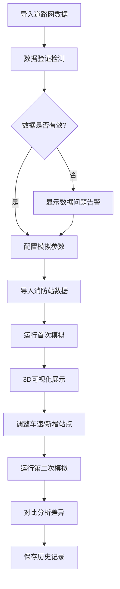

## 1. 产品概述

城市消防覆盖沙盘是一个交互式3D可视化决策工具，帮助消防规划员直观分析消防站响应时间、识别盲区街区、优化站点布局。支持多轮模拟对比、数据验证提醒、历史记录持久化。

- **核心目标**：解决新区规划中消防站位置争议，提供数据驱动的决策依据
- **目标用户**：消防规划员、城市规划师、应急管理部门
- **核心价值**：将抽象的消防覆盖数据转化为可交互、可解释的3D可视化体验

## 2. 核心功能

### 2.1 用户角色
| 角色 | 注册方式 | 核心权限 |
|------|----------|----------|
| 消防规划员 | 本地登录 | 导入数据、运行模拟、对比分析、导出报告 |

### 2.2 功能模块
1. **3D沙盘主界面**：城市3D网格、消防站标记、热力图覆盖、盲区高亮
2. **数据导入面板**：道路网、消防站、车速、人口数据导入与验证
3. **模拟控制中心**：参数配置、运行模拟、时间轴播放、筛选过滤
4. **对比分析视图**：两次运行结果对比、变化高亮、差异统计
5. **历史记录管理**：模拟历史查询、结果复用、避免重复计算
6. **告警提醒系统**：参数越界、数据缺口、计算异常实时提醒

### 2.3 页面详情
| 页面名称 | 模块名称 | 功能描述 |
|---------|----------|----------|
| 3D沙盘主页 | 城市3D场景 | 支持拖拽旋转、缩放、建筑高亮、响应时间热力图 |
| 3D沙盘主页 | 盲区街区标记 | 红色高亮超出响应时间阈值的街区，可点击查看详情 |
| 数据导入面板 | 数据上传 | 支持GeoJSON格式道路网、消防站CSV、车速配置 |
| 数据导入面板 | 数据验证 | 检测断路、重复人口、响应时间超限等数据问题 |
| 模拟控制中心 | 参数配置 | 响应时间阈值、车速系数、消防站选择等参数 |
| 模拟控制中心 | 时间轴播放 | 动态展示不同时段消防响应能力变化 |
| 对比分析视图 | 差异可视化 | 两次模拟结果叠加显示，变化区域高亮 |
| 对比分析视图 | 统计报告 | 响应时间变化、盲区增减、覆盖范围变化 |
| 历史记录面板 | 历史列表 | 所有模拟运行记录，支持搜索、筛选、重命名 |
| 告警提醒系统 | 实时告警 | 3D场景内浮层提醒参数越界、数据缺口 |

## 3. 核心流程

用户导入道路网和消防站数据 → 系统验证数据完整性 → 配置模拟参数 → 运行首次覆盖计算 → 查看3D热力图和盲区 → 调整车速或新增站点 → 运行第二次模拟 → 对比分析变化 → 保存历史记录

## 4. 用户界面设计

### 4.1 设计风格
- **主色调**：深海军蓝 (#0A2463) - 专业、可信
- **辅助色**：消防红 (#E63946) - 告警、盲区标记；安全绿 (#2A9D8F) - 正常覆盖；预警橙 (#F4A261) - 边界区域
- **中性色**：炭黑背景 (#1A1A2E)、深灰面板 (#16213E)、浅灰文字 (#E8E8E8)
- **按钮风格**：圆角8px，悬停有微妙发光效果，危险操作使用红色边框
- **字体**：标题使用 Orbitron（科技感），正文使用 Inter（清晰易读）
- **布局风格**：暗色系科技风，左侧控制面板 + 中央3D场景 + 右侧信息面板
- **图标风格**：线性图标，消防主题元素（消防车、消火栓、警示标志）

### 4.2 页面设计概述
| 页面名称 | 模块名称 | UI元素 |
|---------|----------|--------|
| 3D沙盘主页 | 城市3D场景 | 深色背景、蓝绿色建筑、红色热力图渐变、光晕效果 |
| 3D沙盘主页 | 告警浮层 | 半透明红色圆角面板，闪烁边框提醒 |
| 数据导入面板 | 上传区域 | 虚线边框拖放区，文件图标动画 |
| 模拟控制中心 | 时间轴 | 渐变进度条，可拖拽滑块，刻度标记 |
| 对比分析视图 | 差异面板 | 左右分屏或叠加模式，切换动画 |
| 历史记录面板 | 记录卡片 | 悬停上浮效果，时间戳徽章 |

### 4.3 响应式
- 桌面端优先设计（1920×1080）
- 平板适配：左右面板可折叠收起
- 不支持移动端（专业工具，需大屏操作）

### 4.4 3D场景指导
- **环境**：夜间城市氛围，深蓝天空盒，微弱环境光
- **光照设置**：主方向光模拟月光，建筑边缘轮廓光，消防站位置有聚光效果
- **相机设置**：透视相机，初始45度俯视，支持轨道控制（旋转、缩放、平移）
- **构图与焦点**：消防站为视觉焦点，使用光晕和高度突出
- **交互与动画**：建筑选中时轻微上浮，热力图颜色平滑过渡，时间轴播放时有流动动画
- **后期处理**：Bloom光晕效果、轻微噪点、景深（远处建筑模糊）
- **性能预算**：建筑数量控制在2000以内，帧率稳定30fps以上
