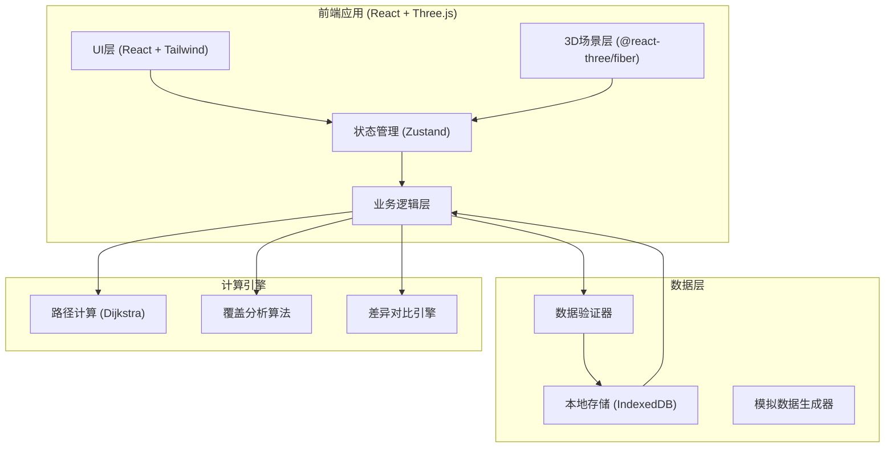
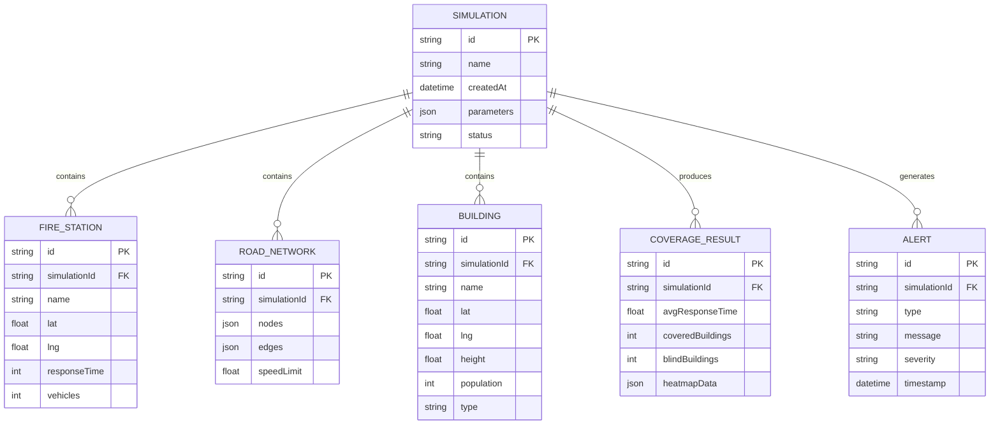

## 1. 架构设计



## 2. 技术描述

- **前端框架**: React@18 + TypeScript
- **构建工具**: Vite@5
- **样式方案**: TailwindCSS@3
- **3D渲染**: Three.js + @react-three/fiber + @react-three/drei
- **后期处理**: @react-three/postprocessing
- **状态管理**: Zustand（轻量、支持持久化）
- **本地数据库**: IndexedDB (via idb 库)
- **路径计算**: 自定义 Dijkstra 算法实现
- **图标库**: Lucide React
- **后端**: 无（纯前端应用，数据本地存储）

## 3. 路由定义

| 路由 | 用途 |
|------|------|
| / | 3D沙盘主界面（单页应用，所有功能在同一页面） |

## 4. 数据模型

### 4.1 数据模型定义



### 4.2 状态存储结构

```typescript
// Zustand Store 定义
interface FireStation {
  id: string;
  name: string;
  position: [number, number, number];
  responseTime: number;
  vehicles: number;
}

interface Building {
  id: string;
  name: string;
  position: [number, number, number];
  height: number;
  population: number;
  type: 'residential' | 'commercial' | 'industrial';
}

interface RoadNode {
  id: string;
  position: [number, number];
}

interface RoadEdge {
  id: string;
  from: string;
  to: string;
  distance: number;
  speedLimit: number;
  isBlocked: boolean;
}

interface CoverageResult {
  buildingId: string;
  responseTime: number;
  fireStationId: string;
  isBlind: boolean;
}

interface Simulation {
  id: string;
  name: string;
  createdAt: number;
  parameters: {
    responseThreshold: number;
    speedCoefficient: number;
  };
  fireStations: FireStation[];
  buildings: Building[];
  roadNodes: RoadNode[];
  roadEdges: RoadEdge[];
  results: CoverageResult[];
  alerts: Alert[];
}

interface Alert {
  id: string;
  type: 'parameter' | 'data' | 'calculation';
  severity: 'warning' | 'error' | 'info';
  message: string;
  timestamp: number;
}
```

## 5. 核心算法模块

### 5.1 路径计算模块
```typescript
// Dijkstra 最短路径算法
function calculateShortestPath(
  nodes: RoadNode[],
  edges: RoadEdge[],
  start: string,
  end: string
): { distance: number; path: string[] } | null;
```

### 5.2 覆盖分析模块
```typescript
// 计算消防站覆盖范围
function calculateCoverage(
  fireStations: FireStation[],
  buildings: Building[],
  roadNetwork: { nodes: RoadNode[]; edges: RoadEdge[] },
  parameters: { speedCoefficient: number }
): CoverageResult[];
```

### 5.3 数据验证模块
```typescript
// 验证数据完整性
function validateData(
  fireStations: FireStation[],
  buildings: Building[],
  roadEdges: RoadEdge[]
): Alert[];

// 检测断路
function detectBrokenRoads(edges: RoadEdge[]): Alert[];

// 检测重复人口
function detectDuplicatePopulation(buildings: Building[]): Alert[];
```

### 5.4 差异对比模块
```typescript
// 对比两次模拟结果
function compareSimulations(
  sim1: Simulation,
  sim2: Simulation
): {
  changedBuildings: string[];
  responseTimeDiff: Map<string, number>;
  newBlindSpots: string[];
  resolvedBlindSpots: string[];
};
```

## 6. 性能优化策略

1. **3D渲染优化**：
   - 建筑使用 InstancedMesh 批量渲染
   - 视锥体剔除（Frustum Culling）
   - LOD（Level of Detail）多层次细节

2. **计算优化**：
   - 路径计算使用 Web Worker 后台执行
   - 结果缓存机制，避免重复计算
   - 增量更新，只重新计算变化部分

3. **存储优化**：
   - IndexedDB 分块存储大数据
   - 历史记录压缩存储
   - 自动清理过期缓存
