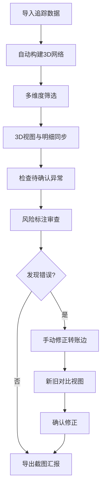

## 1. 产品概述

链上资金流3D可视化交互平台，为安全分析师提供直观的加密货币资金追踪工具，解决传统报告冗长、人工凑表效率低下的问题。通过Three.js 3D力导向图展示钱包地址、转账关系和交易时间的关联，支持风险标注、手动修正和结果对比，大幅提升资金流向分析和汇报效率。

- **核心问题**：钱包追踪报告冗长，客户只关心中转地址流向；内部转账误标、跨链重复、节点过密等异常容易被忽略；缺少可视化沟通工具和修正对比机制
- **目标用户**：安全分析师、区块链审计人员、合规调查人员
- **产品价值**：将抽象的链上数据转化为可交互的3D网络视图，同步筛选与明细，支持人工修正与对比，大幅降低沟通成本和返工率

---

## 2. 核心功能

### 2.1 用户角色

| 角色 | 注册方式 | 核心权限 |
|------|----------|----------|
| 安全分析师 | 内部系统登录 | 3D视图操作、筛选分析、标注风险、手动修正、导出截图、对比视图 |
| 管理人员 | 内部系统登录 | 查看分析结果、审批修正记录 |

### 2.2 功能模块

1. **3D资金流视图**：力导向网络展示钱包节点、转账边、时间轴动画
2. **筛选面板**：按地址、金额、时间、风险等级、链类型筛选
3. **交易明细面板**：点击节点/边显示详细交易记录，与3D视图同步高亮
4. **风险标注系统**：颜色编码 + 文字标签双重标识风险等级
5. **待确认区**：集中展示内部转账误标、跨链重复、节点过密的异常项
6. **手动修正入口**：修改转账边属性、标记/取消标记风险
7. **新旧对比视图**：修正前后结果并排展示，高亮差异
8. **截图导出**：一键导出当前3D视图为图片用于汇报

### 2.3 页面详情

| 页面名称 | 模块名称 | 功能描述 |
|----------|----------|----------|
| 主分析页 | 3D视图区 | 可旋转、缩放、拖拽的3D力导向网络，节点代表钱包，边代表转账，支持时间轴播放 |
| 主分析页 | 左侧筛选面板 | 多维度筛选条件，筛选结果实时同步到3D视图和明细面板 |
| 主分析页 | 右侧明细面板 | 显示选中节点/边的交易详情，支持批量操作和风险标记 |
| 主分析页 | 底部待确认区 | 抽屉式面板，展示三类异常：内部转账误标、跨链重复、节点过密 |
| 修正对比页 | 左右分栏对比 | 左侧原始数据、右侧修正后数据，高亮显示差异边和节点 |
| 修正对比页 | 修正记录面板 | 显示所有手动修正的历史记录，支持撤销和重做 |

---

## 3. 核心流程

安全分析师的典型工作流程：

1. 导入钱包追踪数据 → 系统自动构建3D资金网络
2. 使用筛选面板聚焦目标地址和时间范围 → 3D视图和明细同步更新
3. 检查待确认区的异常项 → 点击自动定位到3D视图中的对应位置
4. 审查风险标注 → 确认或调整风险等级
5. 发现标注错误 → 进入手动修正模式 → 修改转账边属性
6. 切换到对比视图 → 并排查看修正前后差异
7. 调整3D视角和标签显示 → 导出高清截图用于汇报

---

## 4. 用户界面设计

### 4.1 设计风格

- **主色调**：深空蓝 `#0a1628` 作为背景，营造专业数据分析氛围
- **辅助色**：
  - 低风险：翠绿色 `#10b981`
  - 中风险：琥珀黄 `#f59e0b`
  - 高风险：珊瑚红 `#ef4444`
  - 待确认：紫罗兰 `#8b5cf6`
  - 选中高亮：霓虹青 `#06b6d4`
- **字体**：
  - 标题：Space Mono 等宽字体，体现技术感和数据属性
  - 正文：Inter 清晰易读的无衬线字体
  - 地址显示：JetBrains Mono 等宽字体，确保哈希值对齐
- **布局风格**：三栏式专业布局，左侧筛选、中间3D视图、右侧明细，底部可拉出待确认区
- **视觉元素**：玻璃态面板、霓虹发光边框、扫描线动效、节点脉冲动画
- **图标风格**：线性简约图标，配合发光效果

### 4.2 页面设计概述

| 页面名称 | 模块名称 | UI元素 |
|----------|----------|--------|
| 主分析页 | 3D视图区 | 深色星空背景、发光节点、流动光效边、悬浮信息标签、时间轴进度条、视角控制按钮 |
| 主分析页 | 筛选面板 | 玻璃态卡片、分段控件、范围滑块、下拉选择器、颜色图例、重置按钮 |
| 主分析页 | 明细面板 | 可折叠交易列表、风险标签徽章、时间戳格式化、地址复制按钮、标记操作按钮 |
| 主分析页 | 待确认区 | 三栏分类卡片、计数徽章、一键定位按钮、批量处理选项 |
| 修正对比页 | 对比视图 | 左右分栏、联动缩放、差异高亮连接线、差异统计面板 |

### 4.3 3D场景指导

- **环境**：深空背景配合微弱星点，营造沉浸式数据宇宙氛围
- **光照**：
  - 环境光：低强度蓝色环境光，确保暗部可见
  - 主光源：冷白色方向光，从左上45度照射，产生柔和阴影
  - 点光源：每个风险节点自带对应颜色的发光点光源
  - 边缘光： rim light 勾勒节点轮廓，增强3D感
- **相机设置**：
  - 初始位置：(0, 30, 50) 俯视角
  - 控制器：OrbitControls 支持旋转、缩放、平移
  - 自动旋转：可开关，默认关闭
- **节点设计**：
  - 普通地址：低多边形球体，半径与交易次数正相关
  - 中转地址：八面体几何体，带旋转动画
  - 风险地址：十二面体，带脉冲缩放动画和发光材质
  - 选中节点：外发光光环 + 标签始终面向相机
- **边设计**：
  - 普通转账：半透明发光管线，粗细与转账金额正相关
  - 大额转账：带流动光效的虚线管
  - 风险转账：双色渐变 + 箭头指示方向
  - 待确认边：闪烁虚线 + 问号图标
- **交互与动画**：
  - 节点悬停：放大 + 显示详细标签
  - 节点拖拽：可重新定位节点，力导向图实时更新
  - 时间轴播放：边按交易时间顺序渐入，节点按活跃度变化
  - 筛选过渡：淡出/淡入动画，避免突兀变化
- **后处理效果**：
  - Bloom泛光：增强发光节点和边的视觉效果
  - 轻微色差：提升科技感
  - FXAA抗锯齿：保证边缘平滑

### 4.4 响应式设计

- **桌面优先**：1920×1080及以上分辨率为主要设计目标
- **平板适配**：筛选面板和明细面板可折叠为侧边抽屉
- **触摸优化**：支持双指缩放、单指旋转、长按选中
- **大屏支持**：2K/4K分辨率下自动缩放UI元素，保持清晰

---

## 5. 非功能性需求

- **性能要求**：支持1000+节点、5000+边流畅渲染（60fps）
- **交互延迟**：筛选操作响应时间 < 100ms
- **导出质量**：支持4K分辨率截图导出
- **数据安全**：所有操作在本地完成，不上传敏感链上数据
