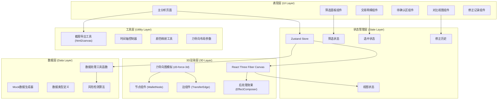
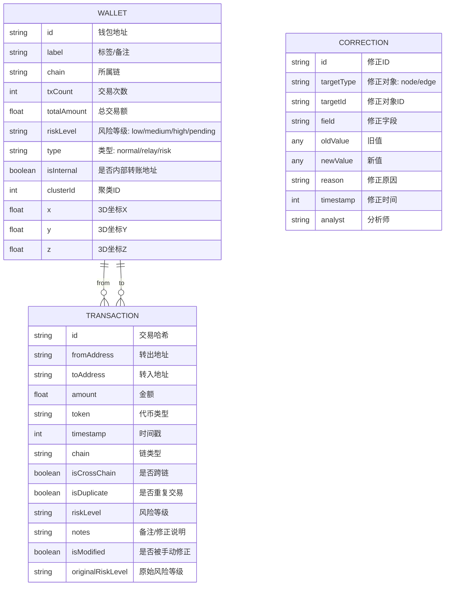

## 1. 架构设计

本项目为纯前端单页应用，所有数据处理和可视化均在浏览器端完成，确保敏感链上数据安全。采用分层架构，将3D渲染、业务逻辑、状态管理和UI组件清晰分离。



---

## 2. 技术描述

### 2.1 核心技术栈

- **前端框架**：React@18 + TypeScript
- **构建工具**：Vite@5
- **样式方案**：TailwindCSS@3 + CSS变量
- **3D渲染**：
  - Three@0.160
  - @react-three/fiber@8.15
  - @react-three/drei@9.92
  - @react-three/postprocessing@2.15
- **力导向布局**：d3-force-3d@3
- **状态管理**：Zustand@4
- **图标库**：@radix-ui/react-icons
- **UI组件**：Radix UI Primitives
- **截图导出**：html2canvas@1.4
- **动画库**：framer-motion@10

### 2.2 项目结构

```
/
├── src/
│   ├── components/
│   │   ├── ui/                    # 基础UI组件（按钮、卡片、滑块等）
│   │   ├── layout/                # 布局组件
│   │   ├── FilterPanel/           # 筛选面板
│   │   ├── DetailPanel/           # 交易明细面板
│   │   ├── PendingArea/           # 待确认区
│   │   ├── CompareView/           # 对比视图
│   │   └── Scene3D/               # 3D场景相关组件
│   │       ├── Canvas3D.tsx
│   │       ├── WalletNode.tsx
│   │       ├── TransferEdge.tsx
│   │       ├── ForceGraph.tsx
│   │       ├── Labels.tsx
│   │       └── Timeline.tsx
│   ├── store/                     # Zustand状态管理
│   │   └── useAppStore.ts
│   ├── types/                     # TypeScript类型定义
│   │   └── index.ts
│   ├── data/                      # 数据层
│   │   ├── mockData.ts
│   │   └── riskDetector.ts
│   ├── utils/                     # 工具函数
│   │   ├── colors.ts
│   │   ├── export.ts
│   │   └── forceLayout.ts
│   ├── hooks/                     # 自定义Hooks
│   │   ├── useForceSimulation.ts
│   │   └── useTimeline.ts
│   ├── App.tsx
│   ├── main.tsx
│   └── index.css
├── public/
├── vite.config.ts
├── tsconfig.json
├── tailwind.config.js
└── package.json
```

---

## 3. 路由定义

| 路由 | 页面/组件 | 功能描述 |
|------|----------|----------|
| `/` | 主分析页 | 3D资金流视图 + 筛选面板 + 明细面板 + 待确认区 |
| `/compare` | 对比视图页 | 左右分栏展示修正前后数据对比 |

---

## 4. 数据模型

### 4.1 核心数据类型定义



### 4.2 TypeScript 类型定义

```typescript
// 钱包节点类型
export interface WalletNode {
  id: string;
  label: string;
  chain: ChainType;
  txCount: number;
  totalAmount: number;
  riskLevel: RiskLevel;
  type: NodeType;
  isInternal: boolean;
  clusterId: number;
  x?: number;
  y?: number;
  z?: number;
  vx?: number;
  vy?: number;
  vz?: number;
}

// 转账边类型
export interface TransferEdge {
  id: string;
  source: string;
  target: string;
  amount: number;
  token: string;
  timestamp: number;
  chain: ChainType;
  isCrossChain: boolean;
  isDuplicate: boolean;
  riskLevel: RiskLevel;
  notes?: string;
  isModified?: boolean;
  originalRiskLevel?: RiskLevel;
}

// 风险等级
export type RiskLevel = 'low' | 'medium' | 'high' | 'pending';

// 节点类型
export type NodeType = 'normal' | 'relay' | 'risk';

// 链类型
export type ChainType = 'ETH' | 'BTC' | 'SOL' | 'BSC' | 'Polygon';

// 筛选条件
export interface FilterCriteria {
  searchAddress: string;
  amountRange: [number, number];
  timeRange: [number, number];
  riskLevels: RiskLevel[];
  chains: ChainType[];
  showInternal: boolean;
  showCrossChain: boolean;
  minTxCount: number;
}

// 应用状态
export interface AppState {
  nodes: WalletNode[];
  edges: TransferEdge[];
  filteredNodes: WalletNode[];
  filteredEdges: TransferEdge[];
  selectedNodeId: string | null;
  selectedEdgeId: string | null;
  filters: FilterCriteria;
  corrections: Correction[];
  originalDataSnapshot: { nodes: WalletNode[]; edges: TransferEdge[] } | null;
  isCompareMode: boolean;
  pendingItems: PendingItem[];
  showLabels: boolean;
  autoRotate: boolean;
  timelinePosition: number;
  isPlaying: boolean;
}

// 待确认项类型
export type PendingType = 'internal_mislabel' | 'cross_chain_duplicate' | 'dense_cluster';

export interface PendingItem {
  id: string;
  type: PendingType;
  description: string;
  relatedNodeIds: string[];
  relatedEdgeIds: string[];
}
```

---

## 5. 核心算法与实现方案

### 5.1 3D力导向图实现

使用 `d3-force-3d` 进行力导向模拟，关键参数：

```typescript
// 力导向模拟配置
export const FORCE_CONFIG = {
  charge: -300,           // 节点斥力
  linkDistance: 80,       // 边目标距离
  linkStrength: 0.5,      // 边强度
  centerStrength: 0.1,    // 中心引力
  collideRadius: 25,      // 碰撞半径
  decay: 0.02,            // 衰减系数
  velocityDecay: 0.4,     // 速度衰减
};

// 自定义Hook：useForceSimulation
export function useForceSimulation(
  nodes: WalletNode[],
  edges: TransferEdge[]
) {
  const simulationRef = useRef<ForceSimulation | null>(null);
  
  useEffect(() => {
    if (!nodes.length) return;
    
    const simulation = d3.forceSimulation(nodes)
      .force('link', d3.forceLink(edges).id(d => d.id)
        .distance(FORCE_CONFIG.linkDistance)
        .strength(FORCE_CONFIG.linkStrength))
      .force('charge', d3.forceManyBody().strength(FORCE_CONFIG.charge))
      .force('center', d3.forceCenter(0, 0).strength(FORCE_CONFIG.centerStrength))
      .force('collision', d3.forceCollide().radius(FORCE_CONFIG.collideRadius))
      .force('x', d3.forceX(0).strength(0.05))
      .force('y', d3.forceY(0).strength(0.05))
      .force('z', d3.forceZ(0).strength(0.05));
    
    simulationRef.current = simulation;
    return () => simulation.stop();
  }, [nodes, edges]);
  
  return simulationRef;
}
```

### 5.2 风险检测算法

```typescript
// 自动检测待确认项
export function detectPendingItems(
  nodes: WalletNode[],
  edges: TransferEdge[]
): PendingItem[] {
  const items: PendingItem[] = [];
  
  // 1. 检测内部转账误标
  edges.filter(e => e.riskLevel === 'high' && e.isInternal).forEach(edge => {
    items.push({
      id: `internal_${edge.id}`,
      type: 'internal_mislabel',
      description: `内部转账 ${edge.id.slice(0, 8)} 被误标为高风险`,
      relatedNodeIds: [edge.source, edge.target],
      relatedEdgeIds: [edge.id],
    });
  });
  
  // 2. 检测跨链重复交易
  const edgeGroups = groupBy(edges, e => `${e.source}-${e.target}-${e.amount}`);
  Object.entries(edgeGroups)
    .filter(([, group]) => group.length > 1 && group.some(e => e.isCrossChain))
    .forEach(([key, group]) => {
      items.push({
        id: `duplicate_${key}`,
        type: 'cross_chain_duplicate',
        description: `检测到 ${group.length} 笔跨链重复交易`,
        relatedNodeIds: [...new Set(group.flatMap(e => [e.source, e.target]))],
        relatedEdgeIds: group.map(e => e.id),
      });
    });
  
  // 3. 检测过密节点聚类
  const clusters = detectDenseClusters(nodes, edges, 10);
  clusters.forEach((cluster, idx) => {
    items.push({
      id: `dense_${idx}`,
      type: 'dense_cluster',
      description: `聚类包含 ${cluster.nodeIds.length} 个地址，连接过于密集`,
      relatedNodeIds: cluster.nodeIds,
      relatedEdgeIds: cluster.edgeIds,
    });
  });
  
  return items;
}
```

### 5.3 着色方案

```typescript
// 颜色映射配置
export const COLORS = {
  background: '#0a1628',
  node: {
    low: '#10b981',
    medium: '#f59e0b',
    high: '#ef4444',
    pending: '#8b5cf6',
    selected: '#06b6d4',
    normal: '#3b82f6',
    relay: '#ec4899',
  },
  edge: {
    low: 'rgba(16, 185, 129, 0.6)',
    medium: 'rgba(245, 158, 11, 0.6)',
    high: 'rgba(239, 68, 68, 0.8)',
    pending: 'rgba(139, 92, 246, 0.7)',
    modified: 'rgba(6, 182, 212, 0.9)',
  },
  glow: {
    low: '#10b981',
    medium: '#f59e0b',
    high: '#ef4444',
    pending: '#8b5cf6',
    selected: '#06b6d4',
  },
};

// 根据风险等级获取节点颜色
export function getNodeColor(riskLevel: RiskLevel, isSelected: boolean): string {
  if (isSelected) return COLORS.node.selected;
  return COLORS.node[riskLevel] || COLORS.node.normal;
}

// 根据转账金额获取边粗细
export function getEdgeWidth(amount: number): number {
  return Math.max(0.5, Math.min(8, Math.log10(amount + 1) * 0.8));
}
```

---

## 6. 性能优化策略

### 6.1 3D渲染优化

- **实例化渲染**：使用 `InstancedMesh` 批量渲染相同几何体的节点
- **LOD (Level of Detail)**：根据相机距离切换节点细节层级
- **视锥体剔除**：Three.js 内置，自动剔除视锥外的对象
- **WebGLRenderer 配置**：启用抗锯齿、幂等纹理、合理像素比

### 6.2 数据处理优化

- **记忆化计算**：使用 `useMemo` 缓存筛选结果和派生数据
- **Web Worker**：力导向模拟和风险检测在 Web Worker 中运行
- **虚拟滚动**：明细面板使用虚拟列表处理大量交易记录

### 6.3 动画优化

- **requestAnimationFrame**：所有动画与浏览器刷新率同步
- **transform 动画**：使用 CSS transform 而非 top/left 避免重排
- **节流防抖**：筛选输入使用防抖，力导向更新使用节流

---

## 7. 外部依赖说明

| 依赖包 | 版本 | 用途 | 是否必须 |
|--------|------|------|----------|
| three | ^0.160.0 | 3D渲染核心库 | 是 |
| @react-three/fiber | ^8.15.0 | React Three.js 渲染器 | 是 |
| @react-three/drei | ^9.92.0 | 3D 辅助组件库 | 是 |
| @react-three/postprocessing | ^2.15.0 | 后处理效果（Bloom等） | 是 |
| d3-force-3d | ^3.0.5 | 3D力导向布局算法 | 是 |
| zustand | ^4.4.0 | 轻量级状态管理 | 是 |
| html2canvas | ^1.4.1 | 截图导出 | 是 |
| framer-motion | ^10.16.0 | UI动画 | 是 |
| tailwindcss | ^3.3.5 | 原子化CSS | 是 |
| @radix-ui/react-icons | ^1.3.0 | 图标库 | 是 |
| @radix-ui/react-slider | ^1.1.2 | 范围滑块组件 | 是 |
| @radix-ui/react-select | ^2.0.0 | 下拉选择组件 | 是 |

---

## 8. 开发与构建

- **开发命令**：`npm run dev`
- **构建命令**：`npm run build`
- **类型检查**：`npm run typecheck`
- **代码规范**：ESLint + Prettier
- **浏览器兼容**：Chrome 90+, Firefox 88+, Safari 14+
