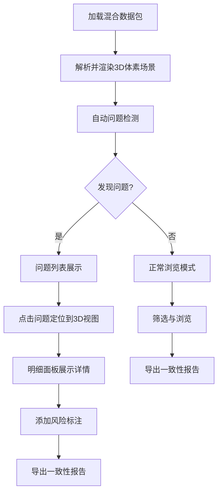

## 1. 产品概述

城市风环境体素图是一个面向建筑顾问的交互式三维风场分析工具，解决高层方案报批时二维箭头图无法说服审查方的问题。系统将建筑体块、风速场与行人区数据融合为可交互的3D体素场景，自动检测风向异常、体素空洞与测点遮挡等常见问题，并提供清晰标注的风险高亮和一致性导出功能，确保截图沟通和文件结论均可追溯。

- 目标用户：建筑顾问、城市规划师、风环境评审人员
- 核心价值：将"说不清"的风环境数据变成"看得见、查得到、下得来"的交互证据

## 2. 核心功能

### 2.1 用户角色

| 角色 | 使用方式 | 核心权限 |
|------|----------|----------|
| 建筑顾问 | 直接访问 | 加载数据、筛选体素、标注风险、导出报告 |
| 评审人员 | 查看截图/导出文件 | 只读查看风险标注与结论 |

### 2.2 功能模块

1. **主工作台**：3D体素风场视图、筛选面板、明细面板、问题检测面板
2. **风险标注页**：风险高亮与文字注解叠加层

### 2.3 页面详情

| 页面名称 | 模块名称 | 功能描述 |
|----------|----------|----------|
| 主工作台 | 3D体素风场视图 | Three.js渲染体素网格，支持旋转/缩放/平移，体素按风速着色，风向箭头叠加，建筑体块半透明渲染 |
| 主工作台 | 数据筛选面板 | 按数据类型（建筑体块/风速/行人区）筛选，按风速区间筛选，按高度层切片，筛选结果实时反映到3D视图与明细面板 |
| 主工作台 | 明细面板 | 展示选中体素的详细属性（坐标、风速、风向、所属区域、检测状态），与3D视图双向联动 |
| 主工作台 | 问题检测面板 | 自动扫描并列表显示风向反转、体素空洞、测点遮挡三类问题，点击问题项定位到3D视图对应位置 |
| 主工作台 | 风险标注层 | 在3D场景中叠加文字标签与警示线框，标注风险区域及原因，支持截图时标注清晰可见 |
| 主工作台 | 导出功能 | 导出JSON报告文件，包含场景摘要、问题列表、风向相关结论，确保文件内容与界面显示一致 |

## 3. 核心流程

1. 用户加载包含建筑体块、风速数据和行人区的混合数据包
2. 系统自动解析数据并渲染3D体素风场场景
3. 问题检测引擎自动扫描三类异常：风向反转、体素空洞、测点遮挡
4. 用户通过筛选面板聚焦关注区域，3D视图与明细面板同步更新
5. 用户点击问题项，3D视图自动定位并高亮，明细面板展示详细属性
6. 用户确认问题后，系统在风险标注层叠加文字注解
7. 用户导出报告，文件中的风向结论与界面摘要完全一致

## 4. 用户界面设计

### 4.1 设计风格

- **主色调**：深色工业风底色（#0F1419），搭配冷蓝（#3B9EFF）和警示橙（#FF6B35）双强调色
- **辅助色**：风险红（#FF3B3B）、安全绿（#00C853）、中性灰（#8B949E）
- **字体**：显示字体 JetBrains Mono（数据/代码风格），正文字体 Source Han Sans / Noto Sans SC
- **布局**：左侧筛选面板 + 中央3D视图 + 右侧明细面板，底部问题检测栏
- **按钮风格**：微圆角（4px），扁平化 + hover态微发光
- **图标风格**：线性图标（Lucide），2px描边

### 4.2 页面设计概览

| 页面名称 | 模块名称 | UI要素 |
|----------|----------|--------|
| 主工作台 | 3D体素风场视图 | 深色背景、体素网格半透明渲染、风向箭头3D叠加、坐标轴标注、高度刻度尺 |
| 主工作台 | 数据筛选面板 | 紧凑卡片式布局、复选框组筛选数据类型、风速滑块区间选择器、高度层切片滑块 |
| 主工作台 | 明细面板 | 表格展示体素属性、选中行高亮、状态标签（正常/异常/待确认） |
| 主工作台 | 问题检测面板 | 底部抽屉式面板、问题计数徽章、问题卡片含类型图标+位置描述+严重程度 |
| 主工作台 | 风险标注层 | 3D场景内CSS2DRenderer叠加文字标签、警示线框、连线标注 |
| 主工作台 | 导出按钮 | 顶栏右侧、带下拉菜单选择导出格式 |

### 4.3 响应式

- 桌面优先设计，最小支持1280px宽度
- 3D视图占据主要空间，侧边面板可折叠
- 高分辨率屏幕适配（devicePixelRatio）

### 4.4 3D场景指引

- **环境**：深色空间背景，轻微雾化效果增加纵深感
- **光照**：环境光 + 方向光（模拟日光），建筑体块接收阴影
- **相机**：透视相机，默认45度俯角，OrbitControls自由旋转，限制最小距离防止穿模
- **构图**：体素网格居中，坐标轴在左下角，风速色阶图例在左上角
- **交互**：鼠标悬停体素高亮，点击选中显示详情，滚轮缩放，右键平移
- **后处理**：轻微Bloom效果增强箭头和标注的视觉突出度
- **性能预算**：目标10万体素60fps，使用InstancedMesh批量渲染

## 5. 数据说明

系统内置模拟数据集，包含：
- 建筑体块：5-8栋不同高度的建筑（10m-120m）
- 风速体素：覆盖200m×200m×150m空间的网格数据，分辨率5m
- 行人区：地面层1.5m-2m高度的行人活动区域标记
- 预置问题：数据中故意包含风向反转、体素空洞、测点遮挡三类异常
