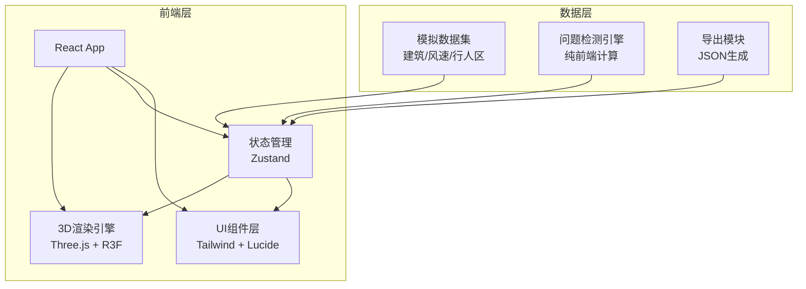

## 1. 架构设计



## 2. 技术说明

- **前端框架**：React@18 + TypeScript + Vite
- **3D渲染**：three + @react-three/fiber + @react-three/drei + @react-three/postprocessing
- **样式方案**：tailwindcss@3
- **状态管理**：zustand
- **图标库**：lucide-react
- **初始化工具**：vite-init (react-ts模板)
- **后端**：无，纯前端应用
- **数据**：前端模拟数据集，内嵌于代码中

## 3. 路由定义

| 路由 | 用途 |
|------|------|
| / | 主工作台，包含3D视图、筛选、明细、问题检测 |

## 4. 数据模型

### 4.1 核心数据结构

```typescript
interface VoxelData {
  id: string
  position: [number, number, number]
  windSpeed: number
  windDirection: [number, number, number]
  category: 'building' | 'wind' | 'pedestrian'
  zoneId?: string
  buildingId?: string
}

interface BuildingBlock {
  id: string
  name: string
  position: [number, number, number]
  size: [number, number, number]
  height: number
}

interface PedestrianZone {
  id: string
  name: string
  bounds: { min: [number, number, number]; max: [number, number, number] }
  pedestrianHeight: number
}

interface DetectedIssue {
  id: string
  type: 'wind_reversal' | 'voxel_hole' | 'sensor_occlusion'
  severity: 'critical' | 'warning' | 'info'
  position: [number, number, number]
  description: string
  affectedVoxelIds: string[]
  confirmed: boolean
}

interface RiskAnnotation {
  id: string
  issueId: string
  label: string
  position: [number, number, number]
  type: 'warning' | 'danger' | 'info'
}

interface ExportReport {
  generatedAt: string
  summary: {
    totalVoxels: number
    buildingCount: number
    pedestrianZoneCount: number
    issueCount: number
    windDirectionConclusion: string
  }
  issues: DetectedIssue[]
  windStatistics: {
    dominantDirection: string
    maxSpeed: number
    avgSpeed: number
    reversalCount: number
  }
}
```

### 4.2 状态模型

```typescript
interface AppStore {
  voxels: VoxelData[]
  buildings: BuildingBlock[]
  pedestrianZones: PedestrianZone[]
  issues: DetectedIssue[]
  annotations: RiskAnnotation[]
  filters: {
    categories: ('building' | 'wind' | 'pedestrian')[]
    windSpeedRange: [number, number]
    heightSlice: [number, number]
  }
  selectedVoxelId: string | null
  selectedIssueId: string | null
  issuePanelOpen: boolean
  detailPanelOpen: boolean
  filterPanelOpen: boolean
}
```

## 5. 问题检测算法

### 5.1 风向反转检测

- 遍历相邻体素对，计算风向向量夹角
- 夹角超过150°标记为疑似反转
- 结合行人区高度层过滤，优先标记行人区附近反转

### 5.2 体素空洞检测

- 使用3D连通性分析，检查期望网格位置是否有数据
- 标记"内部空洞"（被有效体素包围的空位）与"边界缺失"
- 行人区范围内的空洞提升为critical级别

### 5.3 测点遮挡检测

- 对每个行人区测点，射线检测至最近建筑体块
- 遮挡距离小于建筑高度2倍时标记为遮挡风险
- 同时检查测点是否位于建筑背风面涡流区

## 6. 同步机制

- **筛选→3D视图**：Zustand store的filters变更触发3D场景中InstancedMesh的可见性矩阵更新
- **筛选→明细面板**：filters变更同时更新明细面板展示的体素子集
- **3D点击→明细**：Raycaster选中体素后，更新selectedVoxelId，明细面板高亮对应行
- **问题点击→3D+明细**：selectedIssueId变更，3D相机flyTo对应位置，明细面板展示关联体素
- **标注→导出**：annotations数组实时维护，导出时直接从store读取确保一致性

## 7. 导出一致性保证

- 导出文件中的`windDirectionConclusion`字段由函数`generateWindConclusion(issues, voxels)`生成
- 该函数同时用于界面顶栏的摘要文字显示
- 确保同一数据源→同一结论，不会出现界面与文件不一致
