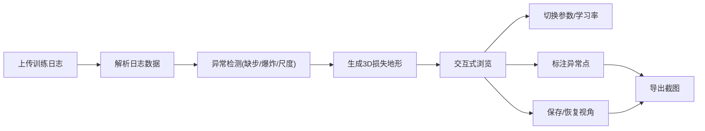

## 1. 产品概述

AI训练损失地形是面向机器学习讲师和学生的Web3D可视化教学工具，将抽象的损失函数、学习率和参数扰动转化为可交互的3D地形，解决学生死记硬背loss曲线下降趋势的痛点。

- 目标用户：机器学习讲师、AI学习者、算法工程师
- 核心价值：通过沉浸式3D交互理解损失面几何特征，直观展示训练过程中的异常现象
- 本次迭代重点：处理日志缺步、损失爆炸、坐标尺度误读三类常见教学坑

## 2. 核心功能

### 2.1 用户角色
| 角色 | 注册方法 | 核心权限 |
|------|---------|----------|
| 机器学习讲师 | 无需注册，本地运行 | 上传训练日志、标注异常点、保存视角、导出截图 |
| 学生用户 | 无需注册，本地运行 | 浏览3D地形、切换参数视角、查看异常标注 |

### 2.2 功能模块
1. **3D损失地形主界面**：损失面渲染、训练轨迹绘制、实时交互控制
2. **日志解析与异常检测**：训练日志导入、自动检测三类异常、标注定位
3. **参数与视角控制**：学习率切换、参数切片选择、视角保存/恢复
4. **标注与导出**：异常点清晰标注、截图导出、课堂报告素材生成

### 2.3 页面详情
| 页面名称 | 模块名称 | 功能描述 |
|---------|---------|----------|
| 主页面 | 3D视口 | 可旋转缩放的损失地形、训练路径动画、学习率热力图 |
| 主页面 | 左侧控制面板 | 参数选择器、视角管理、日志文件上传 |
| 主页面 | 右侧信息面板 | 异常检测报告、坐标点信息、训练统计数据 |
| 主页面 | 底部时间轴 | 训练步骤滑动条、播放/暂停控制、缺步标记 |

## 3. 核心流程

讲师上传训练日志文件 → 系统自动解析并检测异常 → 生成3D损失地形 → 讲师标注关键点 → 切换不同参数切片对比 → 保存典型视角 → 导出截图用于教学

## 4. 用户界面设计

### 4.1 设计风格
- 主色调：深邃科研蓝 `#0A1628` 作为背景，配合青色高光 `#00D4FF` 用于标注
- 辅助色：损失值热力图从冷蓝 `#3B82F6` → 暖红 `#EF4444` 渐变
- 异常标注：亮黄色 `#FBBF24` 虚线框 + 白色文字标签，带黑色描边确保可见
- 字体：显示字体用 `JetBrains Mono` 等宽字体增强科技感，正文字体用 `Inter`
- 布局：深色沉浸式全屏布局，3D视口居中，半透明控制面板悬浮两侧
- 图标风格：线性轮廓图标，配合发光悬停效果

### 4.2 页面设计概述
| 页面名称 | 模块名称 | UI元素 |
|---------|---------|--------|
| 主页面 | 3D视口 | 网格地形、热力着色、悬浮标签、轨迹线、摄像机控制 |
| 主页面 | 左侧控制面板 | 文件上传区、参数下拉框、视角列表、滑块控制 |
| 主页面 | 右侧信息面板 | 异常警告卡片、坐标读数、统计图表、标注列表 |
| 主页面 | 底部时间轴 | 步骤刻度、缺步红色标记、播放控制按钮 |

### 4.3 响应性
- 桌面端为主（讲师授课场景），采用固定侧边栏布局
- 平板端自适应折叠面板，触控手势优化旋转缩放
- 标注文字大小随视角自动调整，确保最小可读尺寸

### 4.4 3D场景指导
- **环境**：深色渐变背景，配合柔和雾效增强空间感，添加细微网格噪点
- **光照**：主光源45度斜上方，边缘光勾勒地形轮廓，点光源突出异常点
- **摄像机**：初始视角45度俯视角，支持轨道旋转、平移、缩放，限制最小最大距离
- **交互**：鼠标拖拽旋转，滚轮缩放，右键平移，双击重置视角
- **动画**：训练路径沿时间轴渐进绘制，异常点脉冲发光效果
- **后处理**：轻微泛光效果增强科技感，FXAA抗锯齿
- **性能**：地形网格面数控制在5万以内，实例化渲染标注点
