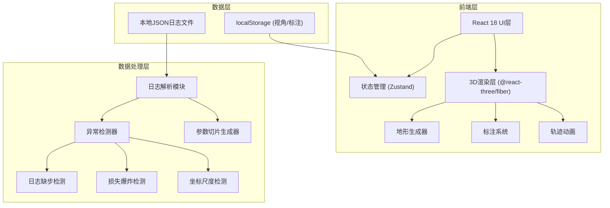

## 1. 架构设计



## 2. 技术描述

- **前端框架**: React@18.2.0 + TypeScript@5.3.0
- **构建工具**: Vite@5.0.0
- **样式方案**: TailwindCSS@3.4.0
- **3D引擎**: three@0.160.0
- **React Three生态**: 
  - @react-three/fiber@8.15.0 (React渲染器)
  - @react-three/drei@9.92.0 (辅助组件)
  - @react-three/postprocessing@2.15.0 (后处理效果)
- **状态管理**: zustand@4.4.0 (轻量级状态)
- **图表库**: recharts@2.10.0 (2D统计图表)
- **工具库**: lodash-es@4.17.0
- **无后端**：纯前端应用，数据通过文件上传和localStorage持久化

## 3. 目录结构

```
src/
├── components/
│   ├── ui/                    # 基础UI组件
│   │   ├── Panel.tsx          # 悬浮面板
│   │   ├── Button.tsx
│   │   └── Slider.tsx
│   ├── control/               # 控制面板
│   │   ├── LeftPanel.tsx      # 左侧：参数/视角
│   │   ├── RightPanel.tsx     # 右侧：异常/信息
│   │   └── Timeline.tsx       # 底部时间轴
│   ├── three3d/               # 3D组件
│   │   ├── LossTerrain.tsx    # 损失地形网格
│   │   ├── TrainingPath.tsx   # 训练轨迹线
│   │   ├── Annotations.tsx    # 标注点系统
│   │   ├── AxisGrid.tsx       # 坐标轴网格
│   │   └── SceneSetup.tsx     # 场景/光照/相机
│   └── upload/                # 文件上传
│       └── LogUploader.tsx
├── store/                     # 状态管理
│   ├── useSceneStore.ts       # 3D场景状态
│   ├── useLogStore.ts         # 日志数据状态
│   └── useViewStore.ts        # 视角管理状态
├── utils/                     # 工具函数
│   ├── logParser.ts           # 日志解析
│   ├── anomalyDetector.ts     # 异常检测
│   ├── terrainGenerator.ts    # 地形生成算法
│   └── colorMap.ts            # 颜色映射
├── types/                     # TypeScript类型
│   └── index.ts
├── data/                      # 样例数据
│   └── sample-log.json        # 第一份训练日志样例
├── App.tsx
├── main.tsx
└── index.css
```

## 4. 核心数据类型定义

```typescript
// 训练日志条目
interface TrainingLogEntry {
  step: number;
  loss: number;
  learningRate: number;
  params: Record<string, number>;
  valLoss?: number;
  timestamp?: number;
}

// 异常检测结果
interface Anomaly {
  id: string;
  type: 'missing_step' | 'loss_explosion' | 'scale_misread';
  severity: 'warning' | 'error';
  step: number;
  position: { x: number; y: number; z: number };
  message: string;
  suggestion: string;
}

// 视角配置
interface ViewPreset {
  id: string;
  name: string;
  cameraPosition: [number, number, number];
  cameraTarget: [number, number, number];
  createdAt: number;
}

// 地形网格数据
interface TerrainData {
  width: number;
  height: number;
  xRange: [number, number];
  yRange: [number, number];
  zRange: [number, number];
  heights: number[][];  // z值矩阵
  paramAxis: string;    // X轴参数名
  lrAxis: string;       // Y轴学习率
}

// 标注点
interface Annotation {
  id: string;
  position: [number, number, number];
  label: string;
  type: 'anomaly' | 'note' | 'checkpoint';
  color: string;
}
```

## 5. 异常检测算法

### 5.1 日志缺步检测
```
输入：日志数组，按step排序
算法：
1. 计算相邻step差值的中位数作为基准步长
2. 遍历检查相邻step差值 > 基准步长 * 2 的位置
3. 标记缺步区间，计算缺失的步数
```

### 5.2 损失爆炸检测
```
输入：loss序列
算法：
1. 计算前N步loss的移动平均和标准差
2. 检测当前loss > 移动平均 + K * 标准差（K=3）
3. 或检测loss增长率 > 1000% 单步跃升
4. 标记爆炸点并给出学习率调整建议
```

### 5.3 坐标尺度误读检测
```
输入：损失值范围，地形高度范围
算法：
1. 检测loss范围是否跨越多个数量级（max/min > 1000）
2. 检测是否存在极端离群点拉高整体尺度
3. 建议对数缩放或裁剪离群值
4. 自动应用safe-log变换保持视觉可读性
```

## 6. 状态管理模块划分

### 6.1 useLogStore - 日志数据
- logEntries: TrainingLogEntry[]
- anomalies: Anomaly[]
- selectedParams: string[]
- actions: loadLog, detectAnomalies, selectParam

### 6.2 useSceneStore - 3D场景
- terrainData: TerrainData | null
- trainingPath: [number, number, number][]
- currentStep: number
- isPlaying: boolean
- annotations: Annotation[]
- actions: setTerrainData, setCurrentStep, addAnnotation

### 6.3 useViewStore - 视角管理
- viewPresets: ViewPreset[]
- currentViewId: string | null
- actions: saveView, restoreView, deleteView
