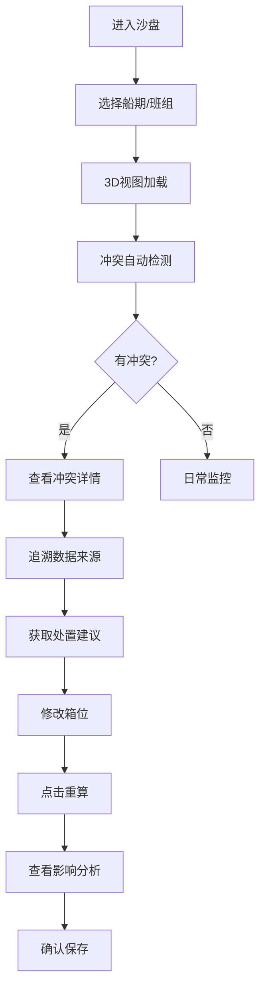
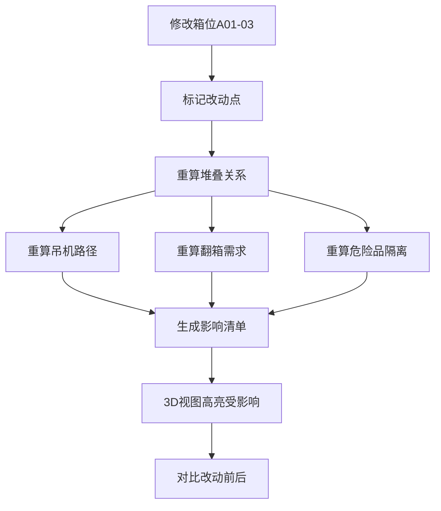

## 1. 产品概述
港口堆场箱位沙盘是面向港口调度员的Web3D生产工具，解决集装箱翻箱次数过多、危险品相邻误算、吊机冲突、箱位重复分配等核心问题。通过3D可视化堆场全景，结合可追溯的决策链，让调度员能直观发现问题、定位责任、快速调整。

### 1.1 核心价值
- **降低翻箱率**：通过3D可视化直观呈现箱位堆叠关系，提前预判翻箱需求
- **杜绝危险品误算**：高亮显示危险品箱及相邻风险，避免混入正常作业单
- **冲突实时预警**：吊机作业冲突、箱位重复分配自动检测并给出处置建议
- **决策可追溯**：每条结论可追查到数据来源（箱位表/集装箱单/吊机排班）
- **改动影响可见**：修改箱位后一键重算，直观展示受影响的作业环节

### 1.2 目标用户
港口调度员、堆场计划员、值班主管

---

## 2. 核心功能

### 2.1 用户角色
| 角色 | 注册方式 | 核心权限 |
|------|----------|----------|
| 调度员 | 工号登录 | 查看3D堆场、切换参数、修改箱位、保存视角、导出报告 |
| 值班主管 | 工号登录 | 调度员所有权限 + 审批箱位调整、查看历史回放 |

### 2.2 功能模块
1. **3D堆场主视图**：可旋转缩放的堆场全景，集装箱、箱位、吊机实时可视化
2. **侧边明细面板**：箱位锁定管理、作业回放时间轴、冲突详情追溯
3. **冲突检测引擎**：危险品相邻检测、吊机冲突检测、箱位重复检测
4. **参数控制中心**：船期筛选、班组切换、作业类型过滤、视角管理
5. **改动影响分析**：箱位修改前后对比，高亮受影响的作业链

### 2.3 页面详情
| 页面名称 | 模块名称 | 功能描述 |
|----------|----------|----------|
| 主沙盘页 | 3D堆场视图 | 支持鼠标拖拽旋转、滚轮缩放、点击选中箱位/集装箱；危险品红框高亮、待作业集装箱蓝框、冲突区域闪烁告警 |
| 主沙盘页 | 顶部工具栏 | 船期选择下拉框、班组切换、作业类型过滤、视角保存/恢复、重算按钮、导出报告 |
| 主沙盘页 | 左侧数据来源面板 | 分"箱位数据"、"集装箱数据"、"吊机数据"三类，每类展示最新同步时间、数据源链接、数据条数 |
| 主沙盘页 | 右侧边栏-箱位锁定 | 锁定/解锁箱位、锁定原因备注、锁定人信息、锁定时间范围 |
| 主沙盘页 | 右侧边栏-作业回放 | 时间轴滑块、播放/暂停、倍速控制、关键节点标记（冲突点/危险品） |
| 主沙盘页 | 右侧边栏-冲突详情 | 冲突列表、点击跳转3D视图定位、"下一步找谁"、"改哪份箱位"处置建议 |
| 主沙盘页 | 底部状态栏 | 当前翻箱次数统计、冲突数量、危险品箱数量、作业完成率 |

---

## 3. 核心流程

### 3.1 日常调度流程
调度员进入沙盘 → 选择当前船期/班组 → 查看3D堆场全局状态 → 检查冲突告警 → 点击冲突项查看详情和追溯链 → 根据"下一步"建议调整箱位 → 点击重算按钮 → 查看改动影响范围 → 确认后保存

### 3.2 箱位改动影响分析流程
调度员修改箱位 → 系统标记改动点 → 重新计算依赖关系 → 高亮受影响的集装箱 → 高亮受影响的吊机作业 → 高亮受影响的船期计划 → 生成改动前后对比报告

---

## 4. 用户界面设计

### 4.1 设计风格
- **主色调**：深海蓝(#0A2463)作为背景基调，配合港口工业感
- **强调色**：警示红(#E63946)用于危险品和严重冲突，警示橙(#FF9F1C)用于一般冲突，安全绿(#2EC4B6)用于正常状态
- **信息色**：钢蓝(#457B9D)用于选中状态，浅灰(#F1FAEE)用于文字
- **字体**：标题使用"JetBrains Mono"等宽字体体现工业感，正文使用"Noto Sans SC"保证可读性
- **按钮风格**：直角矩形、细边框、点击时有凹陷感，体现工业控制台风格
- **布局**：固定三栏布局，中间大区域3D视图，左侧数据来源，右侧操作面板
- **图标风格**：线性图标，工业风，避免可爱/圆润风格

### 4.2 页面设计概览
| 页面名称 | 模块名称 | UI元素 |
|----------|----------|--------|
| 主沙盘页 | 3D视图 | 深海蓝背景、网格地面、集装箱按状态着色、危险品红色外框发光、冲突区域脉冲闪烁、选中箱位白色边框 |
| 主沙盘页 | 顶部工具栏 | 深色半透明背景、下拉框带箭头、按钮悬停发光、状态指示灯 |
| 主沙盘页 | 左侧来源面板 | 卡片式分组、每个数据源带时间戳、"查看原始数据"链接、数据条数角标 |
| 主沙盘页 | 右侧边栏 | 标签页切换（箱位锁定/作业回放/冲突详情）、时间轴带刻度标记、冲突项可展开 |
| 主沙盘页 | 底部状态栏 | 半透明深色条、数据统计带图标、数字实时更新动画 |

### 4.3 响应式设计
- 桌面端：三栏固定布局，3D视图居中占60%宽度
- 平板端：左右面板可折叠收起，3D视图自适应
- 移动端：仅保留核心3D视图和冲突告警列表，其余功能折叠到菜单

### 4.4 3D场景设计
- **环境**：工业港口夜景风格，深色天空配合堆场灯光，营造夜间作业氛围
- **光照**：环境光 + 方向光模拟港口照明，集装箱底部有投影增强立体感
- **相机**：默认Perspective相机，初始视角俯视45度，可环绕堆场中心旋转
- **交互**：OrbitControls控制，阻尼效果顺滑，限制最小/最大缩放距离
- **动画**：冲突箱位脉冲发光动画、吊机作业路径动画、作业回放集装箱移动动画
- **后处理**：轻微Bloom效果增强发光感，FXAA抗锯齿
- **性能**：集装箱使用InstancedMesh批量渲染，单帧目标60fps

---

## 5. 数据追溯设计

### 5.1 追溯链结构
每条冲突或告警结论都包含完整追溯链：
1. **结论**：检测到的问题描述
2. **计算规则**：触发告警的规则名称和版本
3. **数据来源**：
   - 箱位数据：来源文件名 + 行号 + 字段名
   - 集装箱数据：提单号 + 箱号 + 属性
   - 吊机数据：吊机编号 + 排班时间段
4. **时间戳**：数据获取时间、计算时间
5. **上次不同**：与上一版计算的差异

### 5.2 追溯呈现方式
- 悬浮提示：鼠标悬停告警图标时显示简要追溯信息
- 详情面板：点击告警项展开完整追溯链，可点击跳转到原始数据
- 命令行模式：提供/debug命令输出完整计算过程日志

---

## 6. 改动影响可视化

### 6.1 改动标记
- 修改的箱位：3D视图中黄色虚线框持续标记
- 受影响集装箱：橙色半透明闪烁
- 受影响吊机：吊机臂变色 + 作业路径虚线显示
- 受影响船期：顶部船期标签闪烁提示

### 6.2 对比视图
- 提供"改动前后"分屏对比模式
- 左侧显示改动前状态，右侧显示改动后状态
- 中间滑块可调节分割比例
- 差异项用连线连接两侧对应位置
