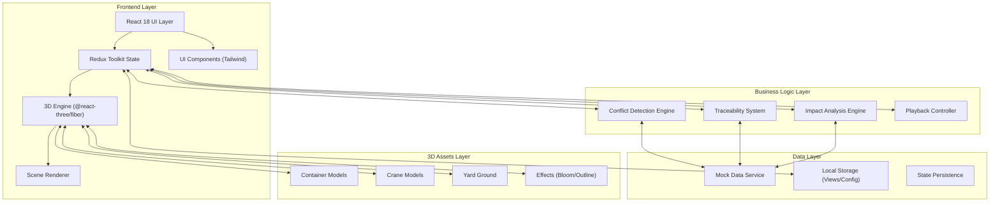
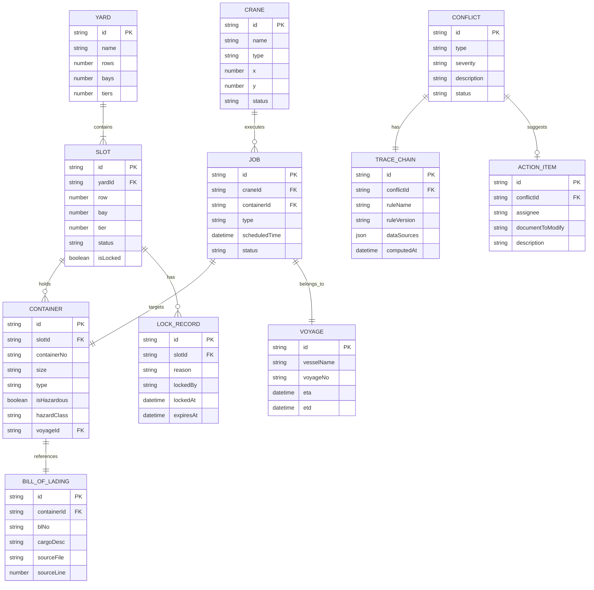

## 1. 架构设计



## 2. 技术选型说明

### 2.1 前端核心技术栈
- **React 18**：UI框架，使用Concurrent Mode提升3D场景渲染性能
- **Vite 5**：构建工具，热更新速度快，支持React Fast Refresh
- **TypeScript 5**：类型安全，降低大型应用维护成本
- **Tailwind CSS 3**：原子化CSS，配合自定义主题实现工业风设计

### 2.2 3D渲染技术栈
- **three.js 0.160**：WebGL渲染引擎基础
- **@react-three/fiber 8.15**：React声明式Three.js封装
- **@react-three/drei 9.92**：常用3D组件库（Controls、Environment、Outline等）
- **@react-three/postprocessing 2.15**：后处理效果（Bloom、FXAA）
- **three-mesh-ui**：3D空间中的UI组件

### 2.3 状态管理
- **Redux Toolkit 2.0**：全局状态管理，处理复杂业务逻辑
- **Redux Toolkit Query**：数据请求与缓存
- **@redux-devtools/extension**：开发时状态调试

### 2.4 数据层
- **Mock Service Worker (MSW)**：前端模拟API，无需后端即可开发
- **localStorage**：保存用户视角配置、个性化设置
- **IndexedDB**：缓存大规模堆场历史数据

### 2.5 工程化
- **ESLint + Prettier**：代码规范
- **Husky + lint-staged**：Git提交钩子
- **Vitest**：单元测试
- **Playwright**：E2E测试

## 3. 目录结构

```
src/
├── @types/                 # TypeScript类型定义
├── app/                    # Redux store配置
├── assets/                 # 静态资源
├── components/             # UI组件
│   ├── layout/            # 布局组件
│   ├── toolbar/           # 顶部工具栏
│   ├── sidebar/           # 侧边栏面板
│   ├── datasource/        # 数据来源面板
│   └── statusbar/         # 底部状态栏
├── features/               # 业务特性模块
│   ├── yard3d/            # 3D堆场场景
│   │   ├── components/    # 3D组件（集装箱、吊机、地面）
│   │   ├── hooks/         # 3D相关hooks
│   │   ├── store/         # 3D状态切片
│   │   └── utils/         # 3D工具函数
│   ├── conflicts/         # 冲突检测
│   │   ├── engine.ts      # 冲突检测引擎
│   │   ├── rules/         # 检测规则
│   │   └── store/         # 冲突状态切片
│   ├── traceability/      # 追溯系统
│   │   ├── TraceChain.ts  # 追溯链模型
│   │   └── store/         # 追溯状态切片
│   ├── impact/            # 改动影响分析
│   │   ├── analyzer.ts    # 影响分析引擎
│   │   └── store/         # 影响分析状态切片
│   └── playback/          # 作业回放
│       ├── controller.ts  # 回放控制器
│       └── store/         # 回放状态切片
├── mocks/                  # Mock数据
│   ├── handlers/          # MSW请求处理器
│   └── data/              # Mock原始数据
├── pages/                  # 页面组件
├── router/                 # 路由配置
├── shared/                 # 共享工具
│   ├── hooks/             # 自定义hooks
│   ├── utils/             # 工具函数
│   └── constants/         # 常量定义
├── styles/                 # 全局样式
├── App.tsx
├── main.tsx
└── vite-env.d.ts
```

## 4. 路由定义

| 路由路径 | 页面名称 | 功能描述 |
|---------|----------|----------|
| `/` | 主沙盘页 | 3D堆场主视图，包含所有核心功能 |
| `/compare` | 对比视图 | 箱位改动前后分屏对比 |
| `/debug` | 调试模式 | 命令行式追溯信息输出 |
| `/history` | 历史记录 | 历史作业回放列表 |

## 5. 核心数据模型

### 5.1 数据模型ER图



### 5.2 TypeScript核心类型定义

```typescript
// 箱位
interface Slot {
  id: string;
  yardId: string;
  row: number;
  bay: number;
  tier: number;
  status: 'empty' | 'occupied' | 'reserved';
  isLocked: boolean;
  lockRecord?: LockRecord;
}

// 集装箱
interface Container {
  id: string;
  slotId: string;
  containerNo: string;
  size: '20GP' | '40GP' | '40HQ';
  type: 'dry' | 'reefer' | 'hazardous' | 'openTop';
  isHazardous: boolean;
  hazardClass?: string;
  voyageId: string;
  weight: number;
}

// 吊机
interface Crane {
  id: string;
  name: string;
  type: 'rtg' | 'rmg' | 'qyc';
  position: { x: number; y: number; z: number };
  status: 'idle' | 'working' | 'maintenance';
  currentJobId?: string;
}

// 冲突
interface Conflict {
  id: string;
  type: 'hazardous_adjacent' | 'crane_collision' | 'slot_duplicate' | 'rehandle_excessive';
  severity: 'critical' | 'warning' | 'info';
  description: string;
  status: 'open' | 'resolved' | 'ignored';
  involvedSlotIds: string[];
  involvedContainerIds: string[];
  involvedCraneIds: string[];
  traceChain: TraceChain;
  actionItems: ActionItem[];
}

// 追溯链
interface TraceChain {
  id: string;
  ruleName: string;
  ruleVersion: string;
  dataSources: DataSource[];
  computedAt: Date;
  previousDiff?: string;
}

// 数据源
interface DataSource {
  type: 'slot' | 'container' | 'crane' | 'voyage';
  sourceFile: string;
  sourceLine?: number;
  sourceField?: string;
  recordId: string;
  value: string;
}

// 行动项
interface ActionItem {
  id: string;
  assignee: string;
  assigneeRole: string;
  documentToModify: string;
  documentSection: string;
  description: string;
  priority: 'high' | 'medium' | 'low';
}

// 视角配置
interface ViewConfig {
  id: string;
  name: string;
  cameraPosition: [number, number, number];
  cameraTarget: [number, number, number];
  createdAt: Date;
  userId: string;
}

// 改动影响
interface ImpactAnalysis {
  modifiedSlotId: string;
  affectedContainers: string[];
  affectedJobs: string[];
  affectedCranes: string[];
  affectedVoyages: string[];
  newConflicts: string[];
  resolvedConflicts: string[];
  rehandleCountChange: number;
}
```

## 6. 冲突检测规则引擎

### 6.1 检测规则清单

| 规则ID | 规则名称 | 触发条件 | 严重程度 |
|--------|----------|----------|----------|
| R-HZ-001 | 危险品相邻检测 | 危险品箱与普通箱相邻距离小于2个箱位 | critical |
| R-HZ-002 | 危险品混堆检测 | 不同类危险品堆放在同一贝位 | critical |
| R-CR-001 | 吊机作业冲突 | 两台吊机作业范围在时间和空间上重叠 | critical |
| R-CR-002 | 吊机路径阻挡 | 吊机移动路径上有障碍物 | warning |
| R-SL-001 | 箱位重复分配 | 同一箱位分配给多个集装箱 | critical |
| R-SL-002 | 悬空箱检测 | 集装箱下方无支撑箱 | warning |
| R-RH-001 | 翻箱次数超标 | 单船作业翻箱率超过30% | warning |
| R-RH-002 | 高频翻箱点 | 单个箱位翻箱次数超过5次 | info |

### 6.2 规则引擎架构
- 使用策略模式实现规则可插拔
- 每条规则独立为一个类，实现`DetectionRule`接口
- 支持规则版本管理，追溯使用的规则版本
- 检测结果自动生成追溯链

## 7. 3D性能优化策略

### 7.1 渲染优化
- **InstancedMesh**：批量渲染相同尺寸的集装箱，减少Draw Call
- **LOD (Level of Detail)**：远距离集装箱使用简化模型
- **视锥体剔除**：仅渲染相机视野内的对象
- **阴影优化**：仅吊机和大型物体投射阴影

### 7.2 交互优化
- **Raycaster优化**：使用BVH加速射线检测
- **事件委托**：统一处理集装箱点击事件，避免每个对象绑定监听器
- **状态批处理**：多次状态变更合并为一次渲染更新

### 7.3 内存管理
- **对象池模式**：复用集装箱和吊机模型对象
- **及时清理**：场景切换时清理几何体和材质
- **纹理压缩**：使用KTX2格式压缩纹理
