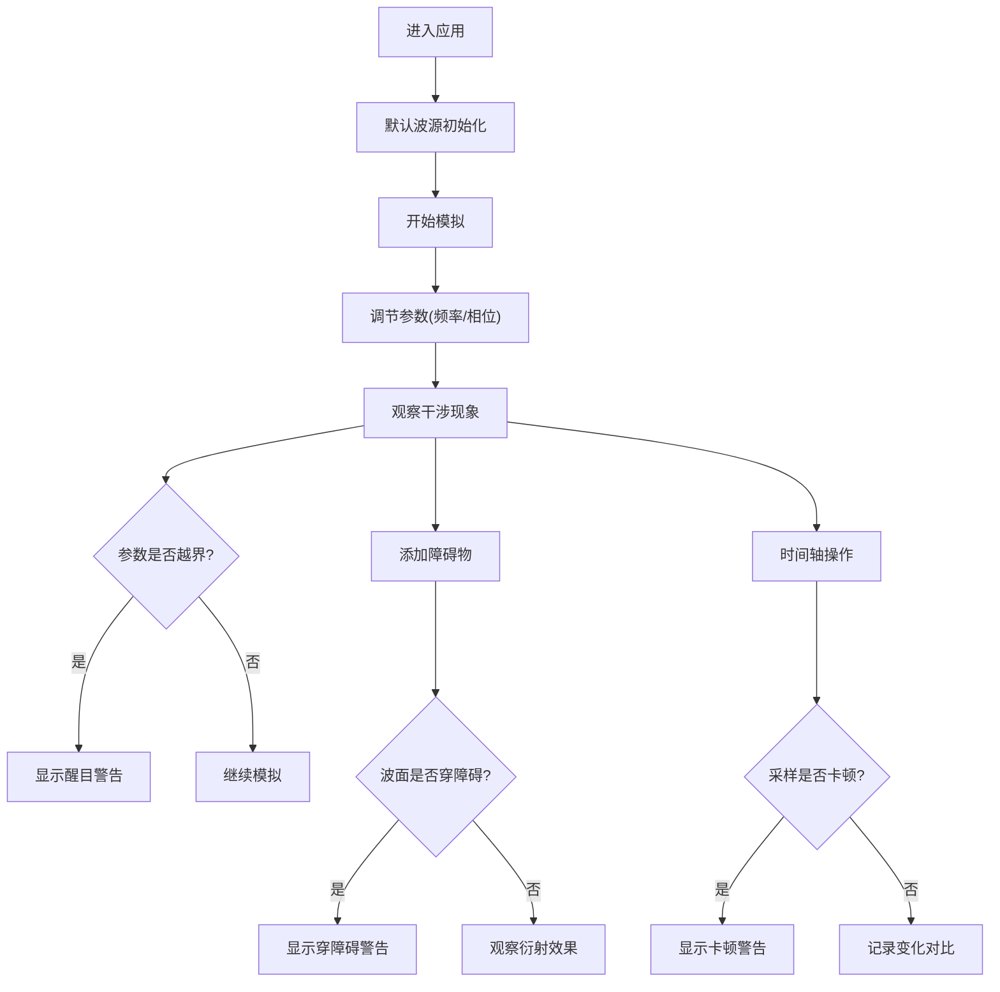

## 1. 产品概述

物理波干涉水槽是一个用于物理教学的交互式网页模拟应用，解决实验器材不足的问题，让学生通过网页调节波源参数观察水波干涉现象。

- **主要目的**：模拟水波干涉实验，提供可调节的频率、相位、障碍物等参数
- **目标用户**：物理教师和学生
- **核心价值**：可视化物理波干涉原理，参数越界和异常情况醒目提示

## 2. 核心功能

### 2.1 用户角色
| 角色 | 注册方式 | 核心权限 |
|------|----------|----------|
| 教师/学生 | 无需注册 | 使用所有模拟功能，调节参数，观察干涉现象 |

### 2.2 功能模块
1. **主模拟页面**：2D/3D波干涉可视化，参数控制面板，时间轴控制
2. **波源管理**：添加/删除波源，调节频率、相位、振幅
3. **障碍物系统**：添加障碍物，观察波的衍射和反射
4. **异常检测**：参数越界警告，波面穿障碍检测，采样卡顿提示

### 2.3 页面详情
| 页面名称 | 模块名称 | 功能描述 |
|----------|----------|----------|
| 主模拟页 | 3D水槽渲染 | 实时3D水面渲染，显示波的传播和干涉 |
| 主模拟页 | 2D俯视图 | 2D热力图显示波的振幅分布，节点线可视化 |
| 主模拟页 | 参数控制面板 | 波源参数调节（频率、相位、振幅），障碍物设置 |
| 主模拟页 | 时间轴控制 | 播放/暂停，速度调节，帧采样，进度拖动 |
| 主模拟页 | 异常警告区 | 醒目显示参数越界、波面穿障碍、采样卡顿等问题 |
| 主模拟页 | 变化对比 | 第二次运行时标出与第一次运行的差异位置 |

## 3. 核心流程

## 4. 用户界面设计

### 4.1 设计风格
- **主色调**：深蓝(#0a1628) - 专业科技感，契合物理实验主题
- **辅助色**：青色(#00d4ff) - 水波高亮，警告红(#ff4444) - 异常提示
- **按钮风格**：直角矩形，轻微3D阴影，点击反馈明显
- **字体**：JetBrains Mono - 等宽字体，适合科学数据显示
- **布局**：左侧控制面板 + 右侧主模拟区 + 底部时间轴 + 顶部警告条
- **图标风格**：简约线性图标，科技感

### 4.2 页面设计概览
| 页面名称 | 模块名称 | UI元素 |
|----------|----------|--------|
| 主模拟页 | 3D水槽 | Three.js渲染，网格水面，波纹动画，半透明水材质 |
| 主模拟页 | 参数面板 | 滑块控件，数值输入，波源列表，障碍物编辑器 |
| 主模拟页 | 警告条 | 顶部固定，红色背景闪烁，详细错误信息 |
| 主模拟页 | 时间轴 | 进度条，播放/暂停按钮，速度选择，帧标记 |
| 主模拟页 | 差异标记 | 第二次运行时用橙色虚线圈出变化区域 |

### 4.3 响应式
- Desktop-first设计，优先保证桌面端体验
- 移动端自适应布局，控制面板折叠为抽屉式
- 触摸设备支持手势缩放和平移

### 4.4 3D场景指导
- **环境**：深色实验室背景，轻微环境光
- **光照**：主光源从上方向下，模拟室内灯光，水面添加高光反射
- **相机**：默认45度俯视角度，支持轨道控制缩放旋转
- **交互**：鼠标悬停显示波高数值，点击添加波源/障碍物
- **后期处理**：Bloom效果增强水波纹发光，FXAA抗锯齿
- **性能**：网格面数控制在100x100以内，确保60fps流畅运行
