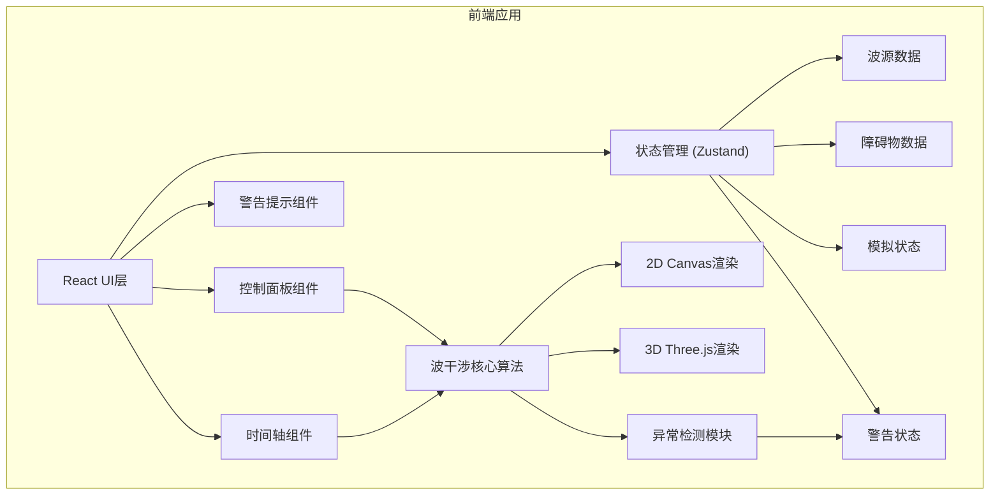

## 1. 架构设计



## 2. 技术描述

- **前端框架**: React@18 + TypeScript
- **构建工具**: Vite@5
- **样式方案**: TailwindCSS@3
- **3D渲染**: Three.js + @react-three/fiber + @react-three/drei
- **2D渲染**: Canvas API
- **状态管理**: Zustand
- **动画库**: framer-motion (警告动画)
- **无后端，纯前端应用**

## 3. 路由定义

| 路由 | 用途 |
|------|------|
| / | 主模拟页面 - 包含所有功能 |

## 4. 数据模型

### 4.1 波源数据模型

```typescript
interface WaveSource {
  id: string;
  x: number;           // 位置X (0-100)
  y: number;           // 位置Y (0-100)
  frequency: number;   // 频率 (0.5-5 Hz)
  phase: number;       // 相位 (0-2π)
  amplitude: number;   // 振幅 (0.1-2.0)
  enabled: boolean;
}
```

### 4.2 障碍物数据模型

```typescript
interface Obstacle {
  id: string;
  type: 'rect' | 'circle' | 'line';
  x: number;
  y: number;
  width?: number;
  height?: number;
  radius?: number;
  rotation?: number;
  absorption: number;  // 吸收系数 (0-1)
}
```

### 4.3 模拟状态模型

```typescript
interface SimulationState {
  isPlaying: boolean;
  time: number;
  speed: number;       // 0.25x - 4x
  gridSize: { width: number; height: number };
  waveData: Float32Array;  // 波高数据
  previousWaveData: Float32Array;
}
```

### 4.4 警告状态模型

```typescript
interface Warning {
  id: string;
  type: 'phase_out_of_bounds' | 'wave_penetration' | 'sampling_stutter' | 'data_gap';
  severity: 'warning' | 'error';
  message: string;
  location?: { x: number; y: number };
  timestamp: number;
  dismissed: boolean;
}
```

## 5. 核心算法

### 5.1 波干涉计算算法

```typescript
// 使用波动方程的有限差分法
function calculateWaveInterpolation(
  sources: WaveSource[],
  obstacles: Obstacle[],
  time: number,
  grid: Float32Array,
  prevGrid: Float32Array
): Float32Array {
  // 波速和阻尼参数
  const c = 1.0;  // 波速
  const damping = 0.995;
  
  // 有限差分法计算下一帧
  for (let y = 1; y < height - 1; y++) {
    for (let x = 1; x < width - 1; x++) {
      const idx = y * width + x;
      
      // 拉普拉斯算子
      const laplacian = 
        grid[idx - 1] + grid[idx + 1] + 
        grid[idx - width] + grid[idx + width] - 
        4 * grid[idx];
      
      // 波动方程: d²u/dt² = c² * ∇²u
      prevGrid[idx] = (2 * grid[idx] - prevGrid[idx] + c * c * laplacian) * damping;
      
      // 添加波源
      for (const source of sources) {
        if (source.enabled) {
          const dist = Math.sqrt((x - source.x) ** 2 + (y - source.y) ** 2);
          const wave = source.amplitude * Math.sin(2 * Math.PI * source.frequency * time - dist + source.phase);
          prevGrid[idx] += wave * Math.exp(-dist * 0.05);
        }
      }
    }
  }
  
  // 障碍物处理
  applyObstacles(prevGrid, obstacles);
  
  return prevGrid;
}
```

### 5.2 异常检测算法

```typescript
// 相位越界检测
function detectPhaseOutOfBounds(sources: WaveSource[]): Warning[] {
  return sources
    .filter(s => s.phase < 0 || s.phase > 2 * Math.PI)
    .map(s => ({
      id: `phase-${s.id}`,
      type: 'phase_out_of_bounds',
      severity: 'error',
      message: `波源 ${s.id} 相位越界: ${s.phase.toFixed(2)} (应在 0-2π 之间)`,
      location: { x: s.x, y: s.y },
      timestamp: Date.now(),
      dismissed: false
    }));
}

// 波面穿障碍检测
function detectWavePenetration(grid: Float32Array, obstacles: Obstacle[]): Warning[] {
  // 检测障碍物后方异常波高
  // ...
}

// 采样卡顿检测
function detectSamplingStutter(frameTimes: number[]): Warning | null {
  const avgTime = frameTimes.reduce((a, b) => a + b, 0) / frameTimes.length;
  const stutters = frameTimes.filter(t => t > avgTime * 2);
  if (stutters.length > 3) {
    return {
      id: 'stutter',
      type: 'sampling_stutter',
      severity: 'warning',
      message: `检测到 ${stutters.length} 次采样卡顿，建议降低网格分辨率`,
      timestamp: Date.now(),
      dismissed: false
    };
  }
  return null;
}
```

## 6. 性能优化策略

1. **Web Worker**：波干涉计算在Web Worker中执行，避免阻塞主线程
2. **SharedArrayBuffer**：主线程和Worker共享波数据，减少拷贝
3. **LOD**：3D渲染时根据距离降低网格精度
4. **节流**：参数调节时节流，避免频繁重计算
5. **对象池**：复用警告对象，减少GC
