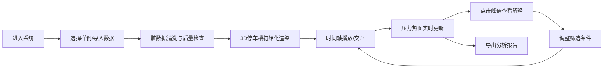

## 1. 产品概述

城市停车需求立方是面向商圈停车运营经理的三维可视化分析平台，解决传统停车预测只给总数、无法直观理解时段-楼层-入口多维压力叠加的核心痛点。系统提供可交互的3D停车楼视图、时间轴动态播放、压力热图实时渲染与可解释性分析面板，同时内置脏数据容错机制，确保运营数据不完整时系统仍可稳定运行。

## 2. 核心功能

### 2.1 用户角色
| 角色 | 注册方式 | 核心权限 |
|------|----------|----------|
| 停车运营经理 | 无需注册（本地演示版） | 查看3D停车楼、播放时间轴、筛选数据、查看压力分析、导出解释报告 |

### 2.2 功能模块
1. **3D停车楼主视图**：多层停车楼三维可视化、入口/出口高亮、楼层实时状态
2. **时间轴控制模块**：时段播放/暂停/拖拽、倍速控制、日期筛选
3. **压力热图模块**：楼层/入口压力热力渲染、多维压力叠加显示
4. **可解释性分析面板**：压力原因追踪、关键因子贡献度、预测依据展示
5. **数据管理模块**：脏数据自动清洗、空值容错处理、数据质量报告
6. **样例演示模块**：边界样例预置、一键切换演示场景

### 2.3 页面详情
| 页面名称 | 模块名称 | 功能描述 |
|----------|----------|----------|
| 主控制台 | 3D停车楼视图 | 可旋转/缩放的3D停车楼模型，实时显示各楼层车位占用、入口车流、压力状态 |
| 主控制台 | 时间轴播放器 | 底部时间轴，支持24小时时段播放、拖拽定位、倍速切换(0.5x/1x/2x/4x) |
| 主控制台 | 筛选工具栏 | 按日期类型（工作日/周末/活动日）、楼层、入口进行多维筛选 |
| 右侧面板 | 压力热图 | 楼层截面热力图、入口排队长度可视化、颜色编码压力等级 |
| 右侧面板 | 可解释分析 | 当前压力峰值的成因拆解（时段贡献、楼层溢出、入口回堵、活动影响等） |
| 右侧面板 | 数据质量 | 脏数据统计、空值处理记录、备注信息展示 |
| 底部抽屉 | 样例选择 | 预置样例一键切换：顺利运行样例、入口回堵样例、楼层满位样例、活动日样例 |

## 3. 核心流程

停车运营经理进入系统 → 选择演示样例或导入数据 → 系统自动清洗脏数据并生成数据质量报告 → 播放时间轴查看24小时停车动态 → 通过3D视图和热图观察压力变化 → 点击压力峰值查看可解释性分析 → 切换筛选条件对比不同场景 → 导出分析报告

## 4. 用户界面设计

### 4.1 设计风格
- **主色调**：深海蓝(#0a1628)作为背景，营造科技感仪表盘氛围
- **强调色**：压力分级渐变色系(绿→黄→橙→红→深红)，青色(#00d4ff)作为交互高亮
- **按钮风格**：微玻璃拟态，圆角8px，悬浮时轻微上浮+发光效果
- **字体**：Space Grotesk作为数字和标题字体，Inter作为正文字体
- **布局风格**：暗色系仪表盘，左侧3D主视图占70%，右侧信息面板占30%，底部时间轴贯通
- **图标风格**：lucide-react线性图标，统一24px尺寸

### 4.2 页面设计概述
| 页面名称 | 模块名称 | UI元素 |
|----------|----------|--------|
| 主控制台 | 3D停车楼视图 | 暗色空间背景、带轮廓线的半透明停车楼体、发光的入口标识、闪烁的车位指示灯、平滑的相机动画 |
| 主控制台 | 时间轴播放器 | 深色玻璃质感、24小时刻度、波形预览图、播放/暂停/重置按钮、倍速选择器、拖拽手柄 |
| 右侧面板 | 压力热图 | 楼层展开视图、热力渐变填充、压力数值标注、图例说明 |
| 右侧面板 | 可解释分析 | 横向条形图展示贡献因子、因果链流程图、自然语言解释文本 |
| 底部抽屉 | 样例选择 | 卡片式样例列表、状态标签（顺利/回堵/满位/活动）、一键加载按钮 |

### 4.3 响应性
- 桌面端优先设计，最低支持1440×900分辨率
- 右侧面板可折叠，折叠后3D视图占满屏幕
- 时间轴在小屏幕上自动调整高度，触控优化拖拽操作

### 4.4 3D场景指导
- **环境/HDRI**：深色宇宙背景，配合柔和的蓝色环境光，营造未来感数据可视化空间
- **光照设置**：主光源为冷白色平行光，辅光源为青色边缘光，各楼层内部有自发光指示灯
- **相机设置**：初始视角为45度俯角，支持轨道控制(OrbitControls)自动旋转，可拖拽旋转/缩放/平移
- **构图与焦点元素**：停车楼位于场景中心，入口处有发光粒子效果表示车流，压力高的楼层有脉冲红光
- **交互与动画**：时间轴播放时，车位灯光逐一点亮/熄灭表示占用变化，入口有车流粒子动画，压力上升时有脉动效果
- **后处理效果**：Bloom泛光效果增强发光元素，轻微色调映射，SSAO增强空间感
- **资源与性能**：所有模型程序化生成，无外部资源依赖，目标帧率60fps

### 4.5 视觉层次设计
- **背景层**：深色网格地面 + 渐变星空背景
- **结构层**：半透明停车楼体框架(20%不透明度)
- **信息层**：车位指示灯、入口标识、楼层编号
- **强调层**：压力热图、峰值高亮、警报闪烁
- **交互层**：选中高亮、悬浮提示、拖拽手柄
