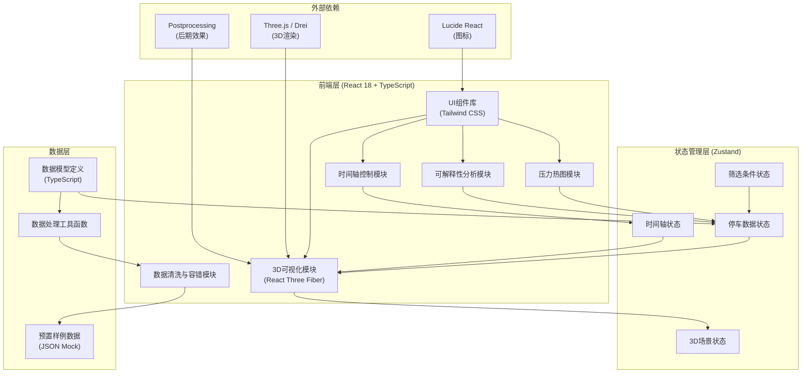
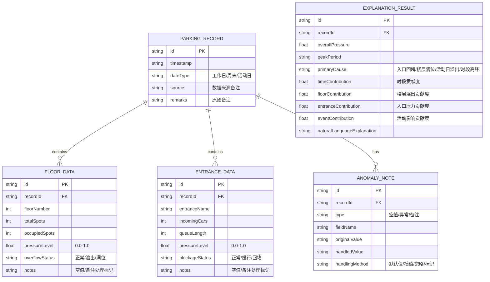

## 1. 架构设计



## 2. 技术描述

- **前端框架**: React 18 + TypeScript + Vite
- **状态管理**: Zustand (轻量级状态管理，适合单页应用)
- **3D渲染**: three.js + @react-three/fiber + @react-three/drei + @react-three/postprocessing
- **样式方案**: Tailwind CSS 3 + 自定义CSS变量
- **图标库**: lucide-react
- **后端服务**: 无后端，纯前端应用，使用预置Mock数据
- **数据存储**: 本地JSON文件，支持未来扩展导入CSV/Excel
- **初始化工具**: vite-init (react-ts模板)

## 3. 路由定义

| 路由 | 用途 |
|------|------|
| / | 主控制台页面（唯一页面，单页应用） |

## 4. 数据模型

### 4.1 数据模型定义



### 4.2 TypeScript 类型定义

```typescript
// 停车数据核心类型
export type DateType = 'workday' | 'weekend' | 'event';
export type PressureLevel = 'low' | 'medium' | 'high' | 'critical';
export type BlockageStatus = 'normal' | 'slow' | 'blocked';
export type OverflowStatus = 'normal' | 'overflow' | 'full';
export type HandlingMethod = 'default' | 'interpolate' | 'ignore' | 'flag';

export interface FloorData {
  id: string;
  floorNumber: number;
  totalSpots: number;
  occupiedSpots: number;
  pressureLevel: number;
  overflowStatus: OverflowStatus;
  notes?: string;
  _dirty?: boolean;
}

export interface EntranceData {
  id: string;
  entranceName: string;
  incomingCars: number;
  queueLength: number;
  pressureLevel: number;
  blockageStatus: BlockageStatus;
  notes?: string;
  _dirty?: boolean;
}

export interface AnomalyNote {
  id: string;
  type: 'null' | 'anomaly' | 'remark';
  fieldName: string;
  originalValue: string | number | null | undefined;
  handledValue: string | number | null;
  handlingMethod: HandlingMethod;
}

export interface ParkingRecord {
  id: string;
  timestamp: string;
  hourOfDay: number;
  dateType: DateType;
  source?: string;
  remarks?: string;
  floors: FloorData[];
  entrances: EntranceData[];
  anomalies: AnomalyNote[];
  _dataQuality: number;
}

export interface ExplanationResult {
  id: string;
  recordId: string;
  overallPressure: number;
  peakPeriod: string;
  primaryCause: string;
  timeContribution: number;
  floorContribution: number;
  entranceContribution: number;
  eventContribution: number;
  naturalLanguageExplanation: string;
  contributingFactors: Array<{
    name: string;
    value: number;
    description: string;
  }>;
}

export interface DemoScenario {
  id: string;
  name: string;
  type: 'smooth' | 'blocked' | 'full' | 'event';
  description: string;
  data: ParkingRecord[];
}
```

## 5. 核心目录结构

```
src/
├── components/
│   ├── 3d/
│   │   ├── ParkingBuilding.tsx      # 3D停车楼主组件
│   │   ├── Floor.tsx                # 单楼层组件
│   │   ├── ParkingSpot.tsx          # 车位组件
│   │   ├── Entrance.tsx             # 入口组件
│   │   └── CarParticles.tsx         # 车流粒子效果
│   ├── timeline/
│   │   ├── TimelinePlayer.tsx       # 时间轴播放器
│   │   └── WaveformPreview.tsx      # 波形预览图
│   ├── heatmap/
│   │   ├── FloorHeatmap.tsx         # 楼层热图
│   │   └── EntranceHeatmap.tsx      # 入口压力热图
│   ├── analysis/
│   │   ├── ExplanationPanel.tsx     # 可解释性分析面板
│   │   ├── FactorBars.tsx           # 贡献因子条形图
│   │   └── CauseChain.tsx           # 因果链流程图
│   ├── data/
│   │   ├── DataQualityPanel.tsx     # 数据质量面板
│   │   └── AnomalyList.tsx          # 异常记录列表
│   ├── sidebar/
│   │   └── ScenarioSelector.tsx     # 样例选择抽屉
│   └── ui/                          # 通用UI组件
│       ├── Button.tsx
│       ├── Slider.tsx
│       ├── Card.tsx
│       └── Badge.tsx
├── hooks/
│   ├── useTimeline.ts               # 时间轴控制Hook
│   ├── useParkingData.ts            # 停车数据管理Hook
│   ├── useDataCleaning.ts           # 数据清洗Hook
│   └── useExplanation.ts            # 可解释性分析Hook
├── store/
│   └── useParkingStore.ts           # Zustand全局状态
├── data/
│   ├── scenarios/                   # 预置演示场景
│   │   ├── smooth.json              # 顺利运行样例
│   │   ├── blocked-entrance.json    # 入口回堵样例
│   │   ├── full-floor.json          # 楼层满位样例
│   │   └── event-day.json           # 活动日样例
│   └── boundary-cases.json          # 边界测试用例
├── utils/
│   ├── dataCleaner.ts               # 脏数据清洗工具
│   ├── pressureCalculator.ts        # 压力计算工具
│   ├── explanationEngine.ts         # 解释生成引擎
│   └── colorUtils.ts                # 颜色工具函数
├── types/
│   └── parking.ts                   # 类型定义
├── App.tsx
├── main.tsx
└── index.css
```

## 6. 关键技术实现要点

### 6.1 脏数据容错处理机制
- **空值处理**：楼层/入口数据为空时使用插值或默认值填充，标记`_dirty`字段
- **备注保留**：原始备注信息存储在`notes`字段，不影响主流程
- **异常检测**：数值超出合理范围时自动修正并记录`AnomalyNote`
- **逐行处理**：单条数据异常不影响整批加载，异常数据标记后继续处理

### 6.2 可解释性分析引擎
- 实时计算时段、楼层、入口、活动四大因子贡献度
- 基于规则引擎生成自然语言解释
- 因果链追踪：识别"入口回堵→楼层溢出→整体压力上升"传导路径
- 支持点击压力峰值回溯历史数据变化

### 6.3 3D性能优化
- 车位使用InstancedMesh批量渲染
- 压力热图使用ShaderMaterial实时着色
- 时间轴播放帧率自适应，低端设备自动降级
- 离屏楼层自动降低渲染精度

### 6.4 边界样例一致性保证
- 所有样例数据使用固定随机种子生成
- 计算逻辑纯函数化，确保重复运行结果一致
- 关键数值使用硬编码基准值，避免浮点误差累积
- 内置回归测试用例，启动时自动验证
