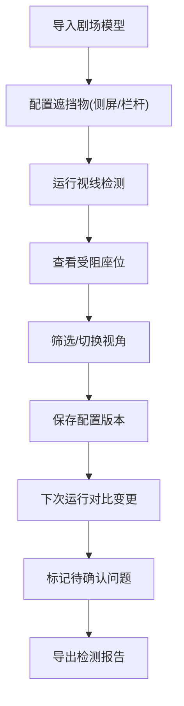

## 1. 产品概述
音乐会座位视线图3D交互系统，为剧院票务经理提供座位视线检测、遮挡判定和历史对比功能，解决高价票投诉问题。
- 核心问题：高价票被投诉看不见舞台侧屏，需提前标出视线受阻座位
- 目标用户：剧院票务经理
- 产品价值：减少投诉，优化售票体验，记录历史配置便于对比

## 2. 核心功能

### 2.1 用户角色
| 角色 | 注册方式 | 核心权限 |
|------|----------|----------|
| 票务经理 | 本地访问 | 3D视图操作、座位筛选、历史对比、导出结果 |

### 2.2 功能模块
1. **3D剧场视图**：剧场模型、座位布局、舞台/侧屏展示
2. **视线检测**：射线检测、遮挡判定、结果可视化
3. **座位筛选**：按区域/状态/价格筛选，明细同步
4. **历史记录**：持久化存储、版本对比、变更标注
5. **待确认分支**：栏杆遮挡记录、问题标记、后续动作

### 2.3 页面详情
| 页面名称 | 模块名称 | 功能描述 |
|----------|----------|----------|
| 主页面 | 3D视窗 | Three.js渲染剧场场景，支持旋转/缩放/平移 |
| 主页面 | 控制面板 | 视角切换、筛选条件、检测触发 |
| 主页面 | 座位列表 | 筛选结果同步展示，点击定位到3D视图 |
| 主页面 | 历史面板 | 历史记录列表、版本对比、变更高亮 |
| 主页面 | 待确认区 | 栏杆遮挡记录、问题类型、后续操作建议 |

## 3. 核心流程
票务经理导入剧场模型 → 配置侧屏/栏杆等遮挡物 → 运行视线检测 → 查看受阻座位 → 筛选特定区域座位 → 保存当前配置 → 下次运行时对比变更 → 标记待确认问题 → 导出报告

## 4. 用户界面设计
### 4.1 设计风格
- 主色调：深炭灰(#1a1a2e) + 剧院红(#e94560) + 金色(#d4af37)
- 辅助色：视线正常(绿#2ecc71)、视线受阻(红#e74c3c)、待确认(黄#f39c12)
- 按钮风格：圆角矩形，微妙阴影，hover有轻微上浮效果
- 字体：Playfair Display(标题) + Source Code Pro(数据)
- 布局：左侧3D主视窗(70%)，右侧信息面板(30%)，三栏垂直布局
- 图标：线性简约风格，结合剧院元素(座位、聚光灯、幕布)

### 4.2 页面设计概述
| 页面名称 | 模块名称 | UI元素 |
|----------|----------|--------|
| 主页面 | 3D视窗 | 深色背景，金色聚光灯效果，座位按状态着色 |
| 主页面 | 控制面板 | 卡片式布局，分组标签，滑动开关，下拉筛选 |
| 主页面 | 座位列表 | 斑马纹表格，悬停高亮，状态标签，点击联动 |
| 主页面 | 历史面板 | 时间轴布局，版本卡片，差异对比高亮 |
| 主页面 | 待确认区 | 警示边框，问题类型标签，建议操作按钮 |

### 4.3 响应式
- 桌面端：左右分栏布局，3D视窗占主导
- 平板端：上下布局，面板可折叠
- 触控优化：支持手势旋转缩放

### 4.4 3D场景指引
- 环境：深色剧场氛围，聚光灯从舞台射出
- 光照：主光源+环境光，座位有轻微自发光便于识别
- 相机：默认透视视角，支持切换正交顶视图
- 动画：座位选中时轻微上浮，检测时射线有动画效果
- 后处理：轻微Bloom效果增强剧场氛围
- 性能：座位使用InstancedMesh优化渲染
