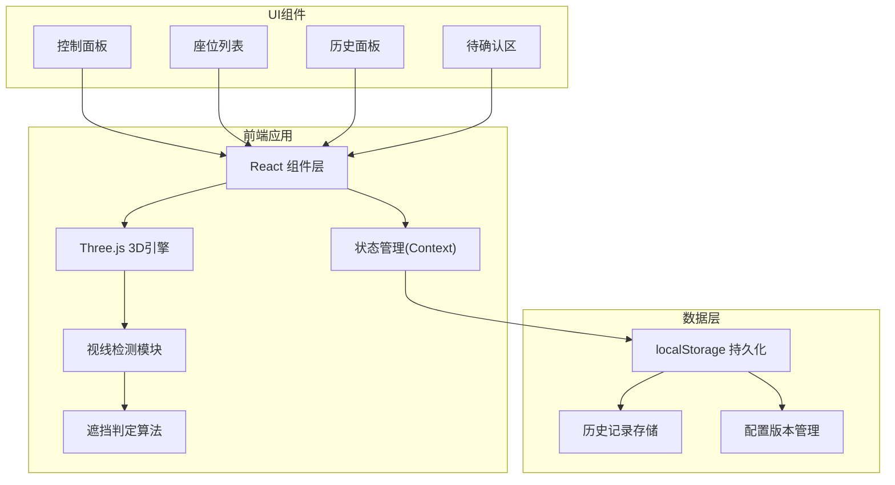
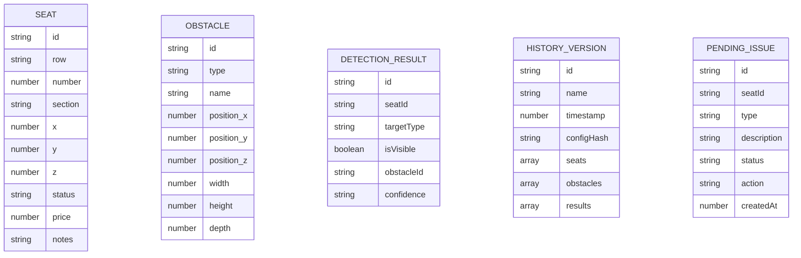

## 1. 架构设计



## 2. 技术描述
- 前端框架: React@18 + TypeScript
- 构建工具: Vite@5
- 样式方案: TailwindCSS@3
- 3D引擎: Three.js@0.160 + @react-three/fiber@8 + @react-three/drei@9
- 状态管理: React Context + useReducer
- 数据持久化: localStorage
- 代码规范: ESLint + Prettier

## 3. 路由定义
| 路由 | 用途 |
|------|------|
| / | 主页面 - 3D剧场视图与控制面板 |

## 4. 数据模型

### 4.1 数据模型定义



### 4.2 TypeScript 类型定义

```typescript
interface Seat {
  id: string;
  row: string;
  number: number;
  section: 'orchestra' | 'mezzanine' | 'balcony';
  position: { x: number; y: number; z: number };
  status: 'available' | 'sold' | 'reserved';
  price: number;
  visibility?: {
    stage: VisibilityResult;
    leftScreen: VisibilityResult;
    rightScreen: VisibilityResult;
  };
}

interface VisibilityResult {
  visible: boolean;
  blockedBy?: string;
  confidence: 'high' | 'medium' | 'low';
}

interface Obstacle {
  id: string;
  type: 'railing' | 'screen' | 'pillar' | 'other';
  name: string;
  position: { x: number; y: number; z: number };
  dimensions: { width: number; height: number; depth: number };
}

interface HistoryVersion {
  id: string;
  name: string;
  timestamp: number;
  configHash: string;
  seats: Seat[];
  obstacles: Obstacle[];
  results: Record<string, any>;
}

interface PendingIssue {
  id: string;
  seatId: string;
  type: 'railing_block' | 'duplicate_seat' | 'view_error' | 'other';
  description: string;
  status: 'pending' | 'confirmed' | 'resolved';
  suggestedAction: string;
  createdAt: number;
}
```

## 5. 核心模块

### 5.1 视线检测模块
- 使用 Three.js Raycaster 进行射线检测
- 从座位位置向舞台/侧屏发射多条射线
- 计算遮挡比例，判定视线受阻程度
- 支持批量检测，使用 Web Worker 优化性能

### 5.2 历史对比模块
- 生成配置哈希，避免重复保存相同配置
- 对比两个版本的座位状态变化
- 高亮显示新增/移除/变更的座位
- 显示遮挡物配置差异

### 5.3 持久化模块
- 使用 localStorage 存储历史版本
- 定期清理过期数据(保留最近50个版本)
- 支持导出/导入JSON格式数据
- 幂等性设计：相同配置不重复创建记录
