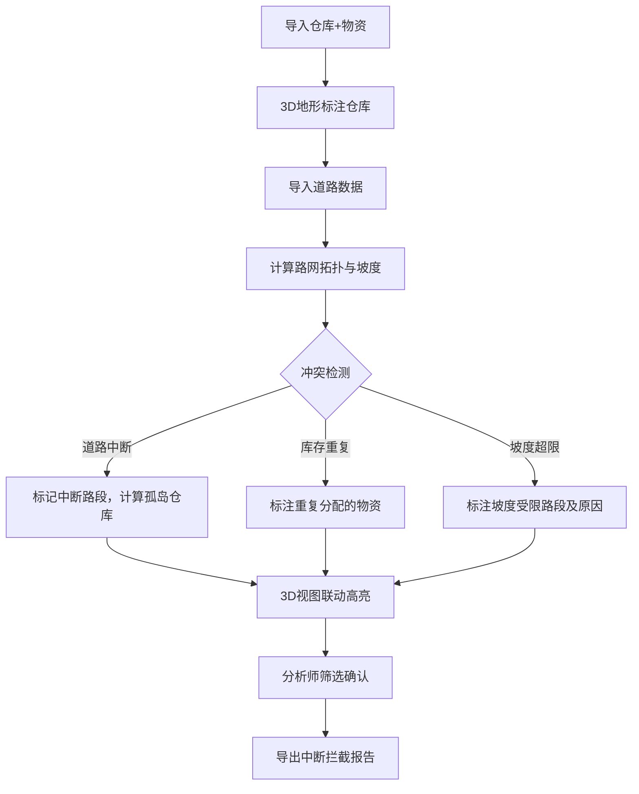

## 1. 产品概述

城市应急物资仓网——面向应急管理分析师的汛期物资仓储三维决策平台。核心解决：汛期物资仓库分布不均、道路中断导致配送受阻、坡度影响漏算三大痛点，通过3D地形交互视图让仓库服务半径、路网中断、库存冲突一目了然。

- 目标用户：应急管理分析师、防汛指挥决策者
- 核心价值：将仓库-道路-地形-物资多维数据统一到三维交互视图，实时发现配送盲区与冲突，一键导出道路中断拦截报告

## 2. 核心功能

### 2.1 用户角色

| 角色 | 使用方式 | 核心权限 |
|------|----------|----------|
| 应急管理分析师 | 直接使用 | 导入数据、三维交互、筛选分析、导出报告 |
| 防汛指挥决策者 | 查看与审阅 | 查看三维视图、审阅导出报告 |

### 2.2 功能模块

1. **主控台页面**：3D地形视图、筛选面板、详情面板、导入面板、冲突告警面板、导出面板

### 2.3 页面详情

| 页面名称 | 模块名称 | 功能描述 |
|----------|----------|----------|
| 主控台 | 3D地形视图 | Three.js渲染三维地形网格，叠加仓库标记、路网线条、服务半径半球，支持旋转/缩放/平移；点击仓库/道路可选中联动 |
| 主控台 | 筛选面板 | 按物资类型、仓库状态、道路状态（畅通/中断/坡度受限）筛选；筛选结果同步3D视图高亮与详情面板 |
| 主控台 | 详情面板 | 选中仓库显示库存明细（库存高亮色条直接在3D标记旁悬浮），选中道路显示坡度/中断/通行状态 |
| 主控台 | 分批导入面板 | 支持仓库+物资先导入、道路后导入；导入时间线显示数据到达顺序，标记"先到/后补" |
| 主控台 | 冲突告警面板 | 道路中断导致仓库孤岛、库存重复分配、坡度影响配送漏算；每条告警给出原因而非仅"失败" |
| 主控台 | 导出面板 | 导出CSV/JSON，核心回答"道路中断有没有被拦住"；包含中断道路清单、受影响仓库、替代路径建议 |

## 3. 核心流程

1. 分析师先导入仓库与物资数据（JSON/CSV），系统在3D地形上标注仓库位置与库存热力
2. 道路数据到达后导入，系统自动计算路网拓扑、坡度影响、服务半径
3. 系统自动检测冲突：道路中断→仓库是否变为孤岛、坡度是否导致配送超时、库存是否重复分配
4. 分析师通过筛选面板聚焦问题区域，3D视图联动高亮，详情面板展示原因
5. 分析师导出报告，确认道路中断拦截情况

## 4. 用户界面设计

### 4.1 设计风格

- **主色**：深蓝灰（#1a1f2e）底色 + 警示橙（#ff6b35）作为中断/告警强调色 + 安全绿（#00d68f）作为正常/畅通色
- **次色**：青蓝（#4ecdc4）用于服务半径、天际蓝（#5b9bd5）用于路网
- **按钮**：圆角微3D风格，hover浮起阴影
- **字体**：显示字体 Rajdhani（科技感数据仪表风格），正文 Source Sans 3
- **布局**：左侧筛选面板（可折叠）+ 中央3D视图（主区域）+ 右侧详情/告警面板（可折叠）
- **图标**：lucide-react 图标库

### 4.2 页面设计概览

| 页面名称 | 模块名称 | UI元素 |
|----------|----------|--------|
| 主控台 | 3D地形视图 | 深色背景、地形网格渐变色（海拔高→暖色/低→冷色）、仓库圆柱标记（顶部库存色条）、路网管线（畅通绿/中断橙/坡度受限黄虚线）、服务半径半透明半球 |
| 主控台 | 筛选面板 | 左侧抽屉，分三组：物资类型复选、仓库状态开关、道路状态开关，实时计数徽章 |
| 主控台 | 详情面板 | 右侧抽屉，选中对象卡片式展示，库存用横向色条比例图，道路坡度用剖面小图 |
| 主控台 | 分批导入面板 | 顶部工具栏按钮，弹出模态框，时间线列表显示导入批次与顺序 |
| 主控台 | 冲突告警面板 | 右侧详情面板下方，告警条目橙色边框，点击定位到3D视图对应位置 |
| 主控台 | 导出面板 | 顶部工具栏按钮，下拉菜单选格式，导出内容含中断拦截摘要 |

### 4.3 响应式

- 桌面优先（1920×1080最佳），1366×768可用
- 3D视图最小宽度800px，侧面板可折叠为图标
- 不支持移动端（三维交互场景不适合触屏）

### 4.4 3D场景指引

- **环境**：深色星空微光背景，营造指挥中心氛围
- **光照**：环境光（淡蓝）+ 方向光（暖白从左上方），仓库标记处加点光源
- **相机**：斜45度俯视初始位置，OrbitControls旋转/缩放/平移，限制最大俯仰角
- **构图**：地形居中，仓库标记突出于地形，路网贴合地形表面
- **交互**：鼠标悬停仓库→悬浮信息卡，点击→选中高亮+右侧详情联动；点击路网→高亮中断段
- **后处理**：轻微泛光（Bloom）让仓库标记和服务半径更醒目
- **性能**：地形LOD，仓库标记InstancedMesh，路网Line合并绘制
