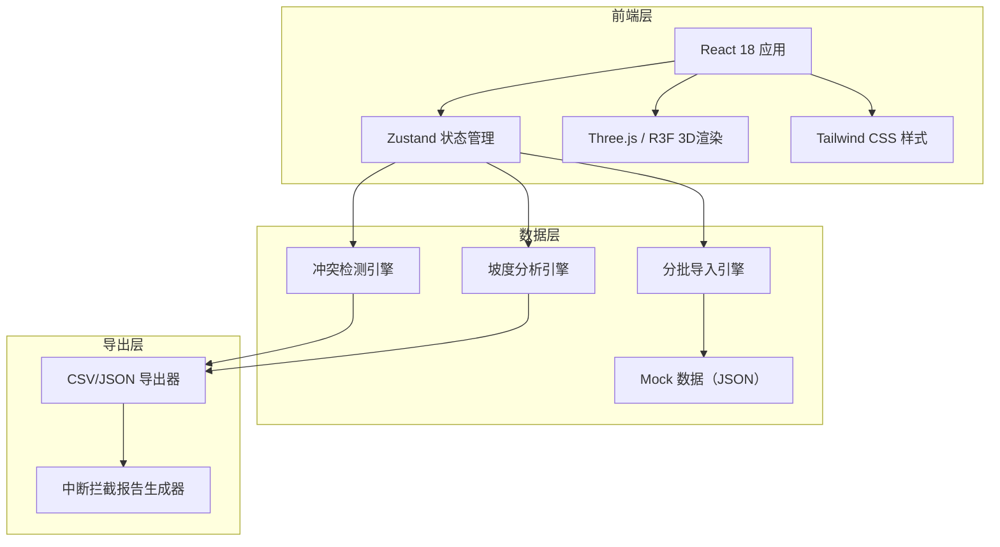
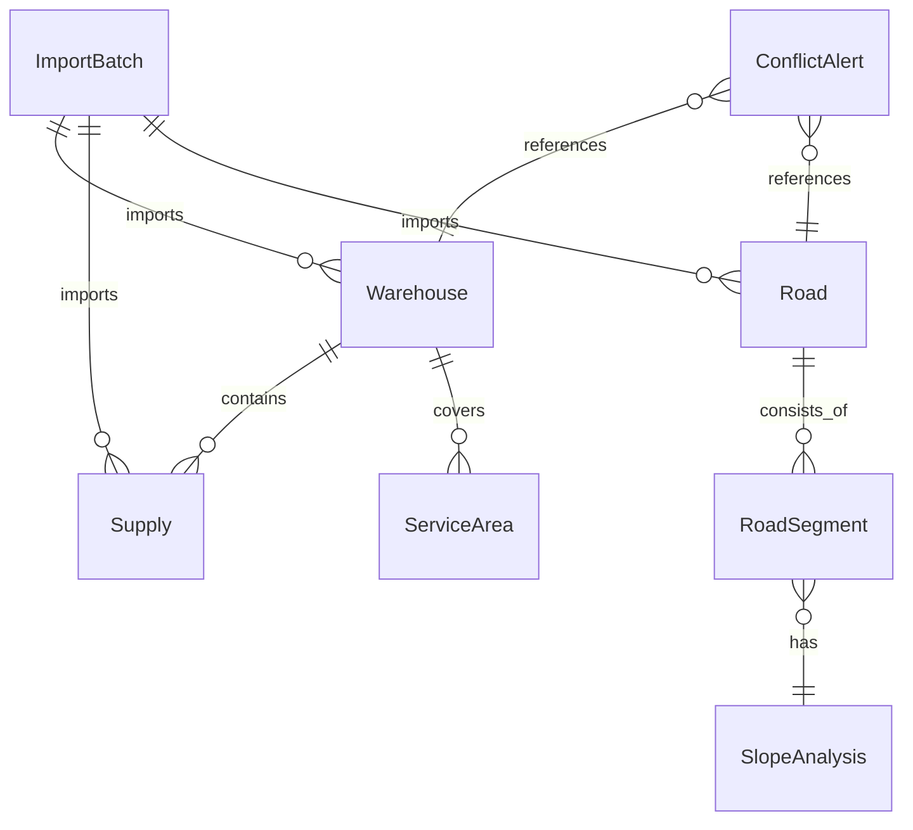

## 1. 架构设计



## 2. 技术说明

- **前端**：React@18 + TypeScript + Tailwind CSS@3 + Vite
- **3D渲染**：three + @react-three/fiber + @react-three/drei + @react-three/postprocessing
- **状态管理**：zustand
- **初始化工具**：vite-init（react-ts模板）
- **后端**：无（纯前端，数据通过导入面板加载本地JSON/CSV）
- **数据**：Mock数据内置，用户可导入自定义数据

## 3. 路由定义

| 路由 | 用途 |
|------|------|
| / | 主控台页面，包含3D视图、筛选、详情、导入、告警、导出全部功能 |

## 4. API定义

无后端API，全部前端本地计算。数据通过文件导入加载。

### 4.1 数据接口类型

```typescript
interface Warehouse {
  id: string;
  name: string;
  position: [number, number, number];
  elevation: number;
  supplies: Supply[];
  serviceRadius: number;
  status: 'normal' | 'isolated' | 'overloaded';
}

interface Supply {
  id: string;
  type: string;
  name: string;
  quantity: number;
  unit: string;
  warehouseId: string;
}

interface Road {
  id: string;
  name: string;
  waypoints: [number, number, number][];
  slopeAngle: number;
  status: 'open' | 'interrupted' | 'slope_limited';
  interruptReason?: string;
  slopeLimitedReason?: string;
}

interface ImportBatch {
  id: string;
  timestamp: number;
  type: 'warehouse' | 'supply' | 'road';
  label: string;
  dataCount: number;
}

interface ConflictAlert {
  id: string;
  type: 'road_interrupted' | 'supply_duplicate' | 'slope_miscalculated';
  severity: 'critical' | 'warning' | 'info';
  message: string;
  reason: string;
  relatedIds: string[];
  position?: [number, number, number];
}
```

## 5. 服务器架构图

无后端服务器。

## 6. 数据模型

### 6.1 数据模型定义



### 6.2 核心数据结构

- **Warehouse**：仓库ID、名称、3D位置、海拔、物资列表、服务半径、状态
- **Supply**：物资ID、类型、名称、数量、单位、所属仓库
- **Road**：道路ID、名称、路径点序列、坡度角、状态、中断原因
- **ImportBatch**：批次ID、时间戳、数据类型、标签、数据条数
- **ConflictAlert**：告警ID、类型、严重度、消息、原因、关联ID、3D位置

### 6.3 Mock初始数据

内置3个仓库、8种物资、5条道路（含2条中断、1条坡度受限），形成完整的演示场景。
