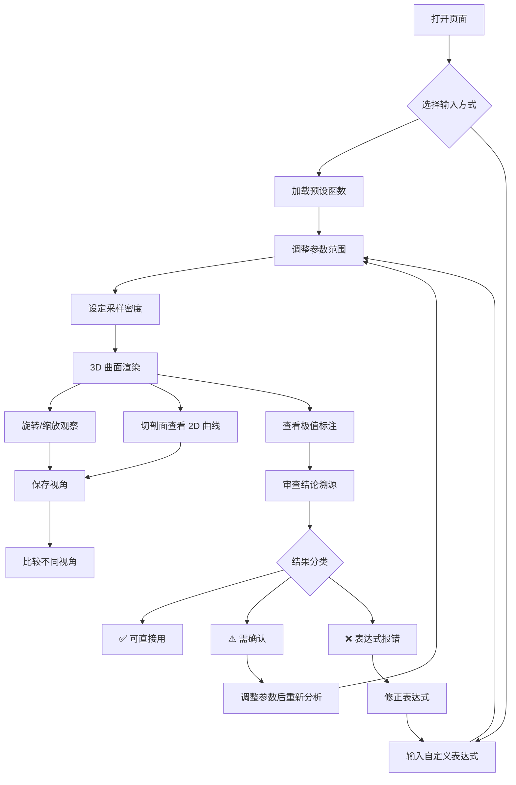

## 1. 产品概述

数学曲面探索器是一款面向数学助教和学生的 Web3D 交互工具，用于直观探索多元函数曲面形态——旋转观察、拖动参数、切剖面、标注极值点与鞍点。所有分析结论均附溯源信息（函数表达式、参数范围、采样密度），并按可信度分为三类：可直接使用、需确认、表达式报错暂不可算。

- 解决痛点：多元函数曲面教学中，学生仅靠想象理解鞍点等概念；助教缺乏可交互演示工具
- 目标用户：高校数学助教、高等数学/数学分析课程学生

## 2. 核心功能

### 2.1 用户角色

| 角色 | 使用方式 | 核心权限 |
|------|----------|----------|
| 数学助教 | 直接访问 | 输入表达式、调整参数、保存视角、导出结论 |
| 学生 | 直接访问 | 浏览预设曲面、拖动参数、切剖面、查看极值标注 |

### 2.2 功能模块

1. **探索主页面**：3D 曲面渲染区 + 参数控制面板 + 剖面联动区 + 结论溯源面板

### 2.3 页面详情

| 页面名称 | 模块名称 | 功能描述 |
|----------|----------|----------|
| 探索主页面 | 3D 曲面渲染区 | Three.js 渲染多元函数曲面，支持旋转/缩放/平移，显示坐标轴与网格，标注极值点与鞍点 |
| 探索主页面 | 参数控制面板 | 输入函数表达式（如 x^2 - y^2），设定 x/y/z 参数范围，调整采样密度滑块，切换剖面方向与位置 |
| 探索主页面 | 剖面联动区 | 2D 曲线图显示指定剖面上的函数值分布，与 3D 曲面联动高亮剖面位置 |
| 探索主页面 | 结论溯源面板 | 列出所有分析结论（极值点坐标、类型、函数值），每条结论可追溯至来源表达式/参数范围/采样密度 |
| 探索主页面 | 结果分类标签 | 每条结论标记为：✅可直接用 / ⚠️需确认 / ❌表达式报错，并附说明 |
| 探索主页面 | 视角管理 | 保存当前相机视角（命名），从已保存列表恢复视角，删除已保存视角 |
| 探索主页面 | 预设函数库 | 提供经典教学函数快速加载（鞍点、抛物面、波浪面等） |

## 3. 核心流程

用户打开页面 → 选择预设函数或输入自定义表达式 → 调整参数范围和采样密度 → 3D 曲面实时渲染 → 切换剖面方向观察 2D 截面曲线 → 查看极值标注与类型 → 在结论面板中审查结果分类 → 保存有价值的视角供后续比较

## 4. 用户界面设计

### 4.1 设计风格

- **主色调**：深邃蓝黑（#0a0e1a）作为背景，配合冷青色（#00e5c8）作为主强调色，暖琥珀色（#f5a623）作为次强调色标注极值
- **按钮风格**：圆角半透明玻璃质感按钮，hover 时发光边框
- **字体**：显示字体使用 JetBrains Mono（数学/代码感），正文使用 Noto Sans SC
- **布局风格**：左侧 3D 视口占主体（约 65%），右侧面板垂直分栏控制区
- **图标风格**：线性图标（lucide-react），与整体科技感统一

### 4.2 页面设计概览

| 页面名称 | 模块名称 | UI 元素 |
|----------|----------|---------|
| 探索主页面 | 3D 曲面渲染区 | 深色背景、坐标轴标签、极值点发光标记（红=极大、蓝=极小、黄=鞍点）、剖面切面半透明高亮 |
| 探索主页面 | 参数控制面板 | 表达式输入框（等宽字体）、范围双滑块、采样密度滑块+数值显示、剖面方向按钮组（XY/XZ/YZ） |
| 探索主页面 | 剖面联动区 | 2D 折线图、剖面位置指示线、与 3D 视图联动的剖面高亮 |
| 探索主页面 | 结论溯源面板 | 结论列表卡片，每条含类型标签+坐标+溯源链接（点击定位到参数来源） |
| 探索主页面 | 视角管理 | 保存按钮+命名弹窗、已保存视角缩略图列表、恢复/删除操作 |
| 探索主页面 | 预设函数库 | 下拉选择或标签式快速切换 |

### 4.3 响应式设计

- 桌面优先设计，3D 视口与面板左右分栏
- 中等屏幕时面板折叠为侧边抽屉
- 小屏幕时面板变为底部抽屉，3D 视口占满

### 4.4 3D 场景指引

- **环境**：深色空间感背景，微弱网格地面提供空间参考
- **光照**：环境光 + 方向光，曲面使用 Phong 材质呈现光泽感
- **相机**：默认透视相机，初始位置斜上方 45° 俯瞰，OrbitControls 交互
- **构图**：曲面居中，坐标轴始终可见，极值标记始终面向相机（Billboard）
- **交互**：鼠标拖拽旋转、滚轮缩放、右键平移；剖面切面可拖拽调整位置
- **后处理**：可选辉光效果（Bloom）增强极值点标注的视觉冲击
